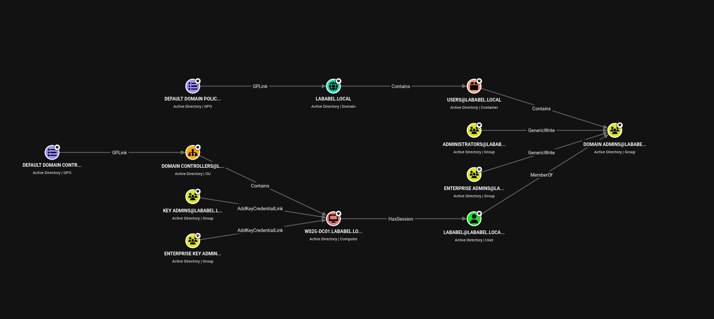
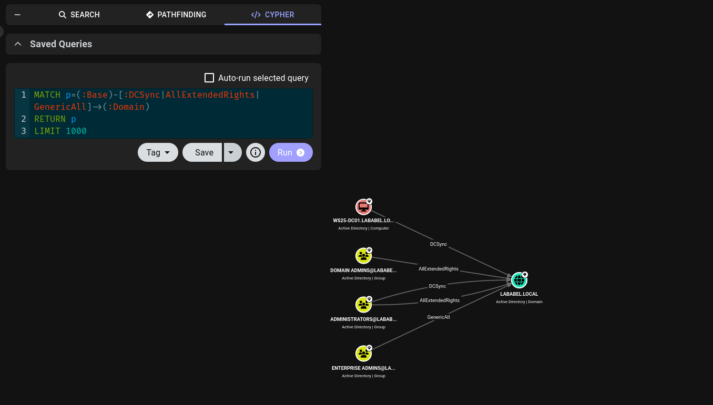
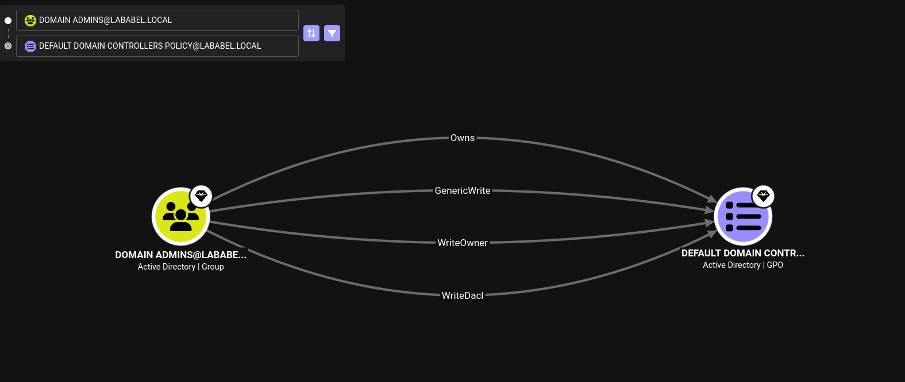
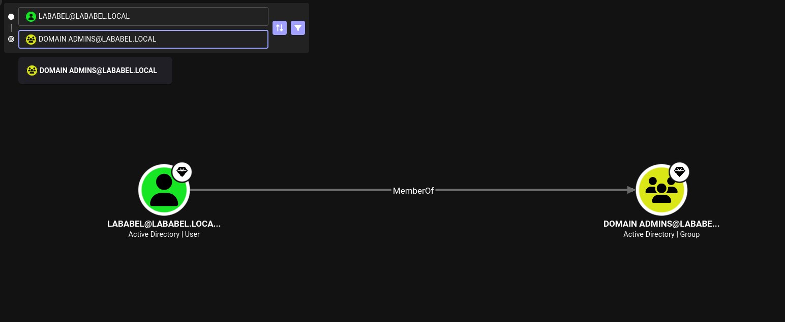

# BloodHound AD Attack Path Mapping — Windows Server 2025 (lababel.local)

**Author:** Santiago Abel Ruiz Diaz
**LinkedIn:** [santiago-a-ruiz-diaz-4aa418b2](https://www.linkedin.com/in/santiago-a-ruiz-diaz-4aa418b2/)
**GitHub:** [Santi4g0RD](https://github.com/Santi4g0RD)
**Platform:** Microsoft Azure
**Domain:** lababel.local
**DC:** WS25-DC01.lababel.local (Windows Server 2025)
**Date:** 2026-06-12

---

## Overview

After applying DISA STIG hardening controls to a Windows Server 2025 Domain Controller, SharpHound was used to collect Active Directory enumeration data. The results were analyzed in BloodHound CE to identify attack paths, privilege escalation opportunities, and high-risk ACL relationships in the domain.

**Tools used:**
- SharpHound (AD collector, run on DC)
- BloodHound CE (graph analysis, run on Kali Linux via Docker)
- xfreerdp drive redirection (file transfer over RDP — no VPN required)

---

## Environment

| Detail | Value |
| --- | --- |
| Domain | lababel.local |
| Domain Controller | WS25-DC01.lababel.local |
| OS | Windows Server 2025 |
| DC Role | AD DS + DNS |
| Collection Method | SharpHound `-c All` |
| Files Collected | 7 |

---

## Data Collection

SharpHound was transferred to the DC via RDP drive redirection from Kali, avoiding the need for a VPN or additional network exposure. Windows Defender exclusions were added for the lab environment before executing the collector.

```powershell
# On DC — disable Defender AV and run SharpHound
Add-MpPreference -ExclusionPath "C:\STIG"
Add-MpPreference -ExclusionPath "\\tsclient\kali"

Copy-Item \\tsclient\kali\SharpHound.exe C:\STIG\
C:\STIG\SharpHound.exe -c All --outputdirectory C:\STIG\

# Copy ZIP back to Kali over the same RDP drive
Copy-Item "C:\STIG\20260612200245_BloodHound.zip" \\tsclient\kali\
```

---

## AD Graph Overview



Key objects identified in the domain:

| Object | Type |
| --- | --- |
| LABABEL@LABABEL.LOCAL | User (Domain Admin) |
| DOMAIN ADMINS | Group |
| ENTERPRISE ADMINS | Group |
| ADMINISTRATORS | Group |
| KEY ADMINS | Group |
| ENTERPRISE KEY ADMINS | Group |
| WS25-DC01 | Domain Controller |
| DEFAULT DOMAIN CONTROLLERS POLICY | GPO |

---

## Findings

### Finding 1 — DCSync Rights



**Query:** Find Principals with DCSync Rights

| Principal | Rights |
| --- | --- |
| DOMAIN ADMINS | DCSync, AllExtendedRights |
| ADMINISTRATORS | DCSync, AllExtendedRights |
| ENTERPRISE ADMINS | GenericAll |
| WS25-DC01 (computer) | DCSync |

**Risk:** Any account in these groups can execute a DCSync attack using `mimikatz lsadump::dcsync` to dump all domain password hashes — including `krbtgt`. This enables a **Golden Ticket** attack for persistent, undetected domain access even after a password reset.

---

### Finding 2 — Domain Admins Control Over Default DC GPO



**Query:** Pathfinding — Domain Admins → Default Domain Controllers Policy

`DOMAIN ADMINS` holds four ACL edges over the **Default Domain Controllers Policy** GPO:

| Edge | Meaning |
| --- | --- |
| Owns | Full ownership of the GPO object |
| GenericWrite | Can modify any GPO setting |
| WriteOwner | Can reassign GPO ownership |
| WriteDacl | Can modify GPO ACL permissions |

**Risk:** An attacker who compromises any Domain Admin account can modify the GPO applied to all Domain Controllers — enabling malicious startup scripts, disabling security controls, or creating backdoor accounts that persist across every DC in the domain.

---

### Finding 3 — Shortest Path to Domain Admin



**Query:** Pathfinding — LABABEL@LABABEL.LOCAL → DOMAIN ADMINS

`LABABEL@LABABEL.LOCAL` → **MemberOf** → `DOMAIN ADMINS`

**1-hop path.** The user account is a direct member of Domain Admins. Compromising this single credential — via phishing, credential stuffing, or password spray — results in immediate full domain control with no lateral movement required.

---

### Finding 4 — Shadow Credentials Attack Surface

`KEY ADMINS` and `ENTERPRISE KEY ADMINS` both have **AddKeyCredentialLink** on `WS25-DC01`.

**Risk:** Any member of these groups can add an alternate credential (certificate-based) to the DC's `msDS-KeyCredentialLink` attribute, then authenticate as the DC account without knowing its password. This enables a stealthy privilege escalation path that bypasses traditional password-based defenses.

---

### Finding 5 — Kerberoastable Accounts

**Query:** `MATCH (u:User {hasspn:true}) RETURN u`

**Result:** No results. No service accounts with registered SPNs exist in this environment — no Kerberoasting attack surface.

---

## Summary

| Finding | Severity | Impact |
| --- | --- | --- |
| DCSync rights held by 3 groups + DC | High | Full domain credential dump, Golden Ticket |
| Domain Admins own Default DC GPO | High | GPO abuse → persistent code exec on all DCs |
| Direct DA membership (1-hop path) | High | Full domain compromise via single credential |
| AddKeyCredentialLink on DC | Medium | Shadow Credentials attack from Key Admins groups |
| No Kerberoastable accounts | Informational | No SPN-based attack surface |

---

## Remediation Recommendations

### Finding 1 — DCSync Rights
DCSync-capable principals should be limited to Domain Controllers only. No human account or security group should hold `Replicating Directory Changes All` or `Replicating Directory Changes` ACEs on the domain object.

1. Open **Active Directory Users and Computers** → View → Advanced Features → right-click the domain → Properties → Security
2. Review all principals with `Replicating Directory Changes` / `Replicating Directory Changes All` — remove any that are not DCs or legitimate sync accounts (e.g., Azure AD Connect)
3. In PowerShell, audit current ACEs:
```powershell
(Get-Acl "AD:\DC=lababel,DC=local").Access | Where-Object {
    $_.ActiveDirectoryRights -match "ExtendedRight" -and
    $_.ObjectType -eq "1131f6aa-9c07-11d1-f79f-00c04fc2dcd2"
}
```
4. If `krbtgt` may be compromised, perform a **double krbtgt password reset** (reset twice, 10 hours apart) to invalidate any Golden Tickets in circulation

---

### Finding 2 — Domain Admins Control Over Default DC GPO
Domain Admins owning and having full write access to the Default Domain Controllers Policy is default behavior in Active Directory — but it becomes a risk when DA accounts are not properly tiered.

1. **Implement a tiered admin model** — create a dedicated `GPO Admins` role for GPO management; Domain Admins should not be used for day-to-day GPO edits
2. **Enable GPO change auditing** in the Default Domain Controllers Policy itself — log all modifications to `Microsoft-Windows-GroupPolicy/Operational`
3. In environments where the risk is high, delegate GPO write access to a dedicated group and remove `GenericWrite` from `DOMAIN ADMINS` on the GPO object via GPMC → Delegation tab
4. Alert on any modification to the Default Domain Controllers Policy GPO — changes outside of a change window should trigger immediate review

---

### Finding 3 — Direct DA Membership (1-hop path)
A single compromised credential providing full domain access is the most common path to total domain compromise. The fix is account separation, not password strength.

1. **Apply a tiered admin model:**
   - **Tier 0** — dedicated DA accounts used only from a Privileged Access Workstation (PAW); never used for email, web browsing, or daily tasks
   - **Tier 1** — server admin accounts
   - **Tier 2** — workstation admin accounts
2. Remove daily-use accounts (like `lababel`) from `DOMAIN ADMINS` — create a separate DA account used only for domain administration tasks
3. **Enable MFA for all privileged accounts** — credential phishing or stuffing alone should not be sufficient for DA access
4. Implement **Privileged Access Workstations (PAWs)** — DA accounts should only be usable from hardened, dedicated admin machines
5. Enable **Protected Users security group** for all DA accounts — prevents NTLM, unconstrained delegation, and long-lived Kerberos tickets

---

### Finding 4 — AddKeyCredentialLink on DC (Shadow Credentials)
`KEY ADMINS` and `ENTERPRISE KEY ADMINS` having `AddKeyCredentialLink` on the DC is the default configuration in new AD forests. It is rarely needed and should be reviewed.

1. Audit current members of `KEY ADMINS` and `ENTERPRISE KEY ADMINS`:
```powershell
Get-ADGroupMember -Identity "Key Admins" -Recursive
Get-ADGroupMember -Identity "Enterprise Key Admins" -Recursive
```
2. If neither group has legitimate members, **leave them empty** — the groups themselves are not the problem, membership is
3. If the `msDS-KeyCredentialLink` write ACE is not needed operationally, remove the `AddKeyCredentialLink` permission from these groups on the DC computer object via ADSI Edit
4. **Monitor `msDS-KeyCredentialLink` attribute modifications** — any write to this attribute on a DC should trigger an alert; it is not modified in normal operations
5. Implement **Windows Hello for Business** or another certificate-based auth solution through proper channels — this removes the operational need for manual `msDS-KeyCredentialLink` writes

---

## Summary

| Finding | Severity | Impact | Remediation Priority |
| --- | --- | --- | --- |
| DCSync rights held by 3 groups + DC | High | Full domain credential dump, Golden Ticket | Immediate — audit and remove excess ACEs |
| Domain Admins own Default DC GPO | High | GPO abuse → persistent code exec on all DCs | High — implement tiered admin + GPO auditing |
| Direct DA membership (1-hop path) | High | Full domain compromise via single credential | High — separate DA accounts, enforce MFA |
| AddKeyCredentialLink on DC | Medium | Shadow Credentials attack from Key Admins groups | Medium — audit group membership, monitor attribute |
| No Kerberoastable accounts | Informational | No SPN-based attack surface | None required |

---

## Related Projects

- [DISA STIG: Windows Server 2025 Hardening](../Win25%20Server%20STIG%20Project/)
