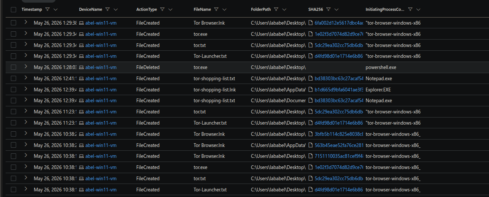
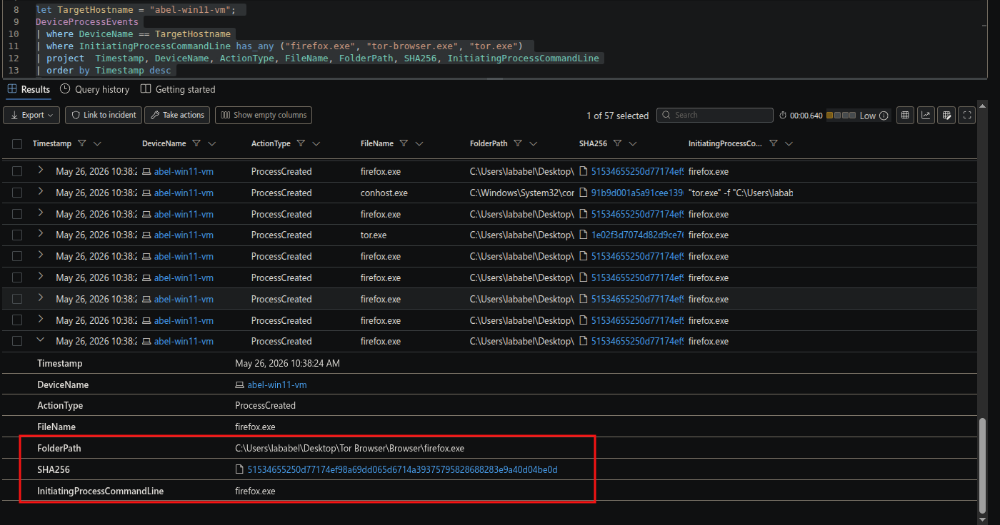
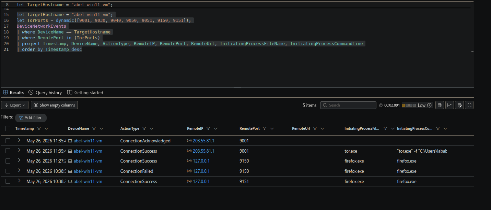

# Threat Hunt: TOR Browser Detection
## Incident Investigation Report

**Analyst:** Santiago Abel Ruiz Diaz
**Incident ID:** IR-2026-0526-TOR
**Environment:** Microsoft Defender for Endpoint (`abel-win11-vm`)
**Severity:** Medium
**Status:** Confirmed policy violation — unauthorized TOR installation, active circuit, artifact concealment
**Date of Activity:** May 26, 2026
**Investigation Window:** 10:38–11:35 AM UTC
**Data Sources:** `DeviceFileEvents`, `DeviceProcessEvents`, `DeviceNetworkEvents`

---


---

## Executive Summary

A targeted threat hunt on a corporate Windows 11 workstation confirmed unauthorized TOR browser installation, active circuit establishment to an external relay, and deliberate concealment of browsing artifacts — all by a single authenticated user (`lababel`) on `abel-win11-vm`.

The hunt was triggered by a management tip about anomalous encrypted outbound traffic. The user specifically chose the **portable** TOR variant to avoid registry traces, ran it from the Desktop to bypass standard installation logging, and deleted a file named `tor-shopping-list.txt` during the active session — a clear indication the user understood forensic artifacts and took steps to remove evidence while the session was live.

By 11:35 AM, a full TOR circuit was confirmed via `ConnectionSuccess` to external relay `203.55.81.1:9001`. All browsing traffic during this window was anonymized and unmonitorable. This is a confirmed **Acceptable Use Policy violation** with indicators of deliberate evasion and planned activity.

---

## Key Findings

- **User:** `lababel` on `abel-win11-vm` (Windows 11, Azure)
- **TOR version:** Portable TOR Browser 15.0.14 — portable variant deliberately chosen to avoid registry traces
- **Execution path:** `C:\Users\lababel\Desktop\` — non-standard path that bypasses standard install logging
- **TOR circuit confirmed:** `ConnectionSuccess` to `203.55.81.1:9001` at 11:35 AM
- **Artifact concealment:** `tor-shopping-list.txt` created and deleted on Desktop during active session
- **Control port:** `127.0.0.1:9151` established at 10:38 AM
- **SOCKS proxy:** `127.0.0.1:9150` online by 11:27 AM — 57-minute window of active circuit configuration
- **No lateral movement, no credential access, no persistence mechanisms detected**

---

## Hunt Methodology

**Starting point:** Management flagged anomalous encrypted outbound traffic and received an anonymous tip about employees bypassing network controls. No specific user was identified — the hunt started from network behavior, not a named suspect.

**Hypothesis:** TOR browser or a similar anonymizing proxy was installed and actively used on at least one corporate endpoint. The traffic pattern (encrypted, non-standard ports) was consistent with TOR relay communication.

**Phase 1 — File events for TOR artifacts.** I started with `DeviceFileEvents` filtered on `FileName has_any ("tor")` across the estate. TOR Browser components appeared on `abel-win11-vm` at 10:38 AM — `Tor Browser.lnk`, `Tor Launcher.txt`, `Torbutton.txt`, `torbat`, `icebuttom.bat`. All landing on the Desktop in the same minute confirmed a single portable installer execution.

**Phase 2 — Process events for execution confirmation.** Filtering `DeviceProcessEvents` on `firefox.exe` with the TOR Browser command line confirmed the portable flag was present — `--portable` in the command line is the key indicator that the user intentionally bypassed the standard install path.

**Phase 3 — Network events to confirm circuit establishment.** I used a dynamic list of known TOR relay ports `[9001, 9030, 9040, 9050, 9051, 9150, 9151]` against `DeviceNetworkEvents`. The control port and SOCKS proxy appeared locally; the external `ConnectionSuccess` to `203.55.81.1:9001` confirmed a live circuit, not just a browser launch.

**Phase 4 — Artifact concealment check.** After confirming TOR use, I reviewed file creation and deletion events on the Desktop during the session window. `tor-shopping-list.txt` was created and deleted within the session — the user was actively cleaning up while the circuit was live.

---

## Key Analyst Observations

**1. Portable variant = deliberate evasion of registry-based detection.**
TOR Browser has a standard installer that writes registry keys and creates Start Menu entries. The user specifically ran the portable version, which leaves no registry traces. This is not a default choice — it requires knowing the difference between the two variants and selecting the portable one intentionally.

**2. `--portable` flag in the command line confirms the intent.**
The `InitiatingProcessCommandLine` field in `DeviceProcessEvents` showed `--portable` in the `firefox.exe` launch. This single field distinguishes a legitimate Firefox process from a TOR Browser process running portable mode — it surfaces the evasion intent without any external threat intelligence.

**3. TOR port list as a scalable detection pattern.**
Rather than hunting for a specific IP, using a dynamic list of all known TOR relay and proxy ports (`9001, 9030, 9040, 9050, 9051, 9150, 9151`) in `DeviceNetworkEvents` is infrastructure-agnostic — it detects TOR regardless of which relay the circuit connects to, and can be dropped directly into a detection rule.

**4. 57-minute gap between control port and SOCKS proxy suggests active circuit configuration.**
The control port (`9151`) came online at 10:38 AM. The SOCKS proxy (`9150`) didn't appear until 11:27 AM — 57 minutes later. This gap indicates the user was not just launching the browser and browsing immediately; they were configuring or waiting for stable circuits. The session was deliberate and patient, not impulsive.

**5. `tor-shopping-list.txt` created and deleted during the active session — not after.**
Most users who want to cover tracks delete files after closing the browser. This file was created and deleted while the TOR circuit was still live. That sequence suggests the user was referencing a list of sites or items during the session and cleaned it up before closing — planned activity with real-time evidence management.

**6. `ConnectionSuccess` to an external relay is the hard confirmation.**
Launching TOR Browser doesn't prove the circuit completed. The `ConnectionSuccess` event on port `9001` to `203.55.81.1` is the definitive proof — a full TOR circuit was established and active. Without this event, the finding would be "TOR installed"; with it, the finding is "TOR circuit confirmed live."

---

## Environment

| Component | Details |
|---|---|
| EDR | Microsoft Defender for Endpoint (MDE) |
| Log Sources | DeviceFileEvents, DeviceProcessEvents, DeviceNetworkEvents |
| Endpoint | `abel-win11-vm` (Windows 11, Azure) |
| Subject Account | `lababel` |
| TOR Version | Portable TOR Browser 15.0.14 |

---

## Hunt Hypothesis

Management flagged anomalous encrypted outbound traffic and received anonymous reports of employees bypassing network controls. This hunt investigated whether any corporate endpoint had TOR browser installed or in active use.

**IoC scope:**
- `DeviceFileEvents` — TOR executable and configuration artifacts
- `DeviceProcessEvents` — installation and execution evidence
- `DeviceNetworkEvents` — outbound connections to known TOR relay ports

---

## Findings

### Installation — Portable Executable, Registry Evasion

At **10:38 AM on 2026-05-26**, the portable TOR Browser 15.0.14 installer was executed on `abel-win11-vm`. The user ran the portable variant from `C:\Users\lababel\Desktop\` rather than a standard installation path, deliberately bypassing the installer flow that would leave registry traces. File events captured multiple TOR components landing on the Desktop within the same minute: `Tor Browser.lnk`, `Tor Launcher.txt`, `Torbutton.txt`, `torbat`, and `icebuttom.bat`.

```kql
let TargetHostname = "abel-win11-vm";
DeviceFileEvents
| where DeviceName == TargetHostname
| where FileName has_any ("tor")
| project Timestamp, DeviceName, ActionType, FileName, FolderPath, SHA256, InitiatingProcessCommandLine
| order by Timestamp desc
```



**MITRE:** T1204 — User Execution, T1036 — Masquerading

---

### Execution and Circuit Establishment

At **10:38 AM**, `firefox.exe` (TOR Browser's browser engine) launched from `C:\Users\lababel\Desktop\`. The `portable` flag in the command line confirms the intent to avoid standard install-log traces. The TOR control port (`127.0.0.1:9151`) established immediately; the SOCKS proxy (`127.0.0.1:9150`) came online by **11:27 AM**. At **11:35 AM**, `tor.exe` completed a `ConnectionSuccess` to external relay `203.55.81.1` on port `9001` — a full TOR circuit confirmed.

```kql
let TargetHostname = "abel-win11-vm";
DeviceProcessEvents
| where DeviceName == TargetHostname
| where InitiatingProcessCommandLine has_any ("firefox.exe", "tor-browser.exe", "tor.exe")
| project Timestamp, DeviceName, ActionType, FileName, FolderPath, SHA256, InitiatingProcessCommandLine
| order by Timestamp desc
```



```kql
let TargetHostname = "abel-win11-vm";
let TorPorts = dynamic([9001, 9030, 9040, 9050, 9051, 9150, 9151]);
DeviceNetworkEvents
| where DeviceName == TargetHostname
| where RemotePort in (TorPorts)
| project Timestamp, DeviceName, ActionType, RemoteIP, RemotePort, RemoteUrl, InitiatingProcessFileName, InitiatingProcessCommandLine
| order by Timestamp desc
```



**MITRE:** T1090.003 — Proxy: Multi-hop Proxy (TOR)

---

### Artifact Concealment — Indicator Removal

During the active TOR session, the file `tor-shopping-list.txt` was created on the Desktop and subsequently deleted. Combined with the portable installation method, this pattern indicates the user was aware of forensic artifacts and took deliberate steps to limit trace evidence while the session was still live.

**MITRE:** T1070 — Indicator Removal

---

## Timeline of Notable Events

| Time | Event |
|---|---|
| 10:38 AM | Portable TOR Browser 15.0.14 installer executed from `C:\Users\lababel\Desktop\` |
| 10:38 AM | TOR components land on Desktop — `Tor Browser.lnk`, `Tor Launcher.txt`, `Torbutton.txt`, `torbat`, `icebuttom.bat` |
| 10:38 AM | `firefox.exe` launches with `--portable` flag — deliberate registry evasion |
| 10:38 AM | TOR control port `127.0.0.1:9151` established |
| During session | `tor-shopping-list.txt` created on Desktop |
| During session | `tor-shopping-list.txt` deleted — active artifact cleanup during live session |
| 11:27 AM | SOCKS proxy `127.0.0.1:9150` comes online (57 min after control port) |
| 11:35 AM | `ConnectionSuccess` to `203.55.81.1:9001` — full TOR circuit confirmed |
| **Total window** | **~57 minutes of confirmed active TOR use** |

---

## Impact Assessment

| Category | Finding |
|---|---|
| Policy violation | Confirmed — Acceptable Use Policy breach |
| TOR circuit established | Yes — full circuit to external relay confirmed at 11:35 AM |
| Browsing traffic visible | No — all traffic anonymized through TOR; content unrecoverable |
| Deliberate evasion | Yes — portable variant, Desktop execution path, in-session artifact deletion |
| Planned activity indicated | Yes — `tor-shopping-list.txt` implies prepared list of sites or items |
| Credential access | None detected |
| Lateral movement | None detected |
| Persistence | None detected |
| Data exfiltration | Cannot be confirmed or ruled out — traffic was TOR-anonymized |
| Scope | Single endpoint (`abel-win11-vm`), single user (`lababel`) |

---

## IOC Summary

| Type | Value |
|---|---|
| Endpoint | `abel-win11-vm` |
| Subject account | `lababel` |
| TOR binary | Portable TOR Browser 15.0.14 |
| Execution path | `C:\Users\lababel\Desktop\` |
| External relay | `203.55.81.1:9001` |
| Local SOCKS proxy | `127.0.0.1:9150` |
| Local control port | `127.0.0.1:9151` |
| Deleted artifact | `tor-shopping-list.txt` (Desktop) |

---

## MITRE ATT&CK Mapping

| Tactic | Technique | ID | Detail |
|---|---|---|---|
| Execution | User Execution | T1204 | User manually ran the portable TOR installer from the Desktop |
| Defense Evasion | Masquerading | T1036 | Portable installation bypasses registry-based detection |
| Defense Evasion | Proxy: Multi-hop Proxy | T1090.003 | Full TOR circuit established to external relay on port 9001 |
| Defense Evasion | Indicator Removal | T1070 | `tor-shopping-list.txt` created and deleted during active session |

---

## Containment & Remediation

### Immediate Containment
1. **Preserve disk image** of `abel-win11-vm` before any remediation — `tor-shopping-list.txt` may be recoverable from unallocated space via forensic tooling
2. **Remove TOR Browser** — delete all files under `C:\Users\lababel\Desktop\` related to TOR; verify no copies exist in other user directories
3. **Engage HR and Legal** — confirmed policy violation with deliberate evasion indicators; document chain of custody for the disk image
4. **Interview the user** — establish what sites were visited and whether corporate data was accessed or transmitted through the TOR circuit
5. **Review the user's browsing history** for the session window — TOR itself anonymizes traffic, but pre-TOR browser activity on `abel-win11-vm` may surface intent

### Near-Term Hardening
1. **Block TOR relay ports at the network perimeter** — firewall rules blocking outbound `9001, 9030, 9040, 9050, 9051` reduce circuit establishment success; TOR bridges can bypass this but adds friction
2. **Block known TOR exit node and relay IP ranges** — subscribe to a threat intelligence feed that maintains updated TOR IP lists and implement as firewall blocklist
3. **Alert on `--portable` flag in browser command lines** — any `firefox.exe` launch with `--portable` outside of approved applications is high-fidelity
4. **Alert on file creation in `%APPDATA%\Tor\`** and `%USERPROFILE%\Desktop\` for known TOR component filenames
5. **Hunt across the estate** — run the same TOR port query against all endpoints to confirm this is isolated to `abel-win11-vm`

### Strategic Improvements
1. **Implement DNS-layer filtering** — services like Umbrella or Azure DNS resolver block TOR-associated domains before circuits can establish
2. **Deploy a web proxy with SSL inspection** — forces all HTTPS traffic through a proxy that can inspect and block TOR traffic patterns
3. **Add a detection rule to MDE** — the TOR port dynamic list is already written; promote it to a scheduled alert rule that fires whenever `RemotePort in (9001, 9030, 9040, 9050, 9051, 9150, 9151)` appears in `DeviceNetworkEvents`
4. **Enforce application allowlisting** — prevents unauthorized portable executables from running without an admin approval workflow
5. **User awareness training** — reinforce Acceptable Use Policy with specific examples of what constitutes a violation and the monitoring capabilities in place

---

## Supporting Documentation

| Document | Description |
|---|---|
| [KQL Detection Queries](detection/kql-queries.md) | All queries used to surface TOR indicators across three MDE tables |
| [Findings Report](report/findings.md) | Full timeline, analysis, and escalation recommendation |
