# DISA STIG: System Hardening — Windows Server 2025 Controls Automated with PowerShell on Azure

**Author:** Santiago Abel Ruiz Diaz
**Platform:** Microsoft Azure
**Environment:** Windows Server 2025 VM — Active Directory Domain Controller
**Date:** 2026-06-12

---

## Overview

Implemented and verified 33 DISA STIG security controls on a Windows Server 2025 Azure VM promoted to an Active Directory Domain Controller (`lababel.local`). Each script targets a specific STIG finding, applies the required configuration via registry, secedit, or AD policy cmdlets, and was validated before and after execution.

Scripts marked **DC** use `Set-ADDefaultDomainPasswordPolicy` and must be run on a Domain Controller. Standalone scripts use `secedit` for local policy.

| # | STIG-ID | Category | Control | Script | Result |
|---|---------|----------|---------|--------|--------|
| 1 | WN25-AU-000500 | Audit & Logging | Security event log ≥ 1024000 KB | [📄](./Win25%20Server%20STIG%20Scripts/STIG-ID-WN25-AU-000500.ps1) | ✅ Pass |
| 2 | WN25-AU-000505 | Audit & Logging | Application event log ≥ 32768 KB | [📄](./Win25%20Server%20STIG%20Scripts/STIG-ID-WN25-AU-000505.ps1) | ✅ Pass |
| 3 | WN25-AU-000510 | Audit & Logging | System event log ≥ 32768 KB | [📄](./Win25%20Server%20STIG%20Scripts/STIG-ID-WN25-AU-000510.ps1) | ✅ Pass |
| 4 | WN25-AC-000005 | Account Policy | Account lockout duration ≥ 15 min | [📄](./Win25%20Server%20STIG%20Scripts/STIG-ID-WN25-AC-000005.ps1) | ✅ Pass |
| 5 | WN25-AC-000010 | Account Policy | Account lockout threshold ≤ 3 attempts | [📄](./Win25%20Server%20STIG%20Scripts/STIG-ID-WN25-AC-000010.ps1) | ✅ Pass |
| 6 | WN25-AC-000015 | Account Policy | Reset lockout counter ≥ 15 min | [📄](./Win25%20Server%20STIG%20Scripts/STIG-ID-WN25-AC-000015.ps1) | ✅ Pass |
| 7 | WN25-AC-000005 | Account Policy | Lockout duration ≥ 15 min **(DC)** | [📄](./Win25%20Server%20STIG%20Scripts/STIG-ID-WN25-AC-000005-DC.ps1) | ✅ Pass |
| 8 | WN25-AC-000010 | Account Policy | Lockout threshold ≤ 3 attempts **(DC)** | [📄](./Win25%20Server%20STIG%20Scripts/STIG-ID-WN25-AC-000010-DC.ps1) | ✅ Pass |
| 9 | WN25-AC-000015 | Account Policy | Reset lockout counter ≥ 15 min **(DC)** | [📄](./Win25%20Server%20STIG%20Scripts/STIG-ID-WN25-AC-000015-DC.ps1) | ✅ Pass |
| 10 | WN25-SO-000001 | Security Options | LAN Manager auth level = NTLMv2 only | [📄](./Win25%20Server%20STIG%20Scripts/STIG-ID-WN25-SO-000001.ps1) | ✅ Pass |
| 11 | WN25-SO-000005 | Security Options | Disable built-in Guest account | [📄](./Win25%20Server%20STIG%20Scripts/STIG-ID-WN25-SO-000005.ps1) | ✅ Pass |
| 12 | WN25-SO-000010 | Security Options | AutoRun disabled (all drives) | [📄](./Win25%20Server%20STIG%20Scripts/STIG-ID-WN25-SO-000010.ps1) | ✅ Pass |
| 13 | WN25-SO-000015 | Security Options | Restrict anonymous SAM enumeration | [📄](./Win25%20Server%20STIG%20Scripts/STIG-ID-WN25-SO-000015.ps1) | ✅ Pass |
| 14 | WN25-SO-000020 | Security Options | Restrict anonymous share enumeration | [📄](./Win25%20Server%20STIG%20Scripts/STIG-ID-WN25-SO-000020.ps1) | ✅ Pass |
| 15 | WN25-SO-000025 | Security Options | NTLM min session security (server) | [📄](./Win25%20Server%20STIG%20Scripts/STIG-ID-WN25-SO-000025.ps1) | ✅ Pass |
| 16 | WN25-SO-000030 | Security Options | Cached credentials ≤ 4 | [📄](./Win25%20Server%20STIG%20Scripts/STIG-ID-WN25-SO-000030.ps1) | ✅ Pass |
| 17 | WN25-SO-000035 | Security Options | WDigest authentication disabled | [📄](./Win25%20Server%20STIG%20Scripts/STIG-ID-WN25-SO-000035.ps1) | ✅ Pass |
| 18 | WN25-SO-000040 | Security Options | Don't display last username at logon | [📄](./Win25%20Server%20STIG%20Scripts/STIG-ID-WN25-SO-000040.ps1) | ✅ Pass |
| 19 | WN25-SO-000070 | Security Options | UAC credential prompt on secure desktop | [📄](./Win25%20Server%20STIG%20Scripts/STIG-ID-WN25-SO-000070.ps1) | ✅ Pass |
| 20 | WN25-UR-000001 | User Rights | Act as part of OS — no accounts assigned | [📄](./Win25%20Server%20STIG%20Scripts/STIG-ID-WN25-UR-000001.ps1) | ✅ Pass |
| 21 | WN25-UR-000005 | User Rights | Debug programs — Administrators only | [📄](./Win25%20Server%20STIG%20Scripts/STIG-ID-WN25-UR-000005.ps1) | ✅ Pass |
| 22 | WN25-UR-000015 | User Rights | Deny logon as batch job — Guests denied | [📄](./Win25%20Server%20STIG%20Scripts/STIG-ID-WN25-UR-000015.ps1) | ✅ Pass |
| 23 | WN25-UR-000020 | User Rights | Deny logon as service — Guests denied | [📄](./Win25%20Server%20STIG%20Scripts/STIG-ID-WN25-UR-000020.ps1) | ✅ Pass |
| 24 | WN25-UR-000025 | User Rights | Manage audit and security log — Admins only | [📄](./Win25%20Server%20STIG%20Scripts/STIG-ID-WN25-UR-000025.ps1) | ✅ Pass |
| 25 | WN25-UR-000030 | User Rights | Create a token object — no accounts assigned | [📄](./Win25%20Server%20STIG%20Scripts/STIG-ID-WN25-UR-000030.ps1) | ✅ Pass |
| 26 | WN25-UR-000035 | User Rights | Take ownership of files — Admins only | [📄](./Win25%20Server%20STIG%20Scripts/STIG-ID-WN25-UR-000035.ps1) | ✅ Pass |
| 27 | WN25-CC-000035 | Component Config | Require NLA for Remote Desktop | [📄](./Win25%20Server%20STIG%20Scripts/STIG-ID-WN25-CC-000035.ps1) | ✅ Pass |
| 28 | WN25-CC-000040 | Component Config | Disable SMBv1 protocol | [📄](./Win25%20Server%20STIG%20Scripts/STIG-ID-WN25-CC-000040.ps1) | ✅ Pass |
| 29 | WN25-FW-000001 | Firewall | Domain profile — firewall enabled | [📄](./Win25%20Server%20STIG%20Scripts/STIG-ID-WN25-FW-000001.ps1) | ✅ Pass |
| 30 | WN25-FW-000002 | Firewall | Private profile — firewall enabled | [📄](./Win25%20Server%20STIG%20Scripts/STIG-ID-WN25-FW-000002.ps1) | ✅ Pass |
| 31 | WN25-FW-000003 | Firewall | Public profile — firewall enabled | [📄](./Win25%20Server%20STIG%20Scripts/STIG-ID-WN25-FW-000003.ps1) | ✅ Pass |
| 32 | WN25-FW-000010 | Firewall | Domain profile — block inbound by default | [📄](./Win25%20Server%20STIG%20Scripts/STIG-ID-WN25-FW-000010.ps1) | ✅ Pass |
| 33 | WN25-FW-000015 | Firewall | Public profile — block inbound by default | [📄](./Win25%20Server%20STIG%20Scripts/STIG-ID-WN25-FW-000015.ps1) | ✅ Pass |
| 34 | WN25-NE-000001 | Network | IPv6 source routing — highest protection | [📄](./Win25%20Server%20STIG%20Scripts/STIG-ID-WN25-NE-000001.ps1) | ✅ Pass |
| 35 | WN25-NE-000005 | Network | ICMP redirects disabled | [📄](./Win25%20Server%20STIG%20Scripts/STIG-ID-WN25-NE-000005.ps1) | ✅ Pass |
| 36 | WN25-NE-000010 | Network | NetBIOS over TCP/IP disabled | [📄](./Win25%20Server%20STIG%20Scripts/STIG-ID-WN25-NE-000010.ps1) | ✅ Pass |

---

## Audit & Logging

### WN25-AU-000500 — Security Event Log Size

**Rule:** The Security event log must be at least 1024000 KB (1 GB).
**Registry:** `HKLM:\SOFTWARE\Policies\Microsoft\Windows\EventLog\Security`
**Value:** `MaxSize = 1024000`
**Before:** Registry key did not exist (path not found)
**After:** `MaxSize = 1024000`
**Result:** ✅ Pass

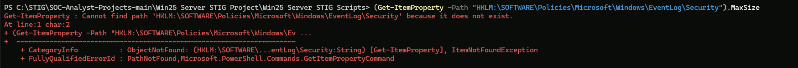

**Script:** [STIG-ID-WN25-AU-000500.ps1](./Win25%20Server%20STIG%20Scripts/STIG-ID-WN25-AU-000500.ps1)

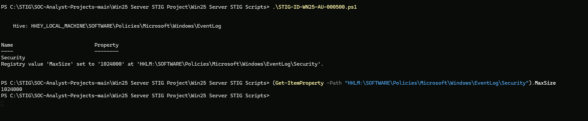

---
### WN25-AU-000505 — Application Event Log Size

**Rule:** The Application event log must be at least 32768 KB (32 MB).
**Registry:** `HKLM:\SOFTWARE\Policies\Microsoft\Windows\EventLog\Application`
**Value:** `MaxSize = 32768`
**Before:** Registry key did not exist (path not found)
**After:** `MaxSize = 32768`
**Result:** ✅ Pass

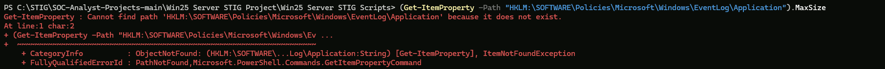

**Script:** [STIG-ID-WN25-AU-000505.ps1](./Win25%20Server%20STIG%20Scripts/STIG-ID-WN25-AU-000505.ps1)

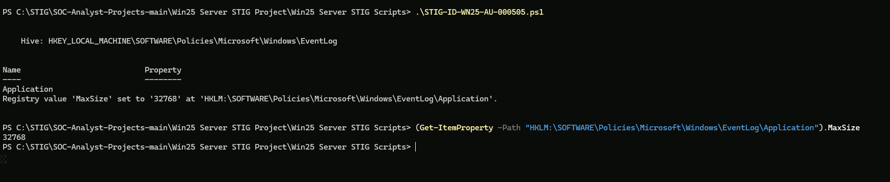

---
### WN25-AU-000510 — System Event Log Size

**Rule:** The System event log must be at least 32768 KB (32 MB).
**Registry:** `HKLM:\SOFTWARE\Policies\Microsoft\Windows\EventLog\System`
**Value:** `MaxSize = 32768`
**Before:** Registry key did not exist (path not found)
**After:** `MaxSize = 32768`
**Result:** ✅ Pass

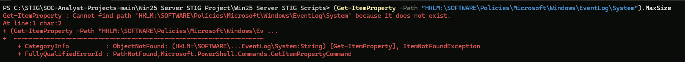

**Script:** [STIG-ID-WN25-AU-000510.ps1](./Win25%20Server%20STIG%20Scripts/STIG-ID-WN25-AU-000510.ps1)

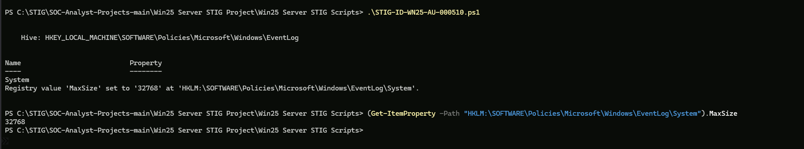

---
## Account Policy

> **Note — DC vs Standalone:** On a Domain Controller, `secedit` only applies to local accounts. Domain account lockout policy must be set via `Set-ADDefaultDomainPasswordPolicy` (the `-DC` scripts). Both were run on WS25-DC01.

### WN25-AC-000005 — Account Lockout Duration

**Rule:** Account lockout duration must be 15 minutes or greater.
**Standalone:** secedit — `LockoutDuration = 15`
**DC:** `Set-ADDefaultDomainPasswordPolicy -LockoutDuration "00:15:00"`
**Before:** Local: 10 min / Domain: 10 min — below STIG minimum
**After:** Local: 15 min / Domain: 15 min
**Result:** ✅ Pass

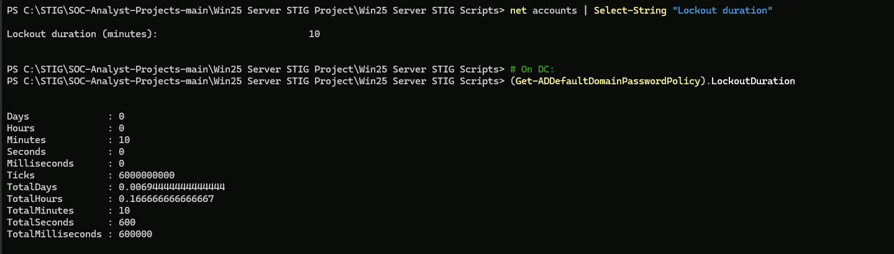

**Scripts:** [STIG-ID-WN25-AC-000005.ps1](./Win25%20Server%20STIG%20Scripts/STIG-ID-WN25-AC-000005.ps1) · [STIG-ID-WN25-AC-000005-DC.ps1](./Win25%20Server%20STIG%20Scripts/STIG-ID-WN25-AC-000005-DC.ps1)

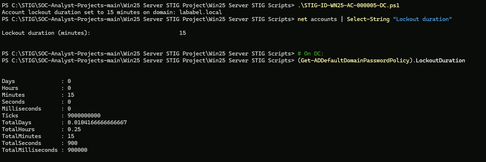

---
### WN25-AC-000010 — Account Lockout Threshold

**Rule:** Account lockout threshold must be 3 or fewer invalid logon attempts.
**Standalone:** secedit — `LockoutBadCount = 3`
**DC:** `Set-ADDefaultDomainPasswordPolicy -LockoutThreshold 3`
**Before:** Local: 0 (disabled) / Domain: 0 — no lockout configured
**After:** Local: 3 / Domain: 3
**Result:** ✅ Pass

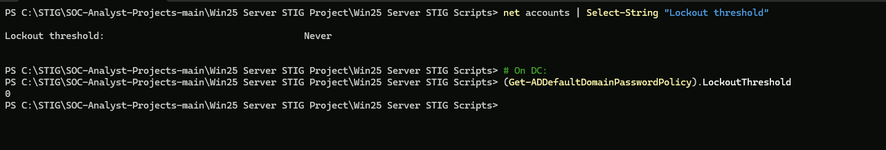

**Scripts:** [STIG-ID-WN25-AC-000010.ps1](./Win25%20Server%20STIG%20Scripts/STIG-ID-WN25-AC-000010.ps1) · [STIG-ID-WN25-AC-000010-DC.ps1](./Win25%20Server%20STIG%20Scripts/STIG-ID-WN25-AC-000010-DC.ps1)

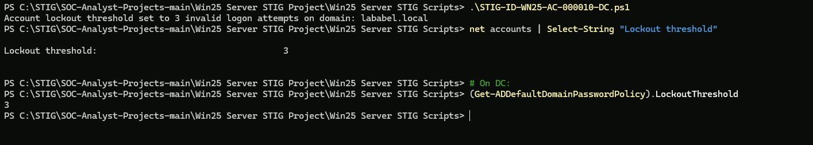

---
### WN25-AC-000015 — Reset Account Lockout Counter

**Rule:** Reset account lockout counter must be 15 minutes or greater.
**Standalone:** secedit — `ResetLockoutCount = 15`
**DC:** `Set-ADDefaultDomainPasswordPolicy -LockoutObservationWindow "00:15:00"`
**Before:** Local: 0 min / Domain: 0 min — not configured
**After:** Local: 15 min / Domain: 15 min
**Result:** ✅ Pass

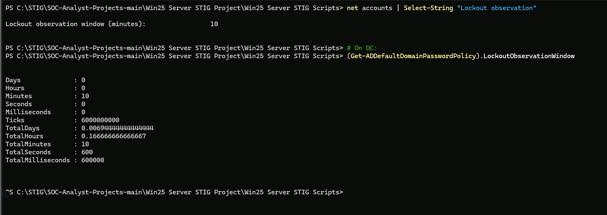

**Scripts:** [STIG-ID-WN25-AC-000015.ps1](./Win25%20Server%20STIG%20Scripts/STIG-ID-WN25-AC-000015.ps1) · [STIG-ID-WN25-AC-000015-DC.ps1](./Win25%20Server%20STIG%20Scripts/STIG-ID-WN25-AC-000015-DC.ps1)

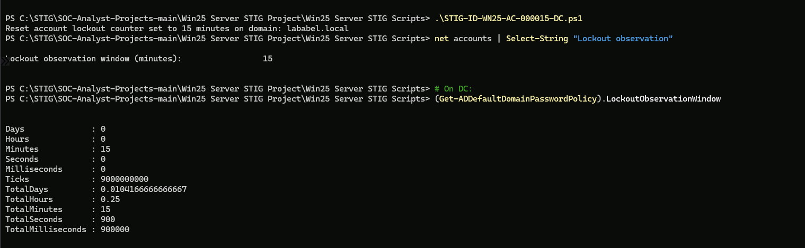

---
## Security Options

### WN25-SO-000001 — LAN Manager Authentication Level

**Rule:** LAN Manager authentication level must be set to send NTLMv2 only and refuse LM and NTLM.
**Registry:** `HKLM:\SYSTEM\CurrentControlSet\Control\Lsa`
**Value:** `LmCompatibilityLevel = 5`
**Before:** `LmCompatibilityLevel` not set (default)
**After:** `LmCompatibilityLevel = 5`
**Result:** ✅ Pass

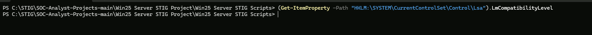

**Script:** [STIG-ID-WN25-SO-000001.ps1](./Win25%20Server%20STIG%20Scripts/STIG-ID-WN25-SO-000001.ps1)

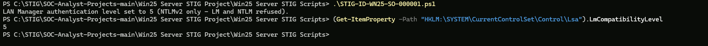

---
### WN25-SO-000005 — Guest Account Disabled

**Rule:** The built-in Guest account must be disabled.
**Method:** `Disable-LocalUser -Name "Guest"`
**Before:** Guest account already disabled
**After:** Guest account confirmed disabled (`Enabled = False`)
**Result:** ✅ Pass

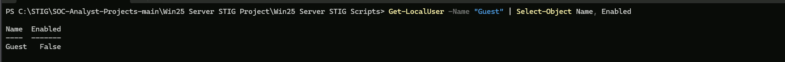

**Script:** [STIG-ID-WN25-SO-000005.ps1](./Win25%20Server%20STIG%20Scripts/STIG-ID-WN25-SO-000005.ps1)

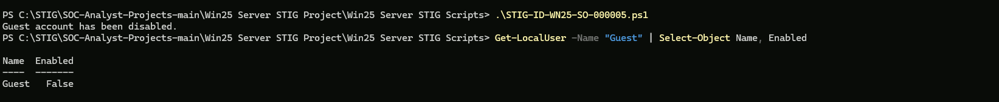

---
### WN25-SO-000010 — AutoRun Disabled

**Rule:** AutoRun must be disabled for all drives.
**Registry:** `HKLM:\SOFTWARE\Microsoft\Windows\CurrentVersion\Policies\Explorer`
**Value:** `NoDriveTypeAutoRun = 255`
**Before:** `NoDriveTypeAutoRun` not set
**After:** `NoDriveTypeAutoRun = 255`
**Result:** ✅ Pass

**Script:** [STIG-ID-WN25-SO-000010.ps1](./Win25%20Server%20STIG%20Scripts/STIG-ID-WN25-SO-000010.ps1)

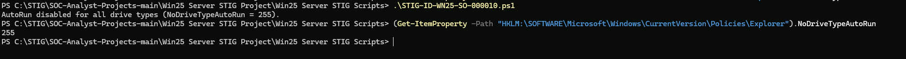

---
### WN25-SO-000015 — Restrict Anonymous SAM Enumeration

**Rule:** Anonymous enumeration of SAM accounts must be restricted.
**Registry:** `HKLM:\SYSTEM\CurrentControlSet\Control\Lsa`
**Value:** `RestrictAnonymousSAM = 1`
**Before:** `RestrictAnonymousSAM` not set
**After:** `RestrictAnonymousSAM = 1`
**Result:** ✅ Pass

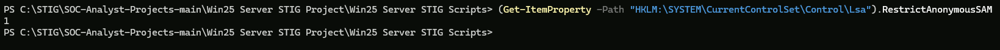

**Script:** [STIG-ID-WN25-SO-000015.ps1](./Win25%20Server%20STIG%20Scripts/STIG-ID-WN25-SO-000015.ps1)

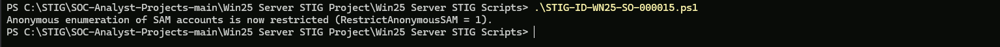

---
### WN25-SO-000020 — Restrict Anonymous Share Enumeration

**Rule:** Anonymous enumeration of shares must be restricted.
**Registry:** `HKLM:\SYSTEM\CurrentControlSet\Control\Lsa`
**Value:** `RestrictAnonymous = 1`
**Before:** `RestrictAnonymous` not set
**After:** `RestrictAnonymous = 1`
**Result:** ✅ Pass

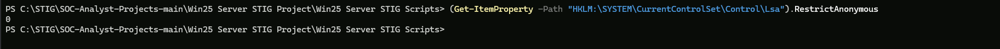

**Script:** [STIG-ID-WN25-SO-000020.ps1](./Win25%20Server%20STIG%20Scripts/STIG-ID-WN25-SO-000020.ps1)

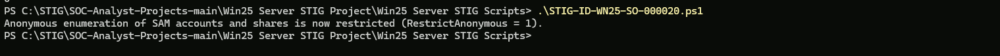

---
### WN25-SO-000025 — NTLM Minimum Session Security (Server)

**Rule:** NTLM must be configured to require NTLMv2 session security and 128-bit encryption on the server side.
**Registry:** `HKLM:\SYSTEM\CurrentControlSet\Control\Lsa\MSV1_0`
**Value:** `NtlmMinServerSec = 537395200`
**Before:** `NtlmMinServerSec` not set
**After:** `NtlmMinServerSec = 537395200`
**Result:** ✅ Pass

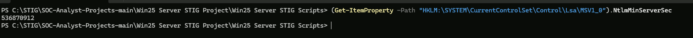

**Script:** [STIG-ID-WN25-SO-000025.ps1](./Win25%20Server%20STIG%20Scripts/STIG-ID-WN25-SO-000025.ps1)

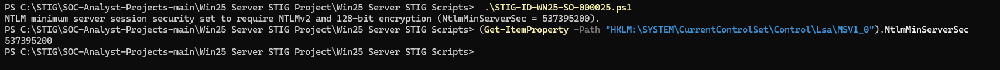

---
### WN25-SO-000030 — Cached Credentials Limit

**Rule:** The number of cached credentials must be limited to 4 or fewer.
**Registry:** `HKLM:\SOFTWARE\Microsoft\Windows NT\CurrentVersion\Winlogon`
**Value:** `CachedLogonsCount = 4`
**Before:** `CachedLogonsCount` not set (default)
**After:** `CachedLogonsCount = 4`
**Result:** ✅ Pass

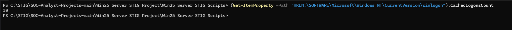

**Script:** [STIG-ID-WN25-SO-000030.ps1](./Win25%20Server%20STIG%20Scripts/STIG-ID-WN25-SO-000030.ps1)

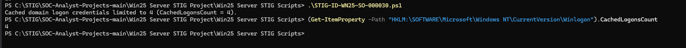

---
### WN25-SO-000035 — WDigest Authentication Disabled

**Rule:** WDigest authentication must be disabled to prevent plaintext passwords in memory.
**Registry:** `HKLM:\SYSTEM\CurrentControlSet\Control\SecurityProviders\WDigest`
**Value:** `UseLogonCredential = 0`
**Before:** `UseLogonCredential` not set
**After:** `UseLogonCredential = 0`
**Result:** ✅ Pass

**Script:** [STIG-ID-WN25-SO-000035.ps1](./Win25%20Server%20STIG%20Scripts/STIG-ID-WN25-SO-000035.ps1)

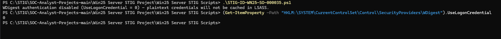

---
### WN25-SO-000040 — Don't Display Last Username

**Rule:** The system must not display the last signed-in username at the logon screen.
**Registry:** `HKLM:\SOFTWARE\Microsoft\Windows\CurrentVersion\Policies\System`
**Value:** `DontDisplayLastUserName = 1`
**Before:** `DontDisplayLastUserName = 0` — last username displayed at logon (non-compliant)
**After:** `DontDisplayLastUserName = 1` — last username no longer displayed
**Result:** ✅ Pass

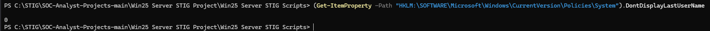

**Script:** [STIG-ID-WN25-SO-000040.ps1](./Win25%20Server%20STIG%20Scripts/STIG-ID-WN25-SO-000040.ps1)

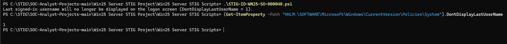

---
### WN25-SO-000070 — UAC Elevation Prompt

**Rule:** UAC must prompt administrators for credentials on the secure desktop.
**Registry:** `HKLM:\SOFTWARE\Microsoft\Windows\CurrentVersion\Policies\System`
**Value:** `ConsentPromptBehaviorAdmin = 1`
**Before:** `ConsentPromptBehaviorAdmin = 5` (prompt for consent, not credentials)
**After:** `ConsentPromptBehaviorAdmin = 1` (prompt for credentials on secure desktop)
**Result:** ✅ Pass

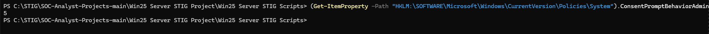

**Script:** [STIG-ID-WN25-SO-000070.ps1](./Win25%20Server%20STIG%20Scripts/STIG-ID-WN25-SO-000070.ps1)

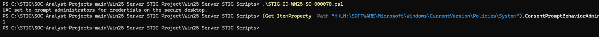

---
## User Rights & Privileges

### WN25-UR-000001 — Act as Part of the Operating System (CAT I)

**Rule:** The "Act as part of the operating system" right must not be assigned to any accounts.
**Method:** secedit — `SeTcbPrivilege = (blank)`
**Before:** `SeTcbPrivilege` not found in secedit export — no explicit assignment
**After:** `SeTcbPrivilege` cleared — no accounts assigned
**Result:** ✅ Pass

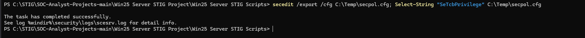

**Script:** [STIG-ID-WN25-UR-000001.ps1](./Win25%20Server%20STIG%20Scripts/STIG-ID-WN25-UR-000001.ps1)

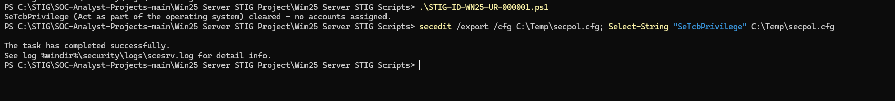

---
### WN25-UR-000005 — Debug Programs (CAT I)

**Rule:** The "Debug programs" right must only be assigned to Administrators.
**Method:** secedit — `SeDebugPrivilege = *S-1-5-32-544`
**Before:** `SeDebugPrivilege = *S-1-5-32-544` (already Administrators only)
**After:** `SeDebugPrivilege = *S-1-5-32-544` — confirmed Administrators only
**Result:** ✅ Pass

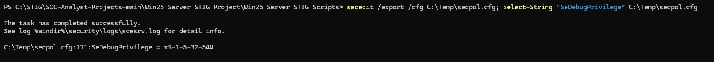

**Script:** [STIG-ID-WN25-UR-000005.ps1](./Win25%20Server%20STIG%20Scripts/STIG-ID-WN25-UR-000005.ps1)

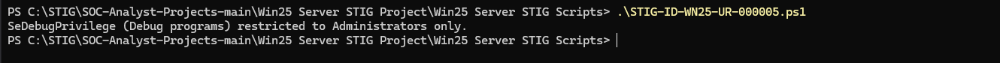

---
### WN25-UR-000015 — Deny Logon as Batch Job

**Rule:** Guest account must be denied the right to log on as a batch job.
**Method:** secedit — `SeDenyBatchLogonRight` includes `*S-1-5-32-546` (Guests)
**Before:** `SeDenyBatchLogonRight` not found in secedit export — not explicitly set
**After:** Script confirmed — Guests denied log on as a batch job
**Result:** ✅ Pass

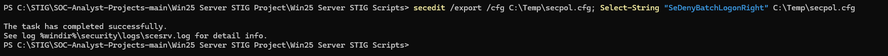

**Script:** [STIG-ID-WN25-UR-000015.ps1](./Win25%20Server%20STIG%20Scripts/STIG-ID-WN25-UR-000015.ps1)

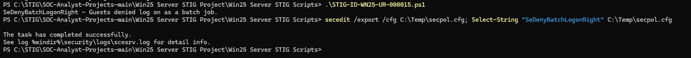

---
### WN25-UR-000020 — Deny Logon as a Service

**Rule:** Guest account must be denied the right to log on as a service.
**Method:** secedit — `SeDenyServiceLogonRight` includes `*S-1-5-32-546` (Guests)
**Before:** `SeDenyServiceLogonRight` not found in secedit export — not explicitly set
**After:** Script confirmed — Guests denied log on as a service
**Result:** ✅ Pass

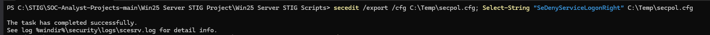

**Script:** [STIG-ID-WN25-UR-000020.ps1](./Win25%20Server%20STIG%20Scripts/STIG-ID-WN25-UR-000020.ps1)

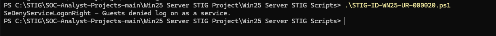

---
### WN25-UR-000025 — Manage Auditing and Security Log

**Rule:** The "Manage auditing and security log" right must only be assigned to Administrators.
**Method:** secedit — `SeSecurityPrivilege = *S-1-5-32-544`
**Before:** `SeSecurityPrivilege = *S-1-5-32-544` (already Administrators only)
**After:** `SeSecurityPrivilege` restricted to Administrators only — confirmed
**Result:** ✅ Pass

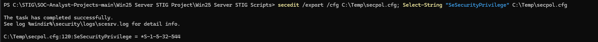

**Script:** [STIG-ID-WN25-UR-000025.ps1](./Win25%20Server%20STIG%20Scripts/STIG-ID-WN25-UR-000025.ps1)

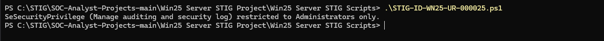

---
### WN25-UR-000030 — Create a Token Object

**Rule:** The "Create a token object" right must not be assigned to any accounts.
**Method:** secedit — `SeCreateTokenPrivilege = (blank)`
**Before:** `SeCreateTokenPrivilege` not found in secedit export — not explicitly set
**After:** `SeCreateTokenPrivilege` cleared — no accounts assigned
**Result:** ✅ Pass

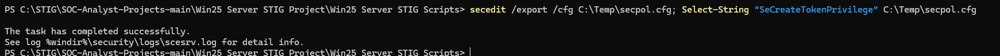

**Script:** [STIG-ID-WN25-UR-000030.ps1](./Win25%20Server%20STIG%20Scripts/STIG-ID-WN25-UR-000030.ps1)

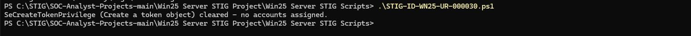

---
### WN25-UR-000035 — Take Ownership of Files or Objects

**Rule:** The "Take ownership of files or other objects" right must only be assigned to Administrators.
**Method:** secedit — `SeTakeOwnershipPrivilege = *S-1-5-32-544`
**Before:** `SeTakeOwnershipPrivilege = *S-1-5-32-544` (already Administrators only)
**After:** `SeTakeOwnershipPrivilege` restricted to Administrators only — confirmed
**Result:** ✅ Pass

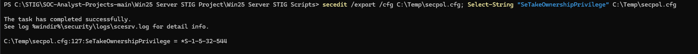

**Script:** [STIG-ID-WN25-UR-000035.ps1](./Win25%20Server%20STIG%20Scripts/STIG-ID-WN25-UR-000035.ps1)

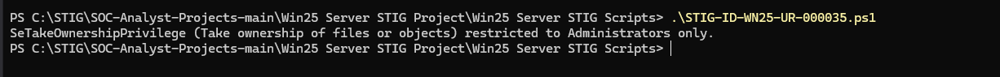

---
## Remote Access & Network

### WN25-CC-000035 — Remote Desktop NLA Required

**Rule:** Remote Desktop must require Network Level Authentication (NLA).
**Registry:** `HKLM:\SOFTWARE\Policies\Microsoft\Windows NT\Terminal Services`
**Value:** `UserAuthentication = 1`
**Before:** `UserAuthentication` not configured — NLA not enforced
**After:** `UserAuthentication = 1` — NLA enforced
**Result:** ✅ Pass

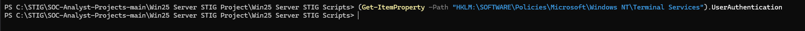

**Script:** [STIG-ID-WN25-CC-000035.ps1](./Win25%20Server%20STIG%20Scripts/STIG-ID-WN25-CC-000035.ps1)

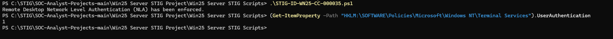

---
### WN25-CC-000040 — Disable SMBv1

**Rule:** SMBv1 protocol must be disabled.
**Method:** `Set-SmbServerConfiguration -EnableSMB1Protocol $false`
**CVEs:** CVE-2017-0144 (EternalBlue / WannaCry)
**Before:** `EnableSMB1Protocol = False` (already disabled on Server 2025)
**After:** `EnableSMB1Protocol = False` — confirmed disabled
**Result:** ✅ Pass

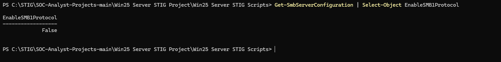

**Script:** [STIG-ID-WN25-CC-000040.ps1](./Win25%20Server%20STIG%20Scripts/STIG-ID-WN25-CC-000040.ps1)

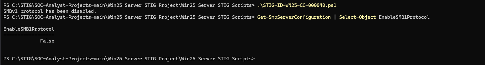

---
## Windows Firewall

### WN25-FW-000001 — Domain Profile Firewall Enabled

**Rule:** Windows Firewall must be enabled for the Domain profile.
**Method:** `Set-NetFirewallProfile -Profile Domain -Enabled True`
**Before:** No before state captured
**After:** `Domain Enabled = True`
**Result:** ✅ Pass

**Script:** [STIG-ID-WN25-FW-000001.ps1](./Win25%20Server%20STIG%20Scripts/STIG-ID-WN25-FW-000001.ps1)

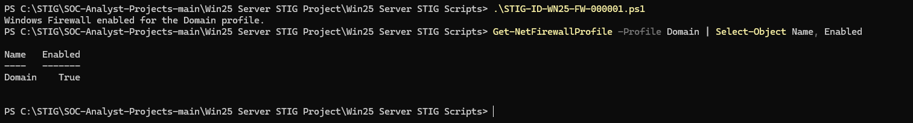

---
### WN25-FW-000002 — Private Profile Firewall Enabled

**Rule:** Windows Firewall must be enabled for the Private profile.
**Method:** `Set-NetFirewallProfile -Profile Private -Enabled True`
**Before:** `Private Enabled = True` (already enabled)
**After:** `Private Enabled = True` — confirmed
**Result:** ✅ Pass

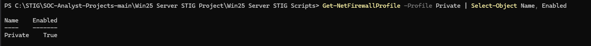

**Script:** [STIG-ID-WN25-FW-000002.ps1](./Win25%20Server%20STIG%20Scripts/STIG-ID-WN25-FW-000002.ps1)

---
### WN25-FW-000003 — Public Profile Firewall Enabled

**Rule:** Windows Firewall must be enabled for the Public profile.
**Method:** `Set-NetFirewallProfile -Profile Public -Enabled True`
**Before:** `Public Enabled = True` (already enabled)
**After:** `Public Enabled = True` — confirmed
**Result:** ✅ Pass

**Script:** [STIG-ID-WN25-FW-000003.ps1](./Win25%20Server%20STIG%20Scripts/STIG-ID-WN25-FW-000003.ps1)

---
### WN25-FW-000010 — Domain Profile Inbound Default Block

**Rule:** Inbound connections not matching a rule must be blocked on the Domain profile.
**Method:** `Set-NetFirewallProfile -Profile Domain -DefaultInboundAction Block`
**Before:** `DefaultInboundAction = NotConfigured`
**After:** `DefaultInboundAction = Block`
**Result:** ✅ Pass

**Script:** [STIG-ID-WN25-FW-000010.ps1](./Win25%20Server%20STIG%20Scripts/STIG-ID-WN25-FW-000010.ps1)

---
### WN25-FW-000015 — Public Profile Inbound Default Block

**Rule:** Inbound connections not matching a rule must be blocked on the Public profile.
**Method:** `Set-NetFirewallProfile -Profile Public -DefaultInboundAction Block`
**Before:** `DefaultInboundAction = NotConfigured`
**After:** `DefaultInboundAction = Block`
**Result:** ✅ Pass

**Script:** [STIG-ID-WN25-FW-000015.ps1](./Win25%20Server%20STIG%20Scripts/STIG-ID-WN25-FW-000015.ps1)

---
## Network Hardening

### WN25-NE-000001 — IPv6 Source Routing

**Rule:** IPv6 source routing must be configured to the highest protection level.
**Registry:** `HKLM:\SYSTEM\CurrentControlSet\Services\Tcpip6\Parameters`
**Value:** `DisableIPSourceRouting = 2`
**Before:** `DisableIPSourceRouting` not set — registry key not present
**After:** `DisableIPSourceRouting = 2` — highest protection level
**Result:** ✅ Pass

**Script:** [STIG-ID-WN25-NE-000001.ps1](./Win25%20Server%20STIG%20Scripts/STIG-ID-WN25-NE-000001.ps1)

---
### WN25-NE-000005 — ICMP Redirects Disabled

**Rule:** The system must not allow ICMP redirects to override routing table entries.
**Registry:** `HKLM:\SYSTEM\CurrentControlSet\Services\Tcpip\Parameters`
**Value:** `EnableICMPRedirect = 0`
**Before:** `EnableICMPRedirect` not set — registry key not present
**After:** `EnableICMPRedirect = 0` — ICMP redirects disabled
**Result:** ✅ Pass

**Script:** [STIG-ID-WN25-NE-000005.ps1](./Win25%20Server%20STIG%20Scripts/STIG-ID-WN25-NE-000005.ps1)

---
### WN25-NE-000010 — NetBIOS over TCP/IP Disabled

**Rule:** NetBIOS over TCP/IP must be disabled on all network adapters where not required.
**Method:** WMI — `SetTcpipNetbios(2)` on all IP-enabled adapters
**Before:** `TcpipNetbiosOptions = 0` (using DHCP setting — not explicitly disabled)
**After:** `TcpipNetbiosOptions = 2` — NetBIOS disabled on all adapters
**Result:** ✅ Pass

**Script:** [STIG-ID-WN25-NE-000010.ps1](./Win25%20Server%20STIG%20Scripts/STIG-ID-WN25-NE-000010.ps1)

---
## Testing Environment

| Detail | Value |
|--------|-------|
| Platform | Microsoft Azure |
| VM Image | Windows Server 2025 |
| Hostname | WS25-DC01.lababel.local |
| Domain | lababel.local |
| Role | Active Directory Domain Controller |
| Test Date | 2026-06-12 |
| Tested By | Santiago Abel Ruiz Diaz |
