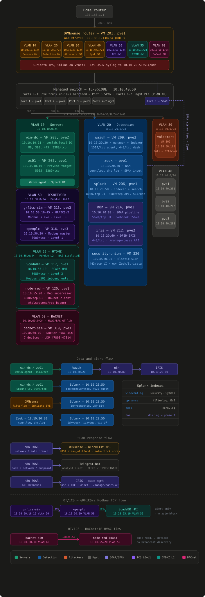

# Splunk SOC Lab — Detection Engineering

**Analyst:** Santiago Abel Ruiz Diaz  
**Platform:** Wazuh 4.12.0 EDR · Splunk Enterprise 10.4.0 · Security Onion (Elastic + Zeek + Suricata) · OPNsense Suricata (ET Open) · Zeek NSM  
**Infrastructure:** Proxmox three-node cluster · 7-VLAN segmented network (IT + OT/ICS + BACnet) · hardware SPAN for full traffic capture

A self-hosted home lab built to practice detection engineering end-to-end: design the infrastructure, simulate real attacks, and validate that every detection layer catches them — or document why it doesn't.



---

## Lab Infrastructure

Full topology is the diagram above — 7 VLANs across a 3-node Proxmox cluster (pve1/pve2/pve3), OPNsense as the inter-VLAN router with inline Suricata, and hardware SPAN feeding Zeek.

Detection layers per technique:
```
Wazuh EDR         ──►  host-based alerts (agents on win-dc, ws01, ubuntu-vm)
Splunk            ──►  SPL against wineventlog + linux_secure + opnsense + zeek
Security Onion    ──►  second Elastic-based SIEM/NSM (own Zeek + Suricata)
Suricata (OPNsense) ─►  inline network IDS at the inter-VLAN boundary
Zeek NSM          ──►  full traffic metadata via hardware SPAN
```

---

## Projects

| Project | Techniques | Status |
|---|---|---|
| [`ad-privesc-lab/`](ad-privesc-lab/) | Two-hop ACL escalation — BloodHound → Kerberoasting → DCSync → Golden Ticket + persistence | ✅ Complete |
| [`credential-attack-detection/`](credential-attack-detection/) | SMB brute force + spray (Windows) · SSH brute force + spray (Linux) · 4-layer detection | ✅ Complete |
| [`ot-ics-lab/`](ot-ics-lab/) | Purdue-model ICS lab — GRFICSv2 process simulation, OpenPLC, ScadaBR HMI; attack + detection validation next | 🔄 Build complete |
| [`security-onion/`](security-onion/) | Second SIEM/NSM platform (Elastic + Zeek + Suricata, no license gating) alongside Splunk; found and fixed a 25-day-dead Zeek sensor and a hidden 3.5TB storage pool along the way | ✅ Complete |

---

## AD PrivEsc Lab

A two-hop ACL privilege escalation chain against a live Active Directory domain. Starting with no credentials, the attacker discovers a misconfigured GenericWrite ACL through BloodHound, weaponizes it via targeted Kerberoasting, and escalates to full domain compromise via DCSync. Ends with a multi-technique persistence phase.

**Attack path:**
```
agarcia  ──GenericWrite──►  mbrown  ──DS-Replication──►  Domain
(spray hit, standard user)  (SPN set, service acct)      (full NTDS dump)
```

**Detection coverage across 12 techniques:**

| Phase | Technique | MITRE | Wazuh | Splunk | Suricata | Zeek |
|---|---|---|---|---|---|---|
| 1.1 | [Port scan](ad-privesc-lab/README.md#11-port-scan--t1046) | T1046 | ❌ | ✅ filterlog 3,041 ports/min | ✅ SID 2024364 Nmap UA | ✅ 121k conn records |
| 1.2 | [User enumeration](ad-privesc-lab/README.md#12-user-enumeration--t1087002) | T1087.002 | ✅ Rule 92652 | ✅ 4624 ANON LOGON | ❌ | ✅ SMB+LDAP burst |
| 2.1 | [Password spray](ad-privesc-lab/README.md#21-password-spray--agarcia--t1110003) | T1110.003 | ✅ Rules 60122+92652 | ✅ 4625 from VLAN 30 | ❌ | ❌ same-node blind |
| 3.1 | [RDP lateral movement](ad-privesc-lab/README.md#31-rdp-to-ws01-as-agarcia--t1021001) | T1021.001 | ✅ Rule 92653 | ✅ 4624 Logon_Type=10 | ❌ | ❌ same-node blind |
| 4.1 | [BloodHound ACL discovery](ad-privesc-lab/README.md#41-bloodhound--acl-path-discovery--t1087002) | T1087.002 | ✅ Rules 92203+92105 | ✅ EventCode 11 file drop | ❌ intra-VLAN | ✅ port 3268 GC burst |
| 5.1 | [Kerberoasting (Rubeus)](ad-privesc-lab/README.md#51-kerberoasting-mbrown--t1558003) | T1558.003 | ❌ file drop only | ✅ 4769 etype=0x17 | ❌ | ✅ port 88 krbtgt |
| 5.2 | [Hash crack](ad-privesc-lab/README.md#52-offline-hash-crack--t1110002) | T1110.002 | — | — | — | — |
| 6.1 | [DCSync (Mimikatz)](ad-privesc-lab/README.md#61-dcsync--t1003006) | T1003.006 | ✅ Rule 92213 lv15 | ✅ 4662 replication GUIDs | ❌ intra-VLAN | ✅ port 49679 dynamic RPC |
| 7.1 | [Scheduled task](ad-privesc-lab/README.md#71-scheduled-task--t1053005) | T1053.005 | ✅ Rule 60228 | ✅ 4698 full task XML | ❌ | ❌ |
| 7.2 | [Registry run key](ad-privesc-lab/README.md#72-registry-run-key--t1547001) | T1547.001 | ✅ Rules 92302+92041 | ✅ Sysmon EventCode 13 | ❌ | ❌ |
| 7.3 | [Obfuscated PowerShell](ad-privesc-lab/README.md#73-obfuscated-powershell--t1059001--t1027) | T1059.001+T1027 | ✅ Rule 92027 | ✅ 4104 decoded payload | ❌ | ❌ same-node blind |
| 7.4 | [Golden Ticket](ad-privesc-lab/README.md#74-golden-ticket--t1558001) | T1558.001 | ✅ Rule 92650 lv12 | ✅ 4624+4672 no 4768 | ❌ | ✅ cifs/win-dc.soclab.local |

→ [`ad-privesc-lab/`](ad-privesc-lab/)

---

## Credential Attack Detection Lab

Brute force and password spray attacks against Windows (SMB) and Linux (SSH) targets, designed to surface the detection difference between the two attack patterns and validate which layers catch them.

**Key findings:**

- Password spray evades Wazuh's brute force correlation rule (60204) — each account gets one failure, threshold never trips. Requires `dc(Account_Name) >= 3` SPL query or manual correlation of Rule 92652 successes from the same source.
- Zeek's NTLM analyzer extracts usernames from SMB authentication on the wire — the full spray target list is visible at the network layer without any host agent.
- SSH auth.log distinguishes attacker knowledge: `Failed password for root` (valid account, wrong password) vs. `Failed password for invalid user sysadmin` (username doesn't exist).
- Suricata has no ET Open signatures for SMB or SSH authentication failures — blind to both attack types across all four phases.

**Detection coverage across 4 phases:**

| Phase | Technique | Wazuh | Splunk | Suricata | Zeek |
|---|---|---|---|---|---|
| 1 | [Windows SMB brute force](credential-attack-detection/README.md#phase-1--windows-smb-brute-force--t1110001) | ✅ Rule 60204 lv10 | ✅ 4625 burst | ❌ | ✅ gssapi,smb,ntlm burst |
| 2 | [Windows SMB spray](credential-attack-detection/README.md#phase-2--windows-smb-password-spray--t1110003) | ✅ Rule 92652 × 3 | ✅ dc(Account_Name) ≥ 3 | ❌ | ✅ NTLM usernames from wire |
| 3 | [Linux SSH brute force](credential-attack-detection/README.md#phase-3--linux-ssh-brute-force--t1110001) | ✅ Rule 5557 lv5 | ✅ auth.log Failed password | ❌ | ✅ port 22 burst |
| 4 | [Linux SSH spray](credential-attack-detection/README.md#phase-4--linux-ssh-password-spray--t1110003) | ✅ Rule 5712 lv10 | ✅ auth.log Invalid user | ❌ | ✅ port 22 burst |

→ [`credential-attack-detection/`](credential-attack-detection/)

---

## OT/ICS Detection Lab

A Purdue-model ICS segment — GRFICSv2 Tennessee Eastman process simulation, OpenPLC, and a ScadaBR HMI on isolated VLANs, wired the way a real Level 0–2 OT environment is rather than a single flat network.

**Infrastructure built and verified end-to-end:** field-device values generated by the process simulation flow through the soft PLC and surface correctly on the supervisory HMI. Attack scripts (Modbus WRITE, plant shutdown) and a first set of Wazuh detection rules are written and staged — attack simulation and detection validation are the next phase, documented separately once run.

→ [`ot-ics-lab/`](ot-ics-lab/)
