# Credential Attack Detection Lab

## Detection Engineering Project

**Analyst:** Santiago Abel Ruiz Diaz  
**Platform:** Wazuh 4.12.0 EDR · Splunk Enterprise 10.4.0 · OPNsense Suricata (ET Open) · Zeek NSM  
**Status:** Complete — four attack phases simulated and validated across four detection layers  
**MITRE Coverage:** T1110.001 (Brute Force) · T1110.003 (Password Spray)

Brute force and password spray attacks against Windows (SMB) and Linux (SSH) targets, designed to surface the detection difference between the two attack patterns and validate which layers catch them — and document exactly where each layer goes blind.

---

## Lab Infrastructure

```
  ╔══════════════════════════════════════════════════════════════════════╗
  ║  SOCLAB  —  Proxmox pve1 (i5-4570, 31 GB)  +  pve2 (32 GB)        ║
  ║  TL-SG108E managed switch  —  hardware SPAN port 8 → Zeek          ║
  ╚══════════════════════════════════════════════════════════════════════╝

  ╔═══════════════════════════════════════════════╗
  ║  VLAN 30 — ATTACKERS   10.10.30.0/24         ║
  ║  voldemort (Kali)       10.10.30.100  pve1   ║
  ╚═══════════════════════╦═══════════════════════╝
                          ║
                          ▼
  ┌─────────────────────────────────────────────┐
  │  OPNsense  —  inter-VLAN router             │
  │  Suricata IDS (ET Open ruleset)             │
  └──────────╦──────────────────────╦───────────┘
             ║                      ║
             ▼                      ▼
  ╔══════════════════════╗   ╔══════════════════════════════╗
  ║  VLAN 10 — SERVERS   ║   ║  VLAN 20 — DETECTION        ║
  ║  10.10.10.0/24       ║   ║  10.10.20.0/24               ║
  ║                      ║   ║                              ║
  ║  win-dc  10.10.10.11 ║   ║  splunk  10.10.20.50  pve1  ║
  ║  pve2    soclab.local║   ║  zeek    10.10.20.30  pve1  ║
  ║                      ║   ║  wazuh   10.10.20.20  pve2  ║
  ║  ubuntu-vm           ║   ╚══════════════════════════════╝
  ║  10.10.10.100  pve2  ║
  ║  SSH target          ║
  ╚══════════════════════╝

  Four detection layers per technique:
  Wazuh EDR  ──►  host-based alerts (Wazuh agents on win-dc, ubuntu-vm)
  Splunk     ──►  SPL against wineventlog + linux_secure indexes
  Suricata   ──►  network IDS at the inter-VLAN boundary (index=opnsense)
  Zeek NSM   ──►  full traffic metadata via hardware SPAN (index=zeek)
```

---

## Targets

| Host | IP | OS | Wazuh Agent | Splunk UF | Zeek Visibility |
|---|---|---|---|---|---|
| win-dc | 10.10.10.11 | Windows Server 2025 | ✅ v4.12.0 | ✅ wineventlog | ✅ cross-node (pve2) |
| ubuntu-vm | 10.10.10.100 | Ubuntu 26.04 LTS | ✅ v4.14.5 | ✅ auth.log → linux_secure | ✅ cross-node (pve2) |

Both targets are on pve2; Kali is on pve1. All attack traffic is cross-node — captured by Zeek's hardware SPAN — and inter-VLAN — seen by Suricata at the OPNsense boundary.

---

## Attack Chain Overview

| Phase | Target | Tool | Technique | MITRE | Wazuh | Splunk | Suricata | Zeek |
|---|---|---|---|---|---|---|---|---|
| 1 | win-dc SMB | NetExec | Brute force — administrator + 11 passwords | T1110.001 | ✅ Rule 60204 lv10 | ✅ 4625 burst | ❌ | ✅ gssapi,smb,ntlm burst |
| 2 | win-dc SMB | NetExec | Password spray — 5 users + 3 passwords | T1110.003 | ✅ Rule 92652 × 3 | ✅ dc(Account_Name) ≥ 3 | ❌ | ✅ NTLM usernames from wire |
| 3 | ubuntu-vm SSH | Hydra | Brute force — root + 11 passwords | T1110.001 | ✅ Rule 5557 lv5 | ✅ auth.log Failed password | ❌ | ✅ port 22 burst |
| 4 | ubuntu-vm SSH | Hydra | Password spray — 6 users + Summer2024! | T1110.003 | ✅ Rule 5712 lv10 | ✅ auth.log Invalid user | ❌ | ✅ port 22 burst |

---

## Wordlists

```
win-users.txt    — agarcia, mbrown, lwilson, dbaker, administrator
linux-users.txt  — admin, root, ubuntu, sysadmin, user, splunk
passwords.txt    — 11 entries (wrong passwords first, correct ones last)
```

---

## Phase 1 — Windows SMB Brute Force — T1110.001

```bash
nxc smb 10.10.10.11 -u administrator -p ~/lab/creds-attack/passwords.txt
```

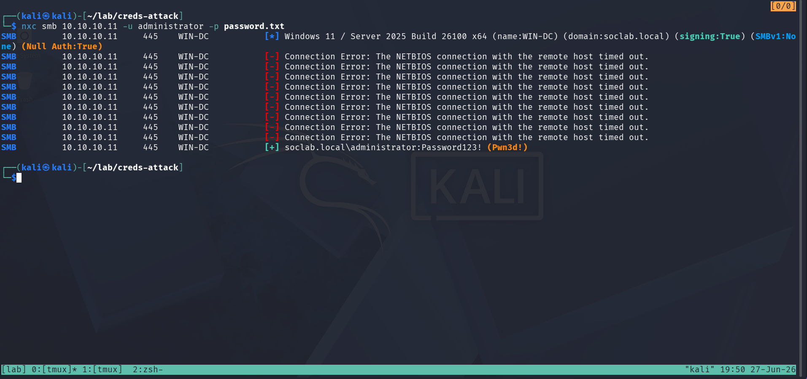

9 wrong passwords returned NETBIOS connection timeouts — WS2025 NTLM auth delay behavior, not true network timeouts. The 10th attempt (`Password123!`) succeeded with `Pwn3d!` — full SMB admin access confirmed.

**Red team note:** Administrator accounts are typically exempt from lockout policy. The NETBIOS timeout pattern is WS2025's rate-limiting behavior on failed NTLM — each failed attempt delays the next connection rather than returning an immediate rejection.

---

#### Detection

**Wazuh (EDR):**

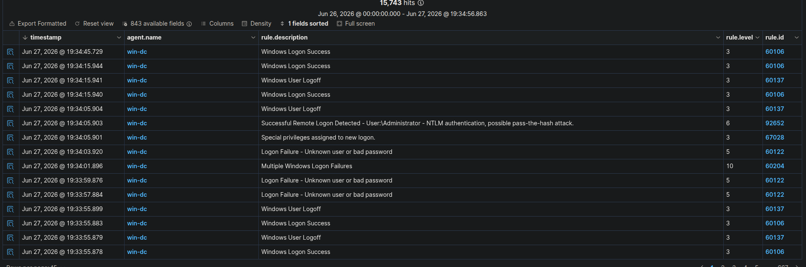

Detected. Four rules fire in sequence:
- **Rule 60122 (level 5)** — "Logon Failure - Unknown user or bad password" — per-attempt failures at 19:33:57, 19:33:59, 19:34:03
- **Rule 60204 (level 10)** — "Multiple Windows Logon Failures" — brute force correlation fired at 19:34:01
- **Rule 92652 (level 6)** — "Successful Remote Logon via NTLM, possible pass-the-hash" — successful auth at 19:34:05
- **Rule 67028 (level 3)** — "Special privileges assigned to new logon" (EventCode 4672) — confirms admin rights

**Splunk / Windows Security log:**

```spl
index=wineventlog ComputerName="win-dc.soclab.local" EventCode=4625
| stats count by Account_Name, Source_Network_Address, Failure_Reason
| sort -count
```

Result: `administrator` · `10.10.30.100` · "Unknown user name or bad password" · **10 events** — attacker IP, targeted account, and failure reason all in one query. Field is `Source_Network_Address`, not `IpAddress`.

**Suricata (IDS):** No alert. No ET Open rule for SMB authentication failure patterns.

```spl
index=opnsense sourcetype=syslog
| rex field=_raw "suricata\[\d+\]: (?<evt>.+)"
| search evt="*alert*" evt="*10.10.30.100*"
| table _time, evt
| sort -_time | head 10
```

**Zeek (NSM):**

```spl
index=zeek sourcetype=zeek_json
| spath input=_raw
| search "id.orig_h"="10.10.30.100" "id.resp_h"="10.10.10.11"
| table _time, "id.orig_h", "id.resp_h", "id.resp_p", service
| sort -_time | head 20
```

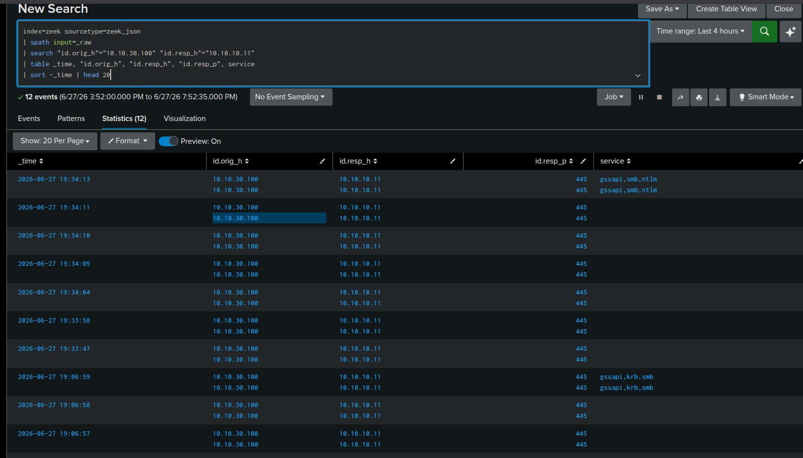

Detected. Burst of port 445 connections from 10.10.30.100 → 10.10.10.11 at 19:33:47–19:34:13. Service label `gssapi,smb,ntlm` — NTLM-authenticated SMB. Rapid repeated NTLM connections from the attacker VLAN fingerprint the brute force pattern. win-dc is pve2 (Kali is pve1) — cross-node, fully captured by SPAN.

**Blue team assessment:** High-confidence detection across three layers. Wazuh fires the level 10 brute force correlation rule within seconds, then escalates on the successful NTLM logon. Splunk shows attacker IP and targeted account via EventCode 4625. Zeek independently confirms the SMB/NTLM burst. Suricata is the only blind layer — no ET Open signatures for SMB auth failures.

---

## Phase 2 — Windows SMB Password Spray — T1110.003

```bash
nxc smb 10.10.10.11 -u win-users.txt -p 'Summer2025!' --continue-on-success
nxc smb 10.10.10.11 -u win-users.txt -p 'Summer2024!' --continue-on-success
nxc smb 10.10.10.11 -u win-users.txt -p 'Spring2025!' --continue-on-success
```

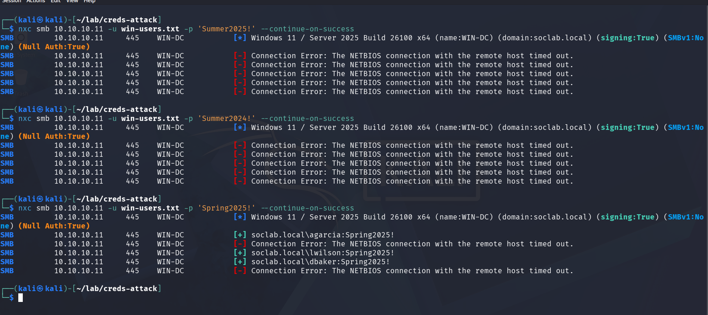

Three spray rounds: `Summer2025!` all failed, `Summer2024!` all failed, `Spring2025!` hit agarcia, lwilson, and dbaker. Each account received exactly 1 attempt per password — no lockout triggered.

**Red team note:** The key distinction from brute force: same low failure count per account, spread across many targets. mbrown and administrator don't use `Spring2025!` so they returned failures in the final round.

---

#### Detection

**Wazuh (EDR):**

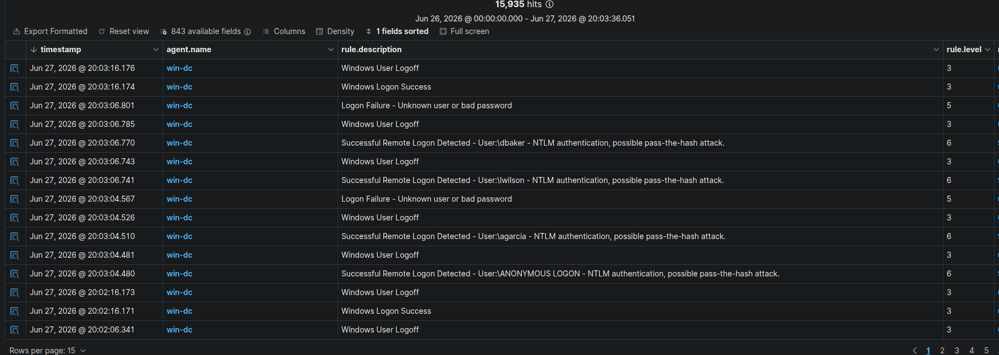

Partial detection. **Rule 60204 (brute force correlation) did not fire** — each account received only 1 failure, below the per-account threshold. Instead:
- **Rule 92652 (level 6) × 3** — "Successful Remote Logon via NTLM" — agarcia, lwilson, dbaker at 20:03:04–20:03:06
- **Rule 60122 (level 5) × 2** — failures for mbrown and administrator

The spray evaded the brute force rule. Detecting it requires correlating multiple Rule 92652 successes from the same source across different accounts — a pattern that needs a custom correlation rule or manual hunting.

**Splunk / Windows Security log:**

Full view — successes and failures from the same source:

```spl
index=wineventlog ComputerName="win-dc.soclab.local" (EventCode=4624 OR EventCode=4625)
  Source_Network_Address="10.10.30.100"
| table _time, EventCode, Account_Name, Source_Network_Address, Logon_Type
| sort -_time | head 20
```

Mix of 4624 (success) and 4625 (failure) from the same source IP across multiple accounts within 3 seconds — the spray signature.

Spray detection — flags ≥3 unique accounts hit from same source in 1 minute:

```spl
index=wineventlog ComputerName="win-dc.soclab.local" EventCode=4625
| bucket _time span=1m
| stats dc(Account_Name) as unique_accounts, count by _time, Source_Network_Address
| where unique_accounts >= 3
| sort -_time
```

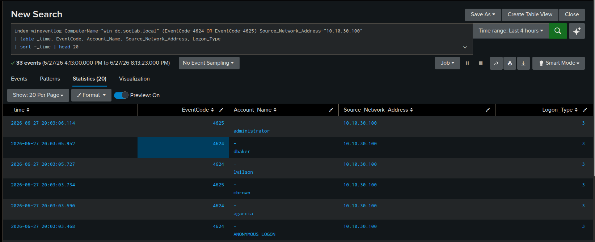

Detected. `10.10.30.100` — 6 unique accounts in the 20:00 bucket (Summer sprays), 3 unique accounts in the 20:03 bucket (Spring spray failures).

**Suricata (IDS):** No alert. Same blind spot as Phase 1.

**Zeek (NSM):**

```spl
index=zeek sourcetype=zeek_json
| spath input=_raw
| search "id.orig_h"="10.10.30.100" "id.resp_h"="10.10.10.11"
| table _time, "id.orig_h", "id.resp_h", "id.resp_p", service, username
| sort -_time | head 20
```

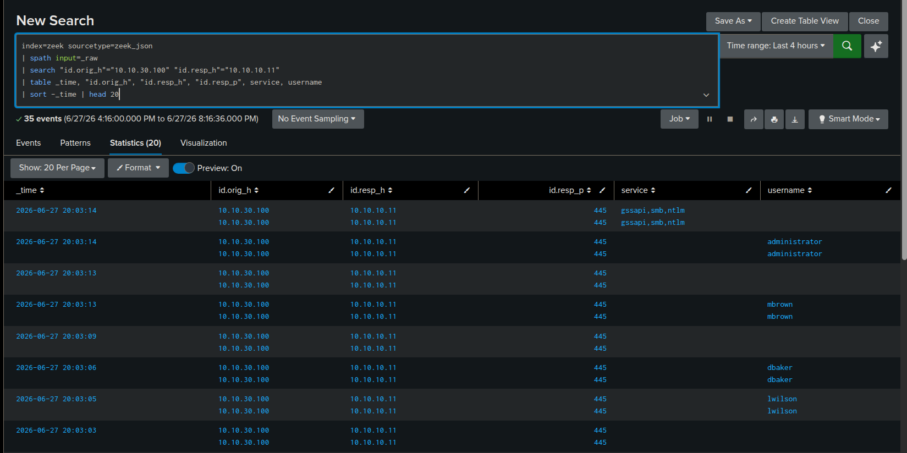

Detected. Port 445 burst at 20:03:03–20:03:14. Zeek's NTLM analyzer extracted usernames from NTLM Type 3 authentication messages on the wire — the full spray target list visible without any agent: `lwilson`, `dbaker`, `mbrown`, `administrator`.

**Blue team assessment:** The spray partially evades Wazuh — Rule 60204 doesn't fire because each account gets only 1 failure. Detection requires the `dc(Account_Name) >= 3` Splunk query or manual correlation of Rule 92652 successes from the same source. Zeek adds unique value: NTLM username extraction from the wire provides the complete target list independently of Windows event logs and without any host agent.

---

## Phase 3 — Linux SSH Brute Force — T1110.001

```bash
hydra -l root -P ~/lab/creds-attack/passwords.txt ssh://10.10.10.100 -t 4
```

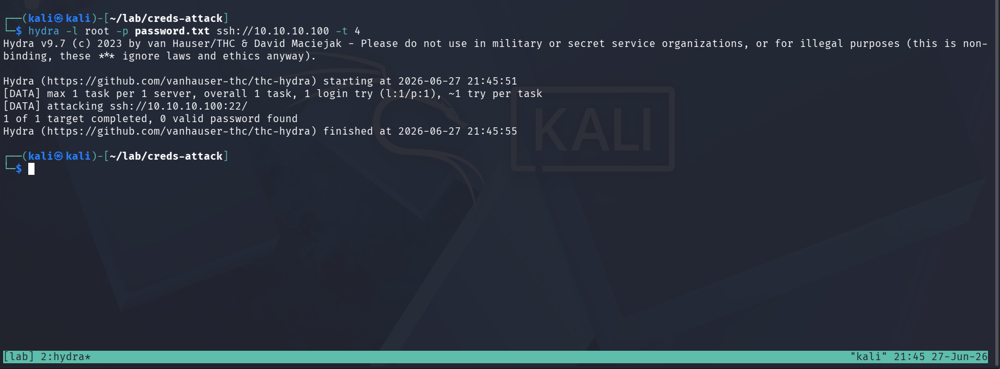

Hydra targeted `root` on ubuntu-vm (10.10.10.100) with 11 passwords — all failed. Root has a different password on this VM.

**Red team note:** SSH does not lock accounts by default. `unix_chkpwd` ran on every attempt because `root` is a valid account — this is the detection artifact that distinguishes brute force (known user, PAM runs) from spray (unknown users, PAM skipped).

---

#### Detection

**Wazuh (EDR):**

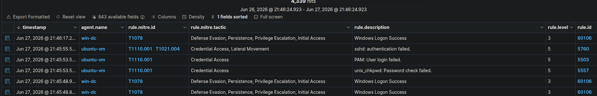

Detected. Three rules fire:
- **Rule 5760 (level 5)** — "sshd: authentication failed"
- **Rule 5503 (level 5)** — "PAM: User login failed"
- **Rule 5557 (level 5)** — "unix_chkpwd: Password check failed" — fires only when the user **exists** but the password is wrong; confirms `root` is a valid account on the target

**Splunk / auth.log:**

```spl
index=linux_secure host="mgmt"
| search _raw="*10.10.30.100*" OR _raw="*Failed*" OR _raw="*Invalid*"
| table _time, _raw
| sort -_time | head 20
```

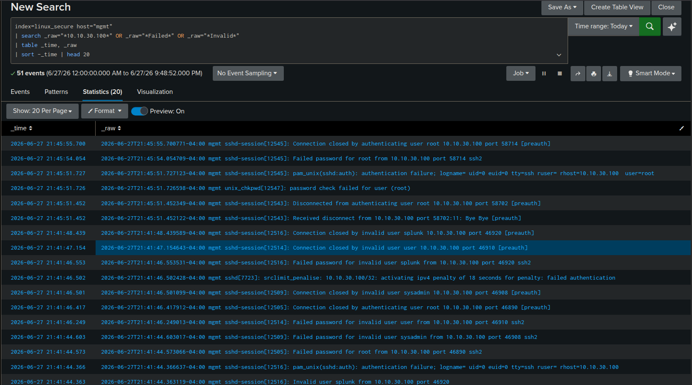

Detected. `Failed password for root from 10.10.30.100` — attacker IP and targeted account visible. `unix_chkpwd: password check failed for user (root)` confirms that `root` exists on the system. No "invalid user" messages — distinguishes brute force against a known account from spray guessing usernames.

**Suricata (IDS):** No alert. No ET Open rule for SSH authentication failure patterns. Traffic routes through OPNsense (VLAN 30 → VLAN 10) but Suricata has no SSH brute force signatures.

**Zeek (NSM):**

```spl
index=zeek sourcetype=zeek_json
| spath input=_raw
| search "id.orig_h"="10.10.30.100" "id.resp_h"="10.10.10.100"
| table _time, "id.orig_h", "id.resp_h", "id.resp_p", service, username
| sort -_time | head 20
```

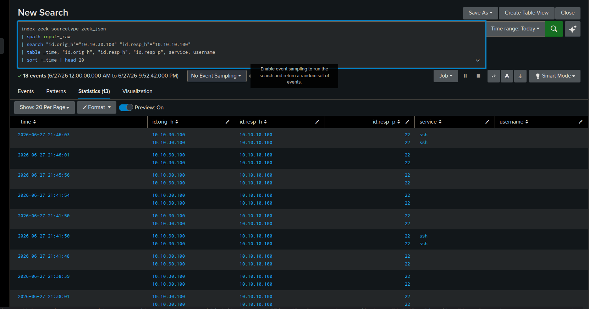

Detected. Port 22 burst at 21:45:56–21:46:03, service=`ssh`. `username` field is empty — SSH encrypts credentials after the handshake, unlike NTLM which sends the username in plaintext in Type 3 messages. Detection relies on the connection burst pattern from the attacker VLAN. ubuntu-vm is pve2, Kali is pve1 — cross-node, hardware SPAN captures it.

**Blue team assessment:** Strong host-based detection. Rule 5557 (`unix_chkpwd`) is the key distinguishing signal — confirms the targeted account exists. Splunk auth.log shows attacker IP, username, and per-attempt failures with full syslog context. Zeek sees the SSH burst but cannot extract usernames — SSH encrypts credentials unlike NTLM. Suricata blind.

---

## Phase 4 — Linux SSH Password Spray — T1110.003

```bash
hydra -L ~/lab/creds-attack/linux-users.txt -p 'Summer2024!' ssh://10.10.10.100 -t 4
```

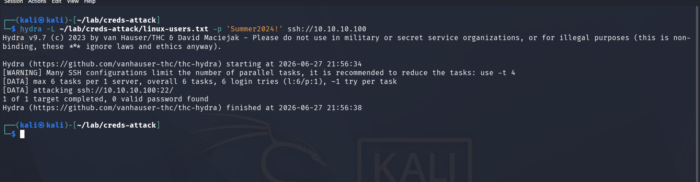

Hydra sprayed 6 usernames (admin, root, ubuntu, sysadmin, user, splunk) with `Summer2024!`. All failed. SSH's built-in rate limiting (`srclimit_penalise`) added an 18-second delay after the burst.

**Red team note:** Most of these users don't exist on ubuntu-vm — the "invalid user" messages reveal the attacker is guessing usernames rather than targeting known accounts. Only `root` exists, and `Summer2024!` is not its password.

---

#### Detection

**Wazuh (EDR):**

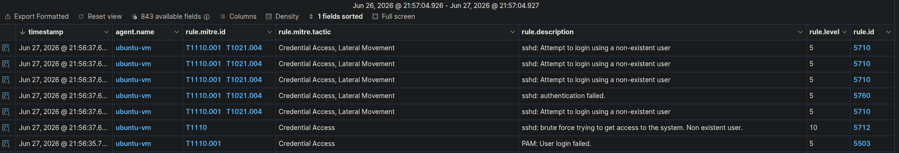

Detected. Four rules fire:
- **Rule 5710 (level 5)** — "sshd: Attempt to login using a non-existent user" — per attempt for each unknown username
- **Rule 5712 (level 10)** — "sshd: brute force trying to get access to the system. Non existent user." — correlation rule triggered; fires for spray because the usernames don't exist (same trigger path as Rule 60204 on Windows, but the non-existent user path bypasses the per-account threshold)
- **Rule 5760 (level 5)** — "sshd: authentication failed"
- **Rule 5503 (level 5)** — "PAM: User login failed"

**Splunk / auth.log:**

```spl
index=linux_secure host="mgmt"
| search _raw="*10.10.30.100*"
| table _time, _raw
| sort -_time | head 20
```

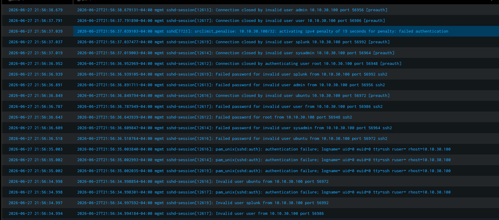

Detected. `Failed password for invalid user splunk from 10.10.30.100` — "invalid user" means the username doesn't exist on the target. Also: `srclimit_penalise: 10.10.30.100/32: activating ipv4 penalty of 18 seconds` — SSH built-in rate limiting fired.

**Suricata (IDS):** No alert. Same blind spot as Phase 3.

**Zeek (NSM):**

```spl
index=zeek sourcetype=zeek_json
| spath input=_raw
| search "id.orig_h"="10.10.30.100" "id.resp_h"="10.10.10.100"
| table _time, "id.orig_h", "id.resp_h", "id.resp_p", service, username
| sort -_time | head 20
```

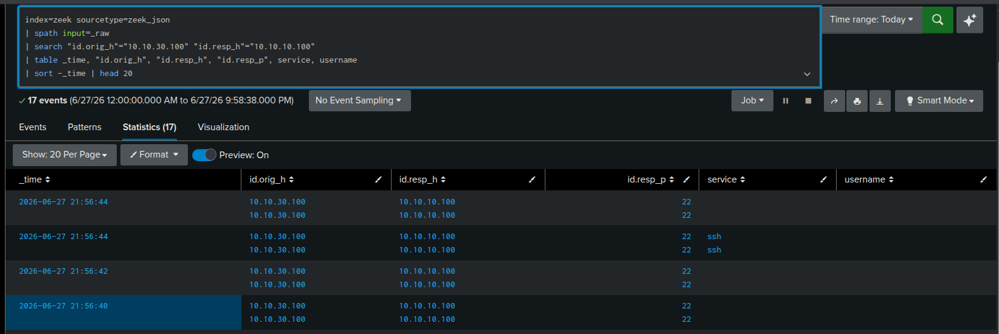

Detected. Port 22 burst at 21:41:48–21:41:54, service=`ssh`. Username field empty — same SSH encryption limitation as Phase 3. The burst pattern from VLAN 30 is the indicator.

**Blue team assessment:** Rule 5712 (level 10) fires for the spray via the "non-existent user" correlation path. The `invalid user` messages in auth.log distinguish an attacker guessing usernames from one targeting known accounts — useful threat intel. `srclimit_penalise` adds network-layer pressure against the attacker but generates no Suricata alert. Zeek sees the burst but no username data.

---

## Key Detection Findings

**Brute force vs. spray: different Wazuh rules fire for Windows, same rule fires for Linux**

Windows Rule 60204 fires when a single account accumulates multiple failures. SMB spray sends 1 failure per account — the rule never triggers. The spray is only caught by correlating `dc(Account_Name) >= 3` in Splunk or hunting for multiple Rule 92652 successes from the same source. Linux Rule 5712 fires for spray anyway — because the sprayed usernames don't exist, the "non-existent user" correlation path triggers regardless of per-account count. This asymmetry means the SSH spray is actually caught at a higher severity than the SMB spray.

**Zeek extracts NTLM usernames from the wire — SSH cannot**

For SMB attacks, Zeek's NTLM analyzer extracts usernames from NTLM Type 3 authentication messages. The full spray target list is visible at the network layer without any agent. SSH encrypts credentials after the handshake — Zeek sees the connection burst but the `username` field is always empty.

**auth.log reveals attacker's knowledge level**

`Failed password for root` (user exists, `unix_chkpwd` runs) vs. `Failed password for invalid user sysadmin` (username doesn't exist, no PAM check) distinguishes brute force against a known account from spray guessing usernames. This distinction survives even when the attacker uses the same tool and source IP for both attacks.

**Suricata is blind to authentication attacks**

ET Open has no rules for SMB or SSH authentication failure patterns. Authentication-layer attacks at this volume are invisible to signature-based network IDS without custom rules.

---

## Field Name Reference

| Field | Windows (wineventlog) | Linux (linux_secure) |
|---|---|---|
| Source IP | `Source_Network_Address` (not `IpAddress`) | parsed from `_raw` |
| Username | `Account_Name` | parsed from `_raw` |
| Failure reason | `Failure_Reason` | "invalid user" vs "Failed password" in raw line |

---

## SOC Overview Dashboard

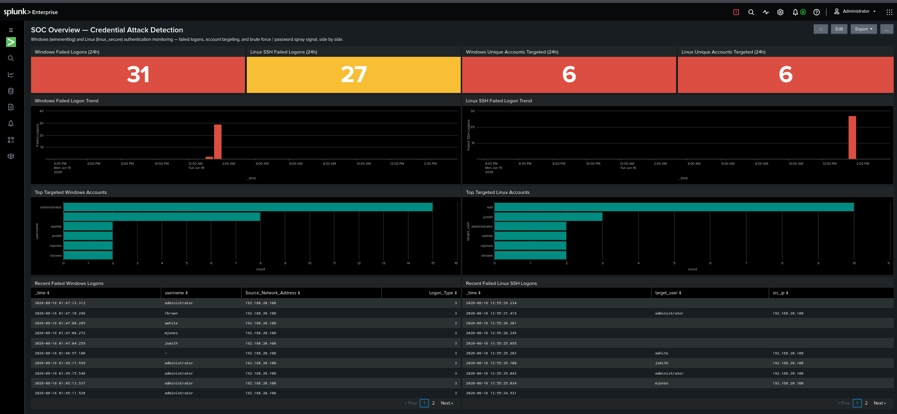

Single pane of glass over both attack surfaces (`dashboards/soc_overview.xml`): color-thresholded KPI tiles for failed logons and unique accounts targeted, failed-logon trend charts, top-targeted-account bar charts, and live triage tables.

---

## Related

- [`ad-privesc-lab/`](../ad-privesc-lab/) — same infrastructure, AD privilege escalation chain
- [`lab-infrastructure/`](../lab-infrastructure/) — Proxmox, OPNsense, Splunk, Wazuh build notes
