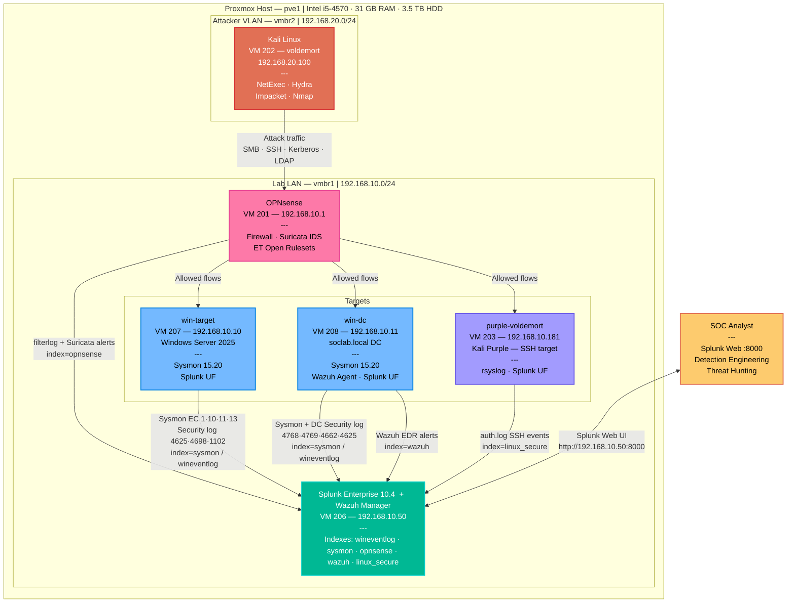

# Home Lab Infrastructure
## Proxmox — OPNsense Firewall + Splunk SIEM

**Analyst:** Santiago Abel Ruiz Diaz
**Proxmox Host:** pve1 — Intel i5-4570 @ 3.20GHz, 4 cores, 31.24 GiB RAM, 3.57 TiB HDD
**Status:** Complete

---

## Overview

This is the platform everything else in this portfolio runs on: a self-hosted Proxmox lab with an OPNsense firewall segmenting an attacker VLAN from a target LAN, and a Splunk Enterprise instance collecting logs from every target. Both [`credential-attack-detection/`](../credential-attack-detection/) and [`atomic-red-team/`](../atomic-red-team/) build directly on top of this.

---

## Network Diagram

```
                         ┌──────────────────────────────────────────────────┐
                         │                Proxmox Host (pve1)                │
                         │                                                    │
                         │   vmbr0 — 192.168.1.0/24   (WAN / Management)     │
                         │   vmbr1 — 192.168.10.0/24  (Lab LAN)              │
                         │   vmbr2 — 192.168.20.0/24  (Attacker VLAN)        │
                         └──────────────────────────────────────────────────┘
                                       │              │              │
                  ┌────────────────────┘              │              └────────────────────┐
                  │                                    │                                   │
         ┌────────▼─────────┐                ┌─────────▼─────────┐               ┌─────────▼─────────┐
         │  VM 201           │                │  VM 206           │               │  VM 202            │
         │  OPNsense         │                │  splunk            │               │  voldemort          │
         │  Firewall/IDS     │                │  Splunk Enterprise  │               │  Kali (attacker)    │
         │  vtnet0 → vmbr0   │                │  vmbr1              │               │  vmbr2               │
         │  vtnet1 → vmbr1   │                │  192.168.10.50       │               │  192.168.20.100       │
         │  vtnet2 → vmbr2   │                └──────────────────────┘               └──────────────────────┘
         └───────────────────┘
                  │
                  │  vmbr1 (Lab LAN)
         ┌────────┴──────────────────────────────┐
         │                                        │
┌────────▼──────────┐                  ┌──────────▼─────────┐
│  VM 207             │                  │  VM 203              │
│  win-target          │                  │  purple-voldemort      │
│  Windows Server 2025  │                  │  Kali Purple (SSH target)│
│  192.168.10.10          │                  │  192.168.10.181            │
└─────────────────────────┘                  └──────────────────────────┘
```

OPNsense sits at the boundary of all three networks. The attacker VLAN (`vmbr2`) only reaches the lab LAN (`vmbr1`) through firewall rules that are explicitly scoped and logged — every attack in this portfolio crosses that boundary and shows up in `index=opnsense` filterlog.

---

## Detection Data Flow



---

## VM Inventory

| VM ID | Name | Role | Bridge | Static IP |
|---|---|---|---|---|
| 201 | opnsense | Firewall / Suricata IDS | vmbr0 + vmbr1 + vmbr2 | 192.168.10.1 (LAN), 192.168.20.1 (OPT1) |
| 206 | splunk | Splunk Enterprise 10.4.0 (Ubuntu 26.04) | vmbr1 | 192.168.10.50 |
| 207 | win-target | Windows Server 2025 Eval | vmbr1 | 192.168.10.10 |
| 203 | purple-voldemort | Kali Purple (Linux SSH target) | vmbr1 | 192.168.10.181 |
| 202 | voldemort | Kali Linux (attacker) | vmbr2 | 192.168.20.100 |

---

## Build Steps

### 1. Proxmox Network Bridges

Created two additional Linux bridges beyond the default management bridge:

| Bridge | IP | Purpose |
|---|---|---|
| vmbr1 | (none — OPNsense owns 192.168.10.1) | Lab LAN |
| vmbr2 | (none — OPNsense owns 192.168.20.1) | Attacker VLAN |

### 2. OPNsense (VM 201)

- 3 NICs: `vtnet0` → vmbr0 (WAN, DHCP from home router), `vtnet1` → vmbr1 (LAN), `vtnet2` → vmbr2 (OPT1)
- UEFI (OVMF) BIOS, Secure Boot disabled (not supported by OPNsense), VirtIO SCSI + VirtIO Block disk, Qemu Guest Agent enabled
- LAN: 192.168.10.1/24, DHCP pool 192.168.10.100–200
- OPT1: 192.168.20.1/24 (Kali attacker uses a static IP — OPT1 DHCP had a Kea quirk and was abandoned)

**Firewall rules:**
- OPT1 → LAN: allow TCP 22 (SSH), 445 (SMB), 3389 (RDP) — logged
- OPT1 → LAN: block everything else — logged
- LAN → any: allow outbound (default)

**Suricata IDS:**
- Enabled on both LAN and OPT1 interfaces, PCAP IDS mode
- ET Open rulesets: exploit, exploit_kit, malware, policy, scan, attack_response, netbios, remote_access, shellcode

**Syslog forwarding:**
- System → Logging/Targets → UDP → 192.168.10.50:514
- Confirmed working — `filterlog` events flow into `index=opnsense`, sourcetype `syslog` ([proof](screenshots/opnsense-syslog-confirmed.png))

Full step-by-step console/GUI build log: [`opnsense-build-log.md`](opnsense-build-log.md)

### 3. Splunk Enterprise (VM 206)

- Ubuntu 26.04 Server, hostname `splunk`, static IP 192.168.10.50
- Splunk Enterprise 10.4.0 installed via `.deb` package, running with `--run-as-root`
- Boot-start enabled, Web UI on port 8000
- Indexes created: `wineventlog` (10 GB), `linux_secure` (10 GB), `opnsense` (10 GB) ([proof](screenshots/splunk-indexes-created.png))
- UDP 514 input configured: sourcetype `syslog` → index `opnsense`

### 4. Windows Server 2025 Target (VM 207)

- Windows Server 2025 Standard Evaluation, VirtIO drivers (NetKVM, viostor, vioserial), Qemu Guest Agent
- Static IP 192.168.10.10, hostname `win-target`
- RDP enabled; Windows Firewall and Defender real-time protection disabled (lab-only — no internet exposure on this VLAN)
- Splunk Universal Forwarder installed, forwarding the Security and System event logs to `index=wineventlog`

### 5. Kali Purple — Linux Target (VM 203)

- Static IP 192.168.10.181
- Kali doesn't ship with rsyslog by default (relies on journald) — installed and enabled rsyslog to get a traditional `/var/log/auth.log`
- Splunk Universal Forwarder installed, monitoring `/var/log/auth.log` → `index=linux_secure`

### 6. Kali Attacker (VM 202)

- Moved to `vmbr2` (attacker VLAN), static IP 192.168.20.100, gateway 192.168.20.1
- Confirmed SSH from Kali → Splunk works through the OPNsense firewall rules before running any attacks

---

## Related

- [`credential-attack-detection/`](../credential-attack-detection/) — the attack simulation and validated SPL detections built on top of this infrastructure
- [`future-work/`](../future-work/) — firewall/IDS-layer detections written against this OPNsense + Suricata setup but not yet exercised against live traffic
