# Full Topology & Purdue Model Walkthrough

**Date:** 2026-08-19
**Analyst:** Santiago Abel Ruiz Diaz

A 7-VLAN Proxmox environment: standard SOC infrastructure (servers, detection stack, attacker segment, management) plus two OT segments — an ICS/Modbus process simulation and a BACnet building-automation network — isolated the way real IT/OT boundaries are, not bolted onto a flat lab.

That separation is the point. IT and OT get segmented in production for real reasons — different protocols, different failure tolerance, different incident-response rules.

← Back to [`lab-infrastructure/`](README.md)

---

## Proxmox Cluster — VLAN 40 (Management)

Cluster quorate, all three nodes (pve1/pve2/pve3) online, full VM inventory intact post-outage.

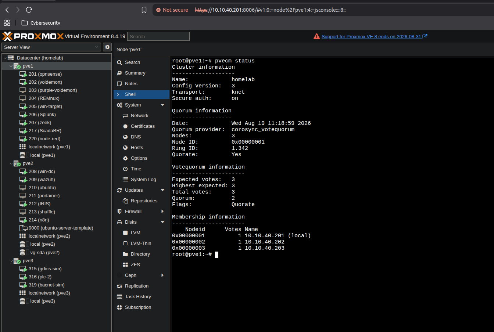

---

## OPNsense — Firewall / Router / IDS

All interfaces up across every VLAN, and the specific inter-VLAN rules built during earlier sessions (SOAR auto-block alias, OTDMZ egress scoping, OTDMZ↔BACNET) confirmed intact post-reboot.

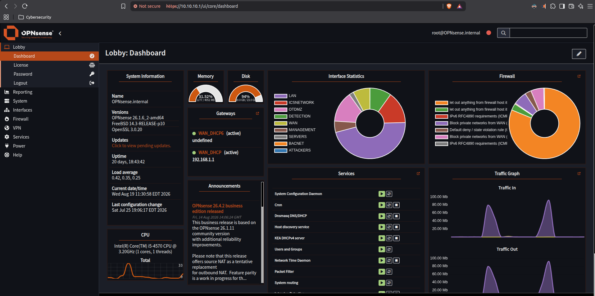
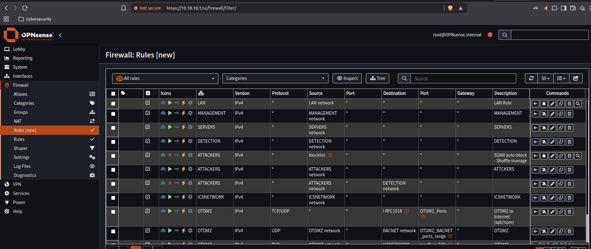

---

## VLAN 10 — Servers

`win-dc` (soclab.local domain controller): all core AD services running, time sync healthy.
`ws01`: secure channel to the domain confirmed in good condition.

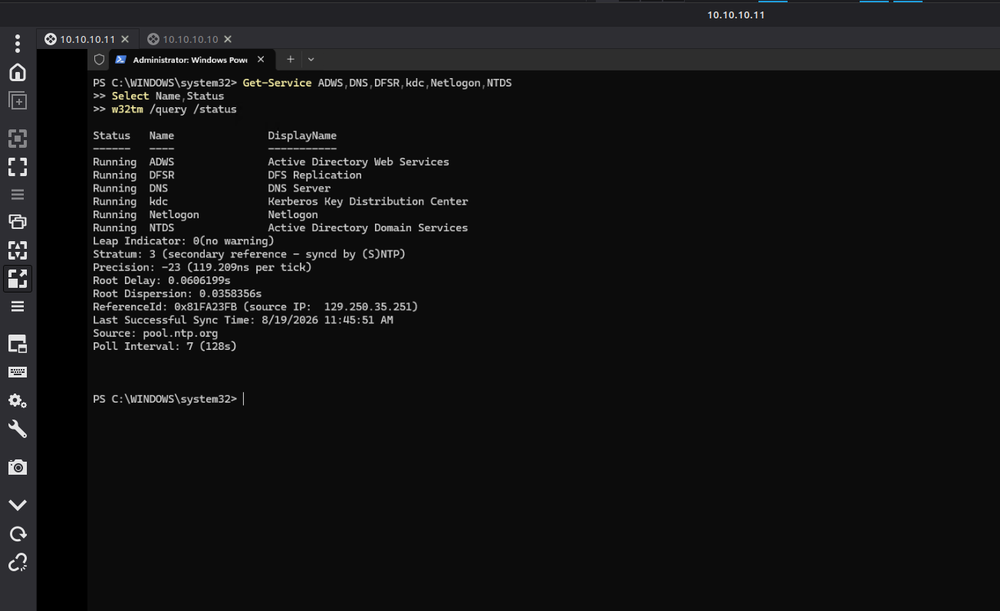
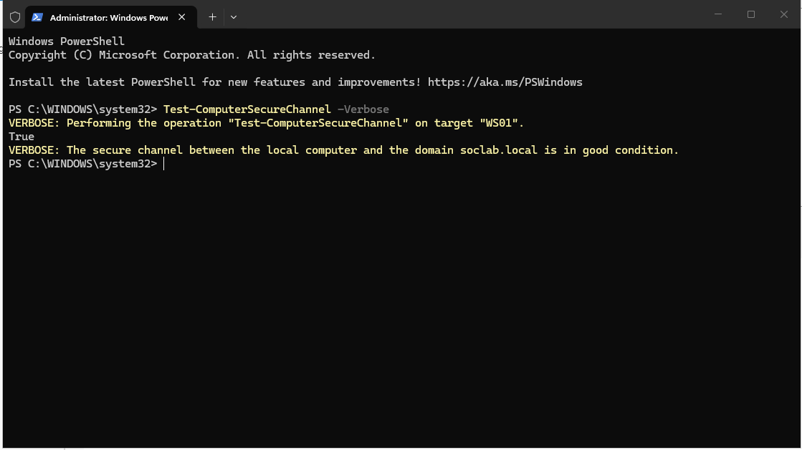

---

## VLAN 20 — Detection / SOC Platform

**Splunk:** up and reachable.

**Security Onion:** a second SIEM/NSM platform added alongside Splunk — own Elastic stack, Zeek, and Suricata. Full build writeup: [`../security-onion/`](../security-onion/).

**Wazuh:** dashboard up, agents reporting.

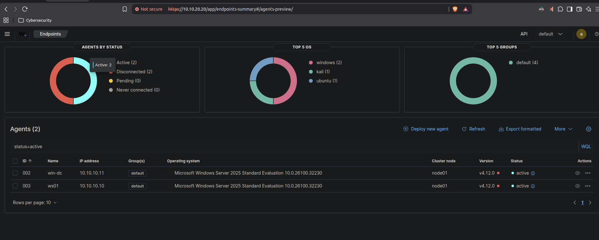

**Zeek — found silently crashed 25 days earlier.** Log timestamps were stale; `zeekctl status` confirmed `crashed`. Fixed with `zeekctl deploy`, verified with fresh log timestamps immediately after.

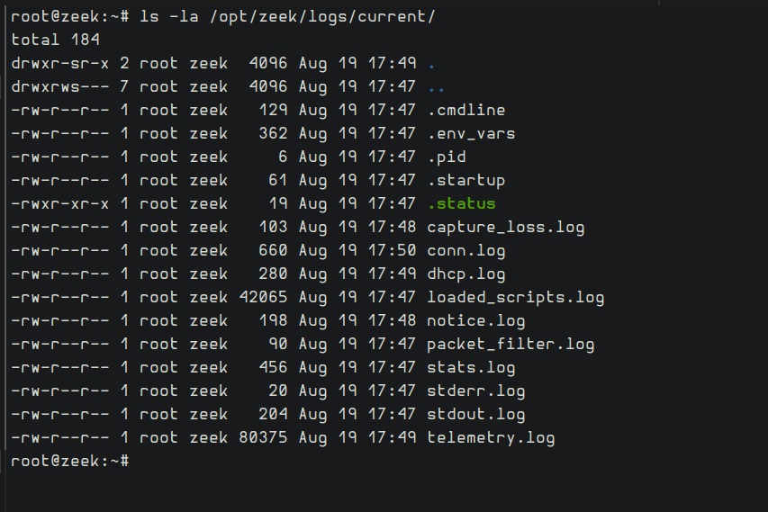

**n8n:** the full SOAR pipeline (hash branch, network/spray branch, OPNsense auto-block, IRIS case creation) loaded correctly, published and intact.

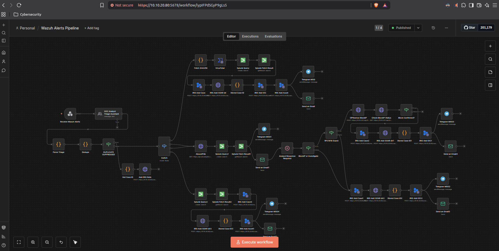

**IRIS:** case management dashboard reachable.

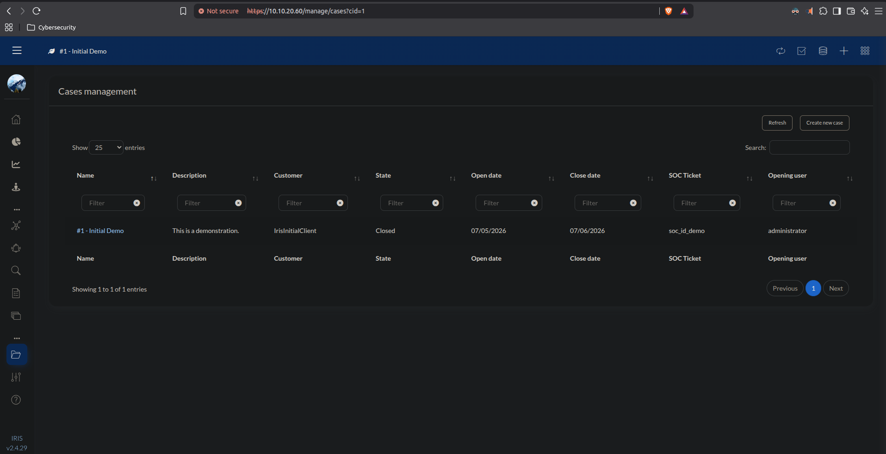

---

## VLAN 50 — ICSNETWORK (OT Purdue Level 0/1)

`grfics-sim`: process simulation live, in-simulation clock matching real time — confirms it's actively running, not a frozen screen.

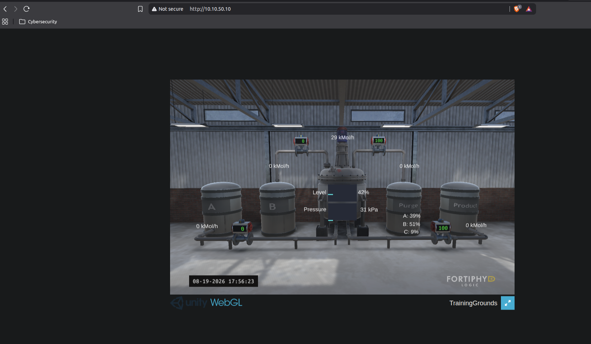

`OpenPLC`: Modbus master connected to all 6 field devices (feed1, feed2, purge, product, tank, analyzer).

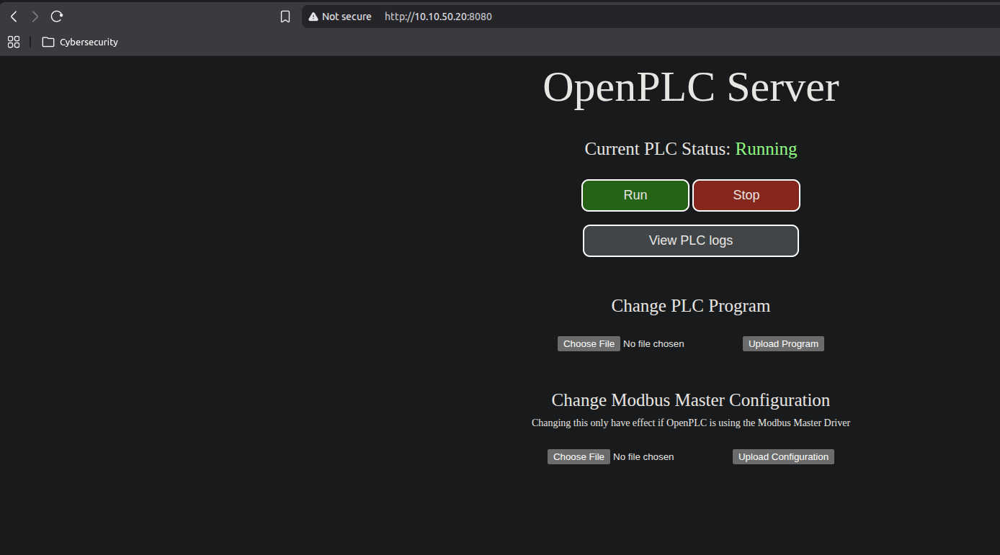

---

## VLAN 55 — OTDMZ (OT Purdue Level 2)

`ScadaBR`: HMI live view, real values (not placeholder `--`), no warning triangles — confirms the full Level 0→1→2 Modbus chain end to end.

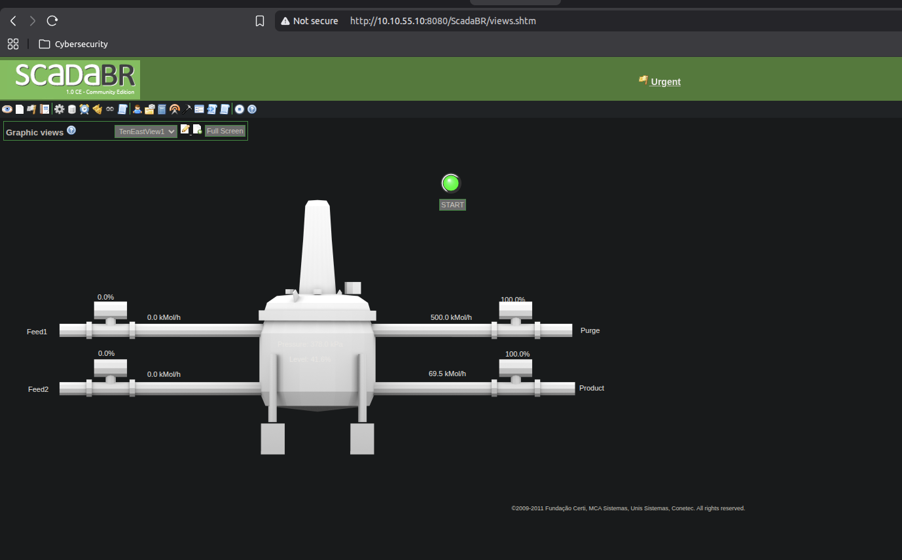

`node-red`: caught mid-execution with an active BACnet read in the debug panel — a live, successful bulk read of multiple HVAC devices (AHU-01, CO2-01, FCU-01, FCU-02, OAT-01), not just a static confirmation that the editor loads.

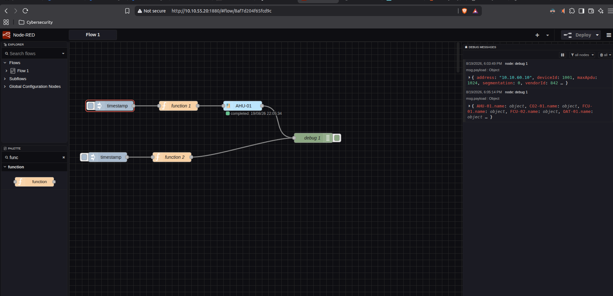

---

## VLAN 60 — BACNET

All 7 simulated HVAC/BMS devices online: AHU-01, CO2-01, FCU-01, FCU-02, OAT-01, TSTAT-01, ZC-01.

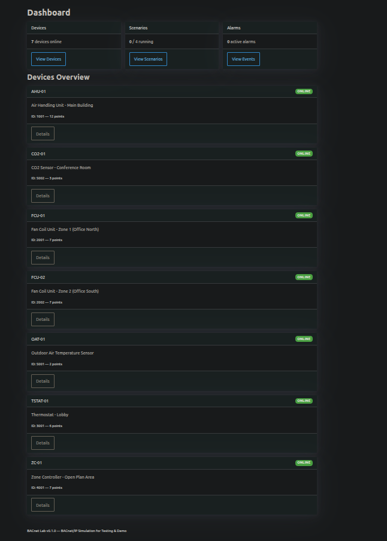

