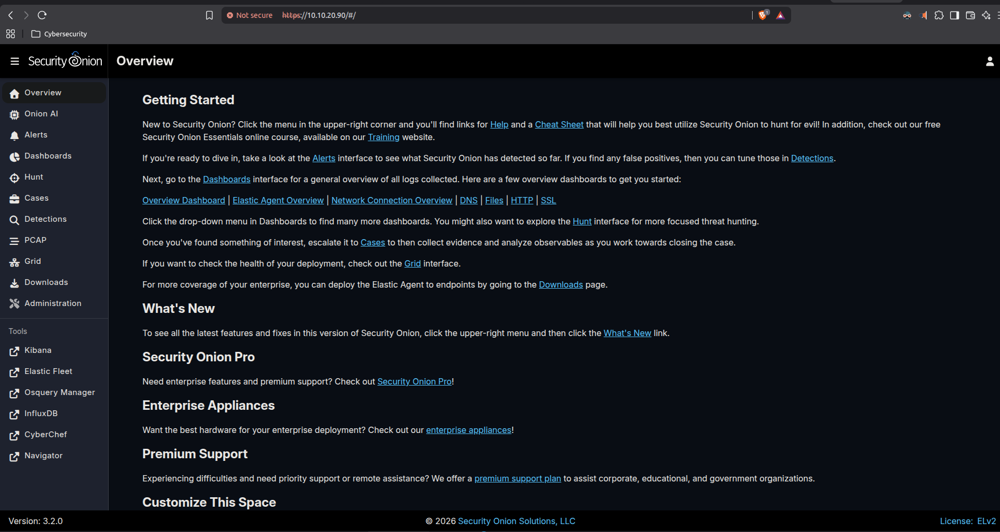
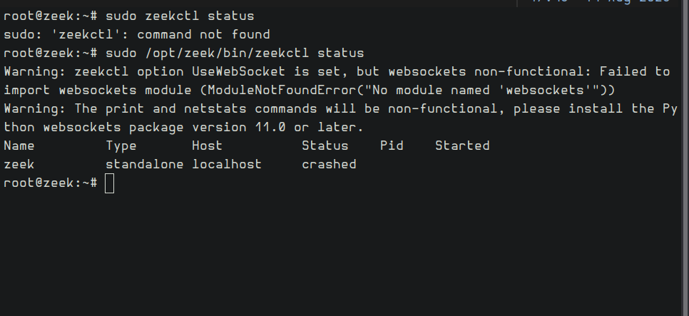
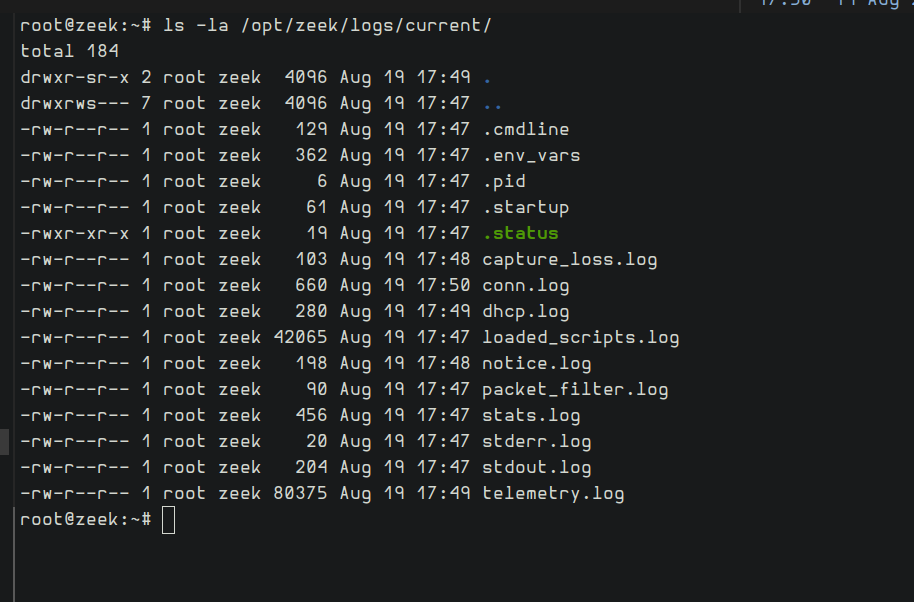

# Security Onion — Second SIEM/NSM Platform

## Infrastructure Project

**Analyst:** Santiago Abel Ruiz Diaz
**Platform:** Security Onion 3.2.0 (Oracle Linux base) — Elasticsearch, Kibana, Zeek, Suricata, Strelka, all bundled and self-managed
**Status:** Standalone install complete and confirmed working
**License:** ELv2 (Elastic components) — no volume quota, no trial expiration, no license-server enforcement

Security Onion running alongside Splunk on the same detection VLAN, not replacing it — a second, fully open NSM/SIEM stack with its own Elastic pipeline, Zeek, and Suricata built in.

---

## Why

Splunk's Enterprise trial license expired mid-build and hit a license-violation gate that Splunk's own documentation says has no self-service reset short of a support case — individual warnings age out after 30 days, so it clears on its own eventually, but there's no way to force it. Rather than lose weeks of portfolio momentum waiting on a licensing clock, this stood up a second platform that doesn't have that failure mode at all: Security Onion's core stack has no trial period, no daily-volume quota, and no search-lockout mechanism.

---

## Build

- **VM 320, pve3** — 4 vCPU, 16GB RAM, 200GB disk, Standalone install type
- **Network:** VLAN 20 (Detection), static `10.10.20.90`
- Every core service confirmed running via `so-status`: `elasticsearch`, `kibana`, `zeek`, `suricata`, `strelka` (malware analysis), `soc`, `sensoroni`, `logstash`, `redis`, `postgres`

### Real gotchas hit during install

Standalone install has real hardware requirements that surfaced mid-wizard, not in a pre-flight check:

1. **Requires 2 NICs minimum** — one management, one dedicated sensor/monitor interface. Had to hot-add a second NIC to the VM to get past this.
2. **Two NICs on the same bridge/VLAN caused a routing conflict** — the second NIC picked up its own DHCP lease and default route, competing with the management interface's static IP. Security Onion refuses to proceed until the management NIC unambiguously owns the default route (`nmcli device set <nic> managed no` isolated it — then had to flip back to `managed yes` once setup needed to configure it as the monitor interface, without letting it re-acquire a competing route).
3. **Root partition undersized despite a big enough virtual disk** — Anaconda's automatic partitioning gave `/` only 64GB out of a 200GB disk (the rest went to `/nsm`, `/tmp`, swap), short of Security Onion's 100GB-free requirement on root specifically. Fixed by growing the virtual disk and extending only the root LV into the new space, leaving the dedicated `/nsm` log-storage volume untouched.
4. **`so-setup` requires a positional argument** (`iso`/`network`/`analyst`) — running it bare fails with an unhelpful "invalid install type" error; the wizard only auto-passes this on the very first boot, not on manual re-runs.

None of these are documented as pre-requisites up front — found and resolved by reading the actual error output and, where the docs were thin, the installer's own source.

### Known, honestly-scoped gaps

- The monitor/sensor NIC is configured but not wired to real SPAN traffic yet — it's a placeholder on the management VLAN. Whether this instance takes over the existing hardware SPAN feed (currently going to a standalone Zeek sensor), gets its own tap, or something else is a deliberate follow-up decision, not an oversight.
- Elastic Fleet's bulk threat-intel package install (MISP, OTX, CrowdStrike integrations, etc.) failed during setup — confirmed non-fatal, core detection stack unaffected. These are optional paid/community TI feeds, not required for Zeek/Suricata/Elastic to function.

---

## Bonus finds — the outage this build surfaced

Sizing this VM's storage led to checking every other host in the lab, which turned up two real problems unrelated to Security Onion itself:

- **A standalone Zeek sensor had been silently crashed for 25 days** (`zeekctl status` → `crashed`, log files stale since the outage) — found while verifying the rest of the detection stack was healthy, fixed with `zeekctl deploy`, confirmed with fresh log timestamps.

  | Before | After |
  |---|---|
  |  |  |

- **A 3.5TB physical disk on the Proxmox node hosting this VM was invisible to Proxmox** — the disk's real LVM-thin pool existed at the block-device level but was never registered as usable storage, leaving only ~64GB accessible. Registered the real pool and consolidated it into a single volume, recovering the missing capacity.
